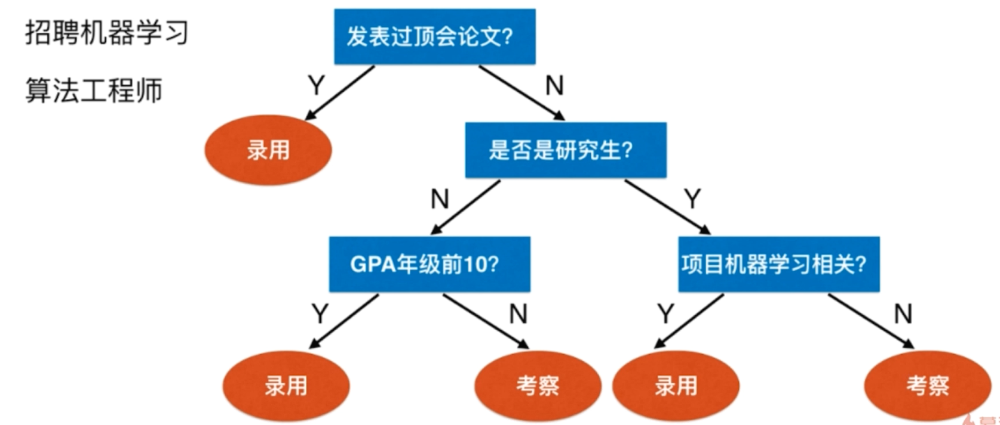
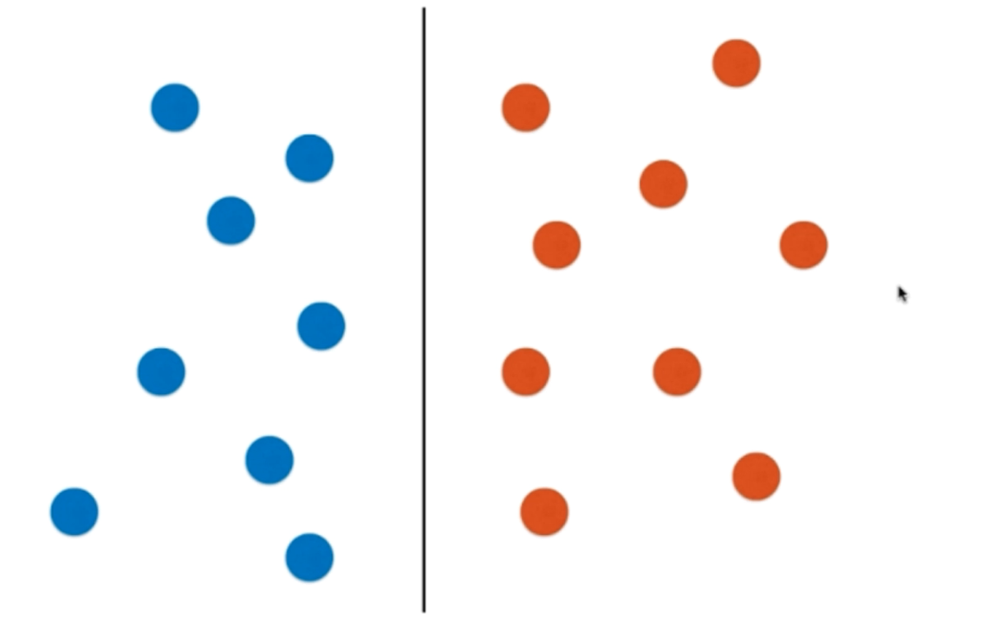

# 决策树

---

以招聘算法工程师为例讲解决策树

## 信息熵

构建决策树时产生的问题：

1. 每个节点在哪个维度做划分
2. 某个维度在哪个值上做划分

熵在信息论中代表随机变量不确定度的度量

* 熵越大，数据的不确定性越高
* 熵越小，数据的不确定性越低

信息熵的计算公式
$$
H = - \sum \limits ^k_{i=1} p_i log(p_i)
$$
计算例子：

## 基尼系数

公式
$$
G = 1 - \sum \limits^k_{i=1}p^2_i
$$
举个栗子：

* 熵信息的计算比基尼系数稍慢
* scikit-learn中默认为基尼系数
* 大多数时候两者没有特别的优劣

## CART

Classification And Regression Tree

根据某一个维度d和某一个阈值v进行划分

### 复杂度

所有的非参数机器学习都有可能产生过拟合

n: 每一个维度

m: 每一个样本

预测：O (logm)

训练：O (n * m * logm)

剪纸：降低复杂度，解决过拟合

DecisionTreeClassifier 几个比较重要的参数：

* min_samples_split
* min_samples_leaf
* min_weight_fraction_leaf
* max_depth
* max_leaf_nodes
* min_features

## 解决回归问题

## 局限性

在决策树中很多分类一条直线就能搞定但有时候它不能

再例如：可以这样划分，但是整个图像斜着后，它的划分方式就改变了

实际：

