- [八股文学习技巧](#八股文学习技巧)
- [Java基础](#java基础)
- [框架](#框架)
  - [Spring](#spring)
- [微服务](#微服务)
- [JVM](#jvm)
- [JUC](#juc)
- [数据库](#数据库)
  - [RabbitMQ](#rabbitmq)
  - [MySql](#mysql)
- [数据结构和算法](#数据结构和算法)
- [操作系统](#操作系统)
- [计算机网络](#计算机网络)
- [设计模式](#设计模式)
- [安全](#安全)
- [杂项](#杂项)
  - [最新技术](#最新技术)
  - [RBAC](#rbac)

# 八股文学习技巧

* [八股文学习路线及攻略](https://leetcode-cn.com/circle/discuss/2Ypo9Z/) 
* [论如何4个月高效刷满 500 题并形成长期记忆](https://leetcode-cn.com/circle/discuss/jq9Zke/ ) 

# Java基础

> 讲讲hashmap，底层原理是什么？ 

**JDK1.8 之前**

<font color='#e67e22'>JDK1.8 之前 HashMap 底层是 **数组和链表** 结合在一起使用也就是 链表散列</font>。HashMap 通过 key 的 hashCode 经过扰动函数处理过后得到 hash 值，然后通过 (n - 1) & hash 判断当前元素存放的位置（这里的 n 指的是数组的长度），如果当前位置存在元素的话，就判断该元素与要存入的元素的 hash 值以及 key 是否相同，如果相同的话，直接覆盖，<u>不相同就通过拉链法解决冲突</u>。

所谓扰动函数指的就是 HashMap 的 hash 方法。使用 hash 方法也就是扰动函数是为了防止一些实现比较差的 hashCode() 方法 换句话说使用扰动函数之后可以减少碰撞。

JDK 1.8 HashMap 的 hash 方法源码:

JDK 1.8 的 hash 方法 相比于 JDK 1.7 hash 方法更加简化，但是原理不变。

```java
    static final int hash(Object key) {
      int h;
      // key.hashCode()：返回散列值也就是hashcode
      // ^ ：按位异或
      // >>>:无符号右移，忽略符号位，空位都以0补齐
      return (key == null) ? 0 : (h = key.hashCode()) ^ (h >>> 16);
  }
```

对比一下 JDK1.7 的 HashMap 的 hash 方法源码.

```java
static int hash(int h) {
    // This function ensures that hashCodes that differ only by
    // constant multiples at each bit position have a bounded
    // number of collisions (approximately 8 at default load factor).

    h ^= (h >>> 20) ^ (h >>> 12);
    return h ^ (h >>> 7) ^ (h >>> 4);
}
```

相比于 JDK1.8 的 hash 方法 ，JDK 1.7 的 hash 方法的性能会稍差一点点，因为毕竟扰动了 4 次。

所谓 **“拉链法”** 就是：将链表和数组相结合。也就是说创建一个链表数组，数组中每一格就是一个链表。若遇到哈希冲突，则将冲突的值加到链表中即可。


**JDK1.8 之后**

相比于之前的版本， JDK1.8 之后在解决哈希冲突时有了较大的变化，当链表长度大于阈值（默认为 8）（将链表转换成红黑树前会判断，如果当前数组的长度小于 64，那么会选择先进行数组扩容，而不是转换为红黑树）时，<font color='#fdcb6e'>将链表转化为红黑树，以减少搜索时间</font>。


TreeMap、TreeSet 以及 JDK1.8 之后的 HashMap 底层都用到了红黑树。红黑树就是为了解决二叉查找树的缺陷，因为二叉查找树在某些情况下会退化成一个线性结构。


> stringbuilder有用过吗？
>
> stringbuilder和stringbuffer什么区别？
>

可变性

`String` 是不可变的（后面会详细分析原因）。

`StringBuilder` 与 `StringBuffer` 都继承自 `AbstractStringBuilder` 类，在 `AbstractStringBuilder` 中也是使用字符数组保存字符串，不过没有使用 `final` 和 `private` 关键字修饰，最关键的是这个 `AbstractStringBuilder` 类还提供了很多修改字符串的方法比如 `append` 方法。

```java
abstract class AbstractStringBuilder implements Appendable, CharSequence {
    char[] value;
    public AbstractStringBuilder append(String str) {
        if (str == null)
            return appendNull();
        int len = str.length();
        ensureCapacityInternal(count + len);
        str.getChars(0, len, value, count);
        count += len;
        return this;
    }
      //...
}
```

**【重要】线程安全性**

`String` 中的对象是不可变的，也就可以理解为常量，线程安全。`AbstractStringBuilder` 是 `StringBuilder` 与 `StringBuffer` 的公共父类，定义了一些字符串的基本操作，如 `expandCapacity`、`append`、`insert`、`indexOf` 等公共方法。`StringBuffer` 对方法加了同步锁或者对调用的方法加了同步锁，所以是线程安全的。`StringBuilder` 并没有对方法进行加同步锁，所以是非线程安全的。

小结：

- String 不可变，因此是线程安全的
- StringBuilder 不是线程安全的
- StringBuffer 是线程安全的，内部使用 synchronized 进行同步

**性能**

每次对 `String` 类型进行改变的时候，都会生成一个新的 `String` 对象，然后将指针指向新的 `String` 对象。`StringBuffer` 每次都会对 `StringBuffer` 对象本身进行操作，而不是生成新的对象并改变对象引用。相同情况下使用 `StringBuilder` 相比使用 `StringBuffer` 仅能获得 10%~15% 左右的性能提升，但却要冒多线程不安全的风险。

**对于三者使用的总结：**

1. 操作少量的数据: 适用 `String`
2. 单线程操作字符串缓冲区下操作大量数据: 适用 `StringBuilder`
3. 多线程操作字符串缓冲区下操作大量数据: 适用 `StringBuffer`


> stringbuilder为什么线程不安全？底层原理是什么？


> 深拷贝和浅拷贝区别，工作原理

1. 浅拷贝：对引用数据类型进行引用传递般的拷贝，此为浅拷贝。
2. 深拷贝：对基本数据类型进行值传递，对引用数据类型，创建一个新的对象，并复制其内容，此为深拷贝。

深拷贝的另一种方式，使用序列化和反序列化，获取一个新对象。

浅拷贝的示例代码如下，我们这里实现了 `Cloneable` 接口，并重写了 `clone()` 方法。

`clone()` 方法的实现很简单，直接调用的是父类 `Object` 的 `clone()` 方法。

```java
public class Address implements Cloneable{
    private String name;
    // 省略构造函数、Getter&Setter方法
    @Override
    public Address clone() {
        try {
            return (Address) super.clone();
        } catch (CloneNotSupportedException e) {
            throw new AssertionError();
        }
    }
}

public class Person implements Cloneable {
    private Address address;
    // 省略构造函数、Getter&Setter方法
    @Override
    public Person clone() {
        try {
            Person person = (Person) super.clone();
            return person;
        } catch (CloneNotSupportedException e) {
            throw new AssertionError();
        }
    }
}
```


**深拷贝**

这里我们简单对 `Person` 类的 `clone()` 方法进行修改，连带着要把 `Person` 对象内部的 `Address` 对象一起复制。

```java
@Override
public Person clone() {
    try {
        Person person = (Person) super.clone();
        person.setAddress(person.getAddress().clone());
        return person;
    } catch (CloneNotSupportedException e) {
        throw new AssertionError();
    }
}

```


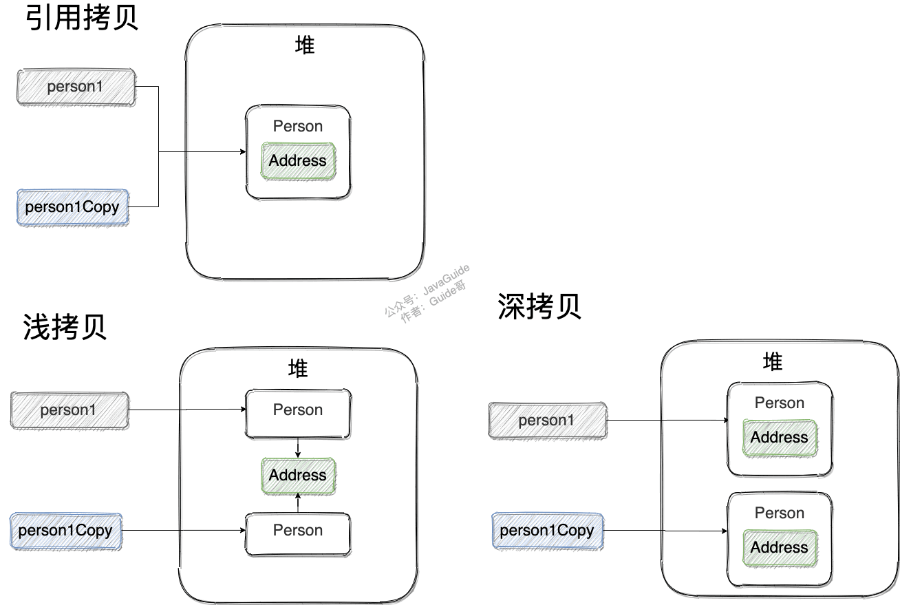

> 序列化和反序列化的概念，方式，例子

如果我们需要持久化 Java 对象比如将 Java 对象保存在文件中，或者在网络传输 Java 对象，这些场景都需要用到序列化。

简单来说：

- **序列化**： 将数据结构或对象转换成二进制字节流的过程
- **反序列化**：将在序列化过程中所生成的二进制字节流转换成数据结构或者对象的过程

对于 Java 这种面向对象编程语言来说，我们序列化的都是对象（Object）也就是实例化后的类(Class)，但是在 C++这种半面向对象的语言中，struct(结构体)定义的是数据结构类型，而 class 对应的是对象类型。

维基百科是如是介绍序列化的：

> **序列化**（serialization）在计算机科学的数据处理中，是指将数据结构或对象状态转换成可取用格式（例如存成文件，存于缓冲，或经由网络中发送），以留待后续在相同或另一台计算机环境中，能恢复原先状态的过程。依照序列化格式重新获取字节的结果时，可以利用它来产生与原始对象相同语义的副本。对于许多对象，像是使用大量引用的复杂对象，这种序列化重建的过程并不容易。面向对象中的对象序列化，并不概括之前原始对象所关系的函数。这种过程也称为对象编组（marshalling）。从一系列字节提取数据结构的反向操作，是反序列化（也称为解编组、deserialization、unmarshalling）。

综上：**序列化的主要目的是通过网络传输对象或者说是将对象存储到文件系统、数据库、内存中。**


例子：

```java
/*
     * 使用序列化和反序列化创建对象，这种方式其实是根据既有的对象进行复制，这个需要事先将可序列化的对象线存到文件里
     */  
@SuppressWarnings("resource")  
public static Worker createWorker4(String objectPath) {  
    ObjectInput input = null;  
    Worker worker = null;  
    try {  
        input = new ObjectInputStream(new FileInputStream(objectPath));  
        worker = (Worker) input.readObject();  
    } catch (FileNotFoundException e) {  
        e.printStackTrace();  
    } catch (IOException e) {  
        e.printStackTrace();  
    } catch (ClassNotFoundException e) {  
        e.printStackTrace();  
    }  
    return worker;  
}  

/*
     * 将创建的对象存入到文件内
     */  
public static void storeObject2File(String objectPath) {  
    Worker worker = new Worker();  
    ObjectOutputStream objectOutputStream;  
    try {  
        objectOutputStream = new ObjectOutputStream(new FileOutputStream(  
            objectPath));  
        objectOutputStream.writeObject(worker);  
    } catch (FileNotFoundException e) {  
        // TODO Auto-generated catch block  
        e.printStackTrace();  
    } catch (IOException e) {  
        // TODO Auto-generated catch block  
        e.printStackTrace();  
    }  
}  
```


> 异常分类，Exception分类，受检异常和非受检异常区别，自定义异常优点

Java异常类层次结构图：

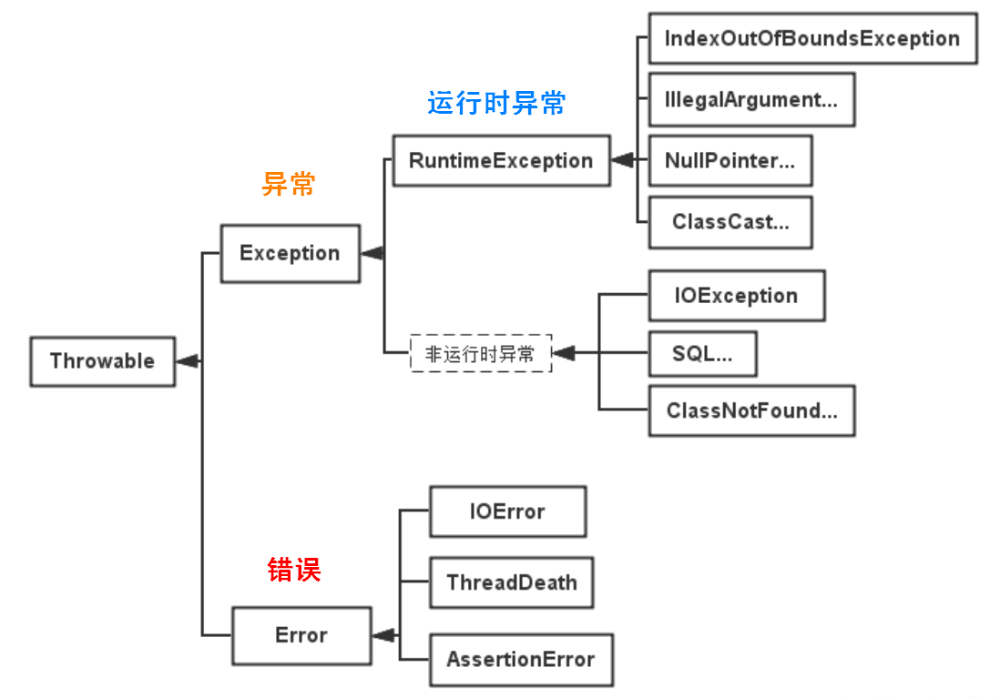


程序本身可以捕获并且可以处理的异常。Exception 这种异常又分为两类：运行时异常和编译时异常。

- **运行时异常**

都是RuntimeException类及其子类异常，如NullPointerException(空指针异常)、IndexOutOfBoundsException(下标越界异常)等，这些异常是不检查异常，程序中可以选择捕获处理，也可以不处理。这些异常一般是由程序逻辑错误引起的，程序应该从逻辑角度尽可能避免这类异常的发生。

运行时异常的特点是Java编译器不会检查它，也就是说，当程序中可能出现这类异常，即使没有用try-catch语句捕获它，也没有用throws子句声明抛出它，也会编译通过。

- **非运行时异常** （编译异常）

是RuntimeException以外的异常，类型上都属于Exception类及其子类。从程序语法角度讲是必须进行处理的异常，如果不处理，程序就不能编译通过。如IOException、SQLException等以及用户自定义的Exception异常，一般情况下不自定义检查异常。


受检异常 ：需要用 try...catch... 语句捕获并进行处理，并且可以从异常中恢复；

非受检异常 ：是程序运行时错误，例如除 0 会引发 Arithmetic Exception，此时程序崩溃并且无法恢复


> 有没有用过自定义异常，声明式异常工作流程，和return区别，项目中自定义异常工作流程


> 类的生命周期，什么时候回收

其中类加载的过程包括了`加载`、`验证`、`准备`、`解析`、`初始化`五个阶段。在这五个阶段中，`加载`、`验证`、`准备`和`初始化`这四个阶段发生的顺序是确定的，*而`解析`阶段则不一定，它在某些情况下可以在初始化阶段之后开始，这是为了支持Java语言的运行时绑定(也成为动态绑定或晚期绑定)*。另外注意这里的几个阶段是按顺序开始，而不是按顺序进行或完成，因为这些阶段通常都是互相交叉地混合进行的，通常在一个阶段执行的过程中调用或激活另一个阶段。


**Java虚拟机将结束生命周期的几种情况**

- 执行了System.exit()方法
- 程序正常执行结束
- 程序在执行过程中遇到了异常或错误而异常终止
- 由于操作系统出现错误而导致Java虚拟机进程终止


# 常用框架

## Spring

> 对spring和springboot的理解


> springboot是怎么加载redis的，为什么比不用springboot更方便呢?


> 加载的redis或者bean是单例还是多例

默认单例


> springboot是怎么实现单例模式的呢？


> Spring bean启动流程和生命周期


# 微服务、分布式

> 讲讲微服务

以前所有的代码都放在同一个工程中、部署在同一个服务器、同一项目的不同模块不同功能互相抢占资源，微服务就是将工程根据不同的业务规则拆分成微服务，部署在不同的服务器上，服务之间相互调用，java中有的微服务有dubbo(只能用来做微服务)、springcloud( 提供了服务的发现、断路器等)。


> 微服务两台机器怎么通信呢?


> 两台机器如何用HTTP怎么找到对方？


> 微服务都有什么部分呢


> 注册中心是什么讲讲


> 网关是什么呢


> 分布式登录怎么保持状态吗


> 分布式系统中，本地缓存和Redis中的数据是否是每台服务器上都备份同样的数据


> 分布式系统相关概念，序列化在分布式系统中的应用，讲一下thrift

# JVM

> Java static关键字，生命周期，static变量存在JVM哪个区域和生命周期


# JUC

> 怎么保证多线程下面单例模式安全

双重校验锁 + volatile


> concurrentMap和hashmap有什么区别

`ConcurrentHashMap` 和 `Hashtable` 的区别主要体现在实现线程安全的方式上不同。

- **底层数据结构：** JDK1.7 的 `ConcurrentHashMap` 底层采用 **分段的数组+链表** 实现，JDK1.8 采用的数据结构跟 `HashMap1.8` 的结构一样，数组+链表/红黑二叉树。`Hashtable` 和 JDK1.8 之前的 `HashMap` 的底层数据结构类似都是采用 **数组+链表** 的形式，数组是 HashMap 的主体，链表则是主要为了解决哈希冲突而存在的；
- **实现线程安全的方式（重要）：** ① **在 JDK1.7 的时候，`ConcurrentHashMap`（分段锁）** 对整个桶数组进行了分割分段(`Segment`)，每一把锁只锁容器其中一部分数据，多线程访问容器里不同数据段的数据，就不会存在锁竞争，提高并发访问率。 **到了 JDK1.8 的时候已经摒弃了 `Segment` 的概念，而是直接用 `Node` 数组+链表+红黑树的数据结构来实现，并发控制使用 `synchronized` 和 CAS 来操作。（JDK1.6 以后 对 `synchronized` 锁做了很多优化）** 整个看起来就像是优化过且线程安全的 `HashMap`，虽然在 JDK1.8 中还能看到 `Segment` 的数据结构，但是已经简化了属性，只是为了兼容旧版本；② **`Hashtable`(同一把锁)** :使用 `synchronized` 来保证线程安全，效率非常低下。当一个线程访问同步方法时，其他线程也访问同步方法，可能会进入阻塞或轮询状态，如使用 put 添加元素，另一个线程不能使用 put 添加元素，也不能使用 get，竞争会越来越激烈效率越低。

**两者的对比图：**

**Hashtable:**

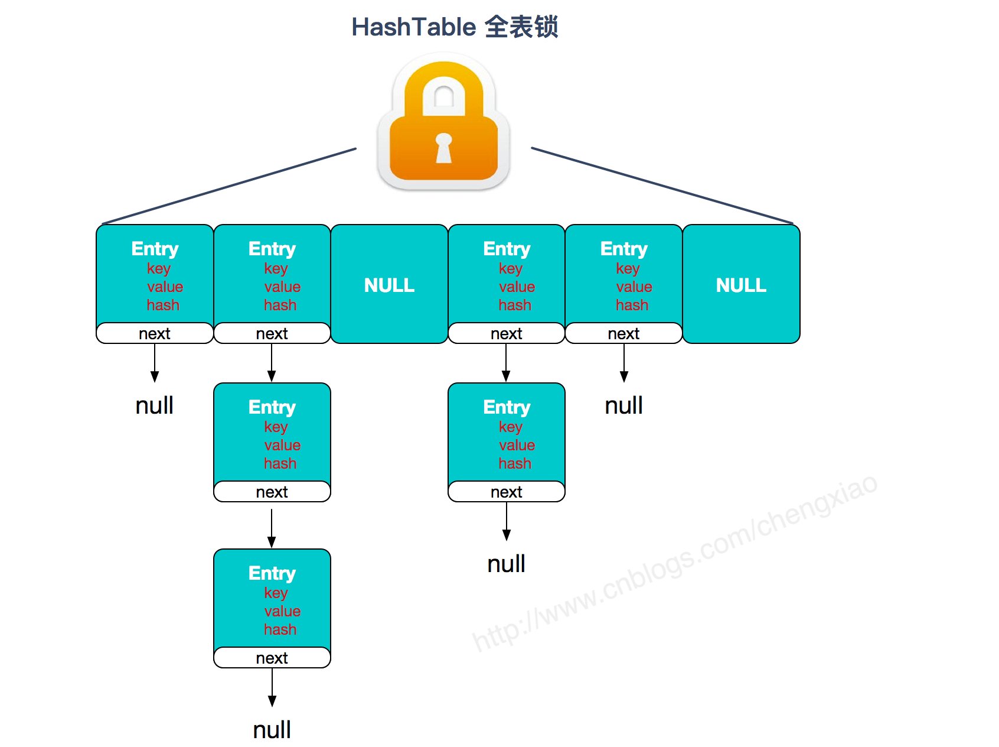

**JDK1.7 的 ConcurrentHashMap：**


**JDK1.8 的 ConcurrentHashMap：**

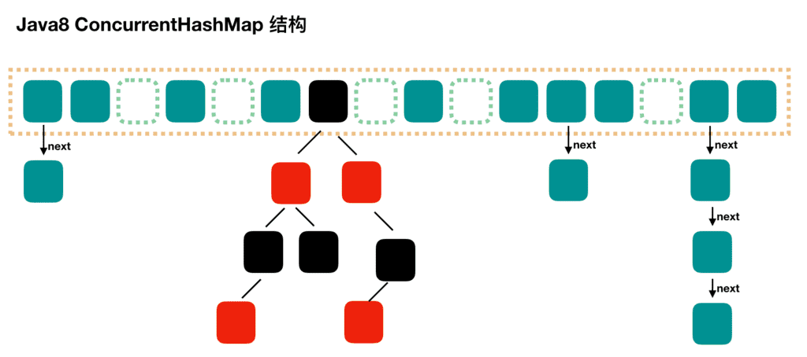

JDK1.8 的 `ConcurrentHashMap` 不再是 **Segment 数组 + HashEntry 数组 + 链表**，而是 **Node 数组 + 链表 / 红黑树**。不过，Node 只能用于链表的情况，红黑树的情况需要使用 **`TreeNode`**。当冲突链表达到一定长度时，链表会转换成红黑树。


> ConcurrentHashMap 线程安全的具体实现方式/底层具体实现

JDK1.7（上面有示意图）

首先将数据分为一段一段的存储，然后给每一段数据配一把锁，当一个线程占用锁访问其中一个段数据时，其他段的数据也能被其他线程访问。

**`ConcurrentHashMap` 是由 `Segment` 数组结构和 `HashEntry` 数组结构组成**。

Segment 实现了 `ReentrantLock`,所以 `Segment` 是一种可重入锁，扮演锁的角色。`HashEntry` 用于存储键值对数据。

```java
static class Segment<K,V> extends ReentrantLock implements Serializable {
}
```

一个 `ConcurrentHashMap` 里包含一个 `Segment` 数组。`Segment` 的结构和 `HashMap` 类似，是一种数组和链表结构，一个 `Segment` 包含一个 `HashEntry` 数组，每个 `HashEntry` 是一个链表结构的元素，每个 `Segment` 守护着一个 `HashEntry` 数组里的元素，当对 `HashEntry` 数组的数据进行修改时，必须首先获得对应的 `Segment` 的锁。

JDK1.8 （上面有示意图）

`ConcurrentHashMap` 取消了 `Segment` 分段锁，采用 CAS 和 `synchronized` 来保证并发安全。数据结构跟 HashMap1.8 的结构类似，数组+链表/红黑二叉树。Java 8 在链表长度超过一定阈值（8）时将链表（寻址时间复杂度为 O(N)）转换为红黑树（寻址时间复杂度为 O(log(N))）

`synchronized` 只锁定当前链表或红黑二叉树的首节点，这样只要 hash 不冲突，就不会产生并发，效率又提升 N 倍。


> 线程安全是什么概念

一个类在可以被多个线程安全调用时就是线程安全的。

线程安全不是一个非真即假的命题，可以将共享数据按照安全程度的强弱顺序分成以下五类: 不可变、绝对线程安全、相对线程安全、线程兼容和线程对立


> hashmap为什么多线程不安全，能举出例子来吗


> 怎么保证线程安全


> volatile和synchronize有什么区别？

`synchronized` 关键字和 `volatile` 关键字是两个互补的存在，而不是对立的存在！

- **`volatile` 关键字**是线程同步的**轻量级实现**，所以 **`volatile `性能肯定比`synchronized`关键字要好** 。但是 **`volatile` 关键字只能用于变量而 `synchronized` 关键字可以修饰方法以及代码块** 。
- **`volatile` 关键字能保证数据的可见性，但不能保证数据的原子性。`synchronized` 关键字两者都能保证。**
- **`volatile`关键字主要用于解决变量在多个线程之间的可见性，而 `synchronized` 关键字解决的是多个线程之间访问资源的同步性**


> volatile能保证i++安全吗


> 乐观锁和悲观锁，具体实现


> 线程池参数，工作流程，阻塞队列中的任务怎么加载到线程中


> ThreadLocal关键字，Tomcat有没有用过


> CAS是什么，原理，原子性怎么保证


> ConcurrentHashMap 和 Hashtable 的区别


> JMM是什么？


# 数据库

## RabbitMQ

> RabbitMQ讲讲对RabbitMQ的了解


> RabbitMQ的交换机和队列是怎样一个联系


> Redis怎么统计在线用户


> Redis的数据结构讲一讲 + 使用场景


> Zset里面跳表是什么


> 讲讲缓存一致性问题


> 脏读幻读的问题


> 不仅从redis角度，同时从数据库并发可能产生问题角度答答


> redis高并发


> redis高可用


> redis主从是怎么做的


> 缓存雪崩，缓存击穿，缓存穿透


> 缓存有哪些，Ehcache和Redis区别，Ehcache为什么效率高


> Redis分布式集群是怎么实现的

## MySql

> 有用mysql做过什么东西吗（开放话题）| 此处写的是如何优化MySQL

1.对查询进行优化，要尽量避免全表扫描，首先应考虑在 where 及 order by 涉及的列上建立索引。

2.应尽量避免在 where 子句中对字段进行 null 值判断，否则将导致引擎放弃使用索引而进行全表扫描，如：

```mysql
select id from t where num is null
```

最好不要给数据库留NULL，尽可能的使用 NOT NULL填充数据库.

备注、描述、评论之类的可以设置为 NULL，其他的，最好不要使用NULL。

不要以为 NULL 不需要空间，比如：char(100) 型，在字段建立时，空间就固定了， 不管是否插入值（NULL也包含在内），都是占用 100个字符的空间的，如果是varchar这样的变长字段， null 不占用空间。

可以在num上设置默认值0，确保表中num列没有null值，然后这样查询：

```mysql
select id from t where num = 0
```

3.应尽量避免在 where 子句中使用 != 或 <> 操作符，否则将引擎放弃使用索引而进行全表扫描。

4.应尽量避免在 where 子句中使用 or 来连接条件，如果一个字段有索引，一个字段没有索引，将导致引擎放弃使用索引而进行全表扫描，如：

```mysql
select id from t where num=10 or Name = 'admin'
```

可以这样查询：

```mysql
select id from t where num = 10
union all
select id from t where Name = 'admin'
```

5.in 和 not in 也要慎用，否则会导致全表扫描，如：

```mysql
select id from t where num in(1,2,3)
```

对于连续的数值，能用 between 就不要用 in 了：

```mysql
select id from t where num between 1 and 3
```

很多时候用 exists 代替 in 是一个好的选择：

```mysql
select num from a where num in(select num from b)
```

用下面的语句替换：

```mysql
select num from a where exists(select 1 from b where num=a.num)
```

6.下面的查询也将导致全表扫描：

```mysql
select id from t where name like ‘%abc%’
```

若要提高效率，可以考虑全文检索。

7.如果在 where 子句中使用参数，也会导致全表扫描。因为SQL只有在运行时才会解析局部变量，但优化程序不能将访问计划的选择推迟到运行时；它必须在编译时进行选择。然 而，如果在编译时建立访问计划，变量的值还是未知的，因而无法作为索引选择的输入项。如下面语句将进行全表扫描：

```sql
select id from t where num = @num
```

可以改为强制查询使用索引：

```sql
select id from t with(index(索引名)) where num = @num
```

应尽量避免在 where 子句中对字段进行表达式操作，这将导致引擎放弃使用索引而进行全表扫描。如：

```sql
select id from t where num/2 = 100
```

应改为:

```sql
select id from t where num = 100*2
```

9.应尽量避免在where子句中对字段进行函数操作，这将导致引擎放弃使用索引而进行全表扫描。如：

```sql
select id from t where substring(name,1,3) = ’abc’       -–name以abc开头的id
select id from t where datediff(day,createdate,’2005-11-30′) = 0    -–‘2005-11-30’    --生成的id
```

应改为:

```sql
select id from t where name like 'abc%'
select id from t where createdate >= '2005-11-30' and createdate < '2005-12-1'
```

10.不要在 where 子句中的“=”左边进行函数、算术运算或其他表达式运算，否则系统将可能无法正确使用索引。 

11.在使用索引字段作为条件时，如果该索引是复合索引，那么必须使用到该索引中的第一个字段作为条件时才能保证系统使用该索引，否则该索引将不会被使用，并且应尽可能的让字段顺序与索引顺序相一致。

 12.不要写一些没有意义的查询，如需要生成一个空表结构：

```sql
select col1,col2 into #t from t where 1=0
```

这类代码不会返回任何结果集，但是会消耗系统资源的，应改成这样：

```sql
create table #t(…)
```

13.Update 语句，如果只更改1、2个字段，不要Update全部字段，否则频繁调用会引起明显的性能消耗，同时带来大量日志。

14.对于多张大数据量（这里几百条就算大了）的表JOIN，要先分页再JOIN，否则逻辑读会很高，性能很差。

15.select count(*) from table；这样不带任何条件的count会引起全表扫描，并且没有任何业务意义，是一定要杜绝的。

16.索引并不是越多越好，索引固然可以提高相应的 select 的效率，但同时也降低了 insert 及 update 的效率，因为 insert 或 update 时有可能会重建索引，所以怎样建索引需要慎重考虑，视具体情况而定。一个表的索引数最好不要超过6个，若太多则应考虑一些不常使用到的列上建的索引是否有 必要。

17.应尽可能的避免更新 clustered 索引数据列，因为 clustered 索引数据列的顺序就是表记录的物理存储顺序，一旦该列值改变将导致整个表记录的顺序的调整，会耗费相当大的资源。若应用系统需要频繁更新 clustered 索引数据列，那么需要考虑是否应将该索引建为 clustered 索引。

18.尽量使用数字型字段，若只含数值信息的字段尽量不要设计为字符型，这会降低查询和连接的性能，并会增加存储开销。这是因为引擎在处理查询和连 接时会逐个比较字符串中每一个字符，而对于数字型而言只需要比较一次就够了。

19.尽可能的使用 varchar/nvarchar 代替 char/nchar ，因为首先变长字段存储空间小，可以节省存储空间，其次对于查询来说，在一个相对较小的字段内搜索效率显然要高些。

20.任何地方都不要使用 select * from t ，用具体的字段列表代替“*”，不要返回用不到的任何字段。

21.尽量使用表变量来代替临时表。如果表变量包含大量数据，请注意索引非常有限（只有主键索引）。

22.避免频繁创建和删除临时表，以减少系统表资源的消耗。临时表并不是不可使用，适当地使用它们可以使某些例程更有效，例如，当需要重复引用大型表或常用表中的某个数据集时。但是，对于一次性事件， 最好使用导出表。

23.在新建临时表时，如果一次性插入数据量很大，那么可以使用 select into 代替 create table，避免造成大量 log ，以提高速度；如果数据量不大，为了缓和系统表的资源，应先create table，然后insert。

24.如果使用到了临时表，在存储过程的最后务必将所有的临时表显式删除，先 truncate table ，然后 drop table ，这样可以避免系统表的较长时间锁定。

25.尽量避免使用游标，因为游标的效率较差，如果游标操作的数据超过1万行，那么就应该考虑改写。

26.使用基于游标的方法或临时表方法之前，应先寻找基于集的解决方案来解决问题，基于集的方法通常更有效。

27.与临时表一样，游标并不是不可使用。对小型数据集使用 FAST_FORWARD 游标通常要优于其他逐行处理方法，尤其是在必须引用几个表才能获得所需的数据时。在结果集中包括“合计”的例程通常要比使用游标执行的速度快。如果开发时 间允许，基于游标的方法和基于集的方法都可以尝试一下，看哪一种方法的效果更好。

28.在所有的存储过程和触发器的开始处设置 SET NOCOUNT ON ，在结束时设置 SET NOCOUNT OFF 。无需在执行存储过程和触发器的每个语句后向客户端发送 DONE_IN_PROC 消息。

29.尽量避免大事务操作，提高系统并发能力。

30.尽量避免向客户端返回大数据量，若数据量过大，应该考虑相应需求是否合理。


> Mysql sql执行过程，用JDBC时sql执行流程


> Mysql监听binlog，binlog是什么

那 `binlog` 到底是用来干嘛的？

可以说`MySQL`数据库的**数据备份、主备、主主、主从**都离不开`binlog`，需要依靠`binlog`来同步数据，保证数据一致性。

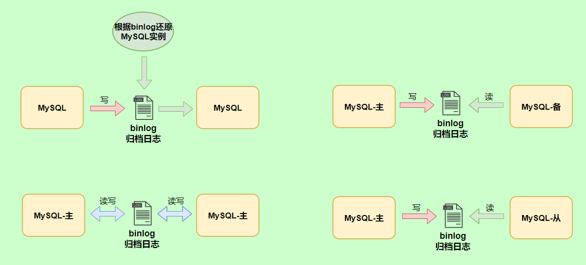

`binlog`会记录所有涉及更新数据的逻辑操作，并且是顺序写。


记录格式：

`binlog` 日志有三种格式，可以通过`binlog_format`参数指定。

- **statement**
- **row**
- **mixed**

指定`statement`，记录的内容是`SQL`语句原文，比如执行一条`update T set update_time=now() where id=1`，记录的内容如下。


同步数据时，会执行记录的`SQL`语句，但是有个问题，`update_time=now()`这里会获取当前系统时间，直接执行会导致与原库的数据不一致。

为了解决这种问题，我们需要指定为`row`，记录的内容不再是简单的`SQL`语句了，还包含操作的具体数据，记录内容如下。


`row`格式记录的内容看不到详细信息，要通过`mysqlbinlog`工具解析出来。

`update_time=now()`变成了具体的时间`update_time=1627112756247`，条件后面的@1、@2、@3 都是该行数据第 1 个~3 个字段的原始值（**假设这张表只有 3 个字段**）。

这样就能保证同步数据的一致性，通常情况下都是指定为`row`，这样可以为数据库的恢复与同步带来更好的可靠性。

但是这种格式，需要更大的容量来记录，比较占用空间，恢复与同步时会更消耗`IO`资源，影响执行速度。

所以就有了一种折中的方案，指定为`mixed`，记录的内容是前两者的混合。

`MySQL`会判断这条`SQL`语句是否可能引起数据不一致，如果是，就用`row`格式，否则就用`statement`格式。


写入机制：

`binlog`的写入时机也非常简单，事务执行过程中，先把日志写到`binlog cache`，事务提交的时候，再把`binlog cache`写到`binlog`文件中。

因为一个事务的`binlog`不能被拆开，无论这个事务多大，也要确保一次性写入，所以系统会给每个线程分配一个块内存作为`binlog cache`。

我们可以通过`binlog_cache_size`参数控制单个线程 binlog cache 大小，如果存储内容超过了这个参数，就要暂存到磁盘（`Swap`）。

`binlog`日志刷盘流程如下


- **上图的 write，是指把日志写入到文件系统的 page cache，并没有把数据持久化到磁盘，所以速度比较快**
- **上图的 fsync，才是将数据持久化到磁盘的操作**

`write`和`fsync`的时机，可以由参数`sync_binlog`控制，默认是`0`。

为`0`的时候，表示每次提交事务都只`write`，由系统自行判断什么时候执行`fsync`。


虽然性能得到提升，但是机器宕机，`page cache`里面的 binlog 会丢失。

为了安全起见，可以设置为`1`，表示每次提交事务都会执行`fsync`，就如同 **redo log 日志刷盘流程** 一样。

最后还有一种折中方式，可以设置为`N(N>1)`，表示每次提交事务都`write`，但累积`N`个事务后才`fsync`。

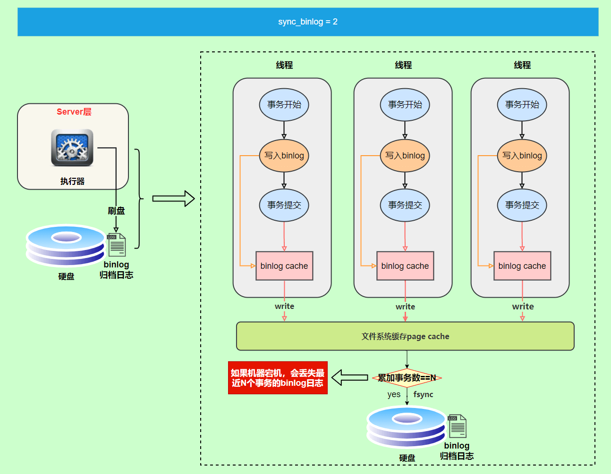

在出现`IO`瓶颈的场景里，将`sync_binlog`设置成一个比较大的值，可以提升性能。

同样的，如果机器宕机，会丢失最近`N`个事务的`binlog`日志。


> redolog和binlog的区别

`redo log` 它是物理日志，记录内容是“在某个数据页上做了什么修改”，属于 `InnoDB` 存储引擎。

而 `binlog` 是逻辑日志，记录内容是语句的原始逻辑，类似于“给 ID=2 这一行的 c 字段加 1”，属于`MySQL Server` 层。

不管用什么存储引擎，只要发生了表数据更新，都会产生 `binlog` 日志。


> Mysql里面为什么用B+树？B+树和二叉树区别？那能不能用哈希呢？

使用B+树而不是二叉搜索树或者红黑树的原因是，由于存储介质的特性，磁盘本身存取就比主存慢很多，每次搜索的磁盘IO的开销过大，而B+树可以使用较少次的磁盘IO搜索到对象。

- B-Tree中一次检索最多需要h-1次I/O（根节点常驻内存），渐进复杂度为O(h)=O(logdN)。
- 红黑树这种结构，h明显要深的多。效率明显比B-Tree差很多。


哈希表是键值对的集合，通过键(key)即可快速取出对应的值(value)，因此哈希表可以快速检索数据（接近 O（1））。

**为何能够通过 key 快速取出 value呢？** 原因在于 **哈希算法**（也叫散列算法）。通过哈希算法，我们可以快速找到 key 对应的 index，找到了 index 也就找到了对应的 value。

```java
hash = hashfunc(key)
index = hash % array_size
```


但是！哈希算法有个 **Hash 冲突** 问题，也就是说多个不同的 key 最后得到的 index 相同。通常情况下，我们常用的解决办法是 **链地址法**。链地址法就是将哈希冲突数据存放在链表中。就比如 JDK1.8 之前 `HashMap` 就是通过链地址法来解决哈希冲突的。不过，JDK1.8 以后`HashMap`为了减少链表过长的时候搜索时间过长引入了红黑树。

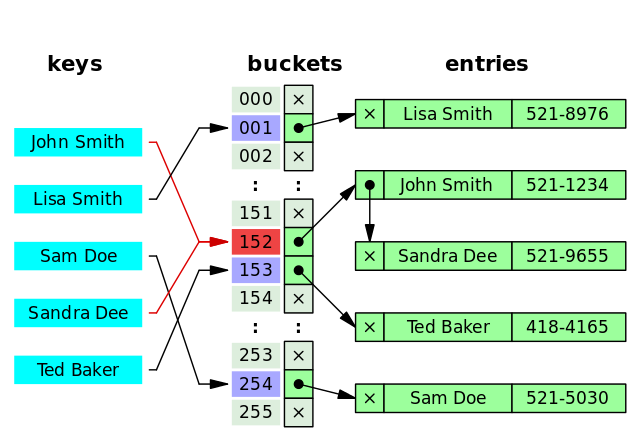

为了减少 Hash 冲突的发生，一个好的哈希函数应该“均匀地”将数据分布在整个可能的哈希值集合中。

既然哈希表这么快，**为什么MySQL 没有使用其作为索引的数据结构呢？**

**1.Hash 冲突问题** ：我们上面也提到过Hash 冲突了，不过对于数据库来说这还不算最大的缺点。

**2.Hash 索引不支持顺序和范围查询(Hash 索引不支持顺序和范围查询是它最大的缺点：** 假如我们要对表中的数据进行排序或者进行范围查询，那 Hash 索引可就不行了。

试想一种情况:

```java
SELECT * FROM tb1 WHERE id < 500;
```

在这种范围查询中，优势非常大，直接遍历比 500 小的叶子节点就够了。而 Hash 索引是根据 hash 算法来定位的，难不成还要把 1 - 499 的数据，每个都进行一次 hash 计算来定位吗?这就是 Hash 最大的缺点了.


> 什么是MVCC？

MVCC，全称Multi-Version Concurrency Control，即多版本并发控制。MVCC是一种并发控制的方法，一般在数据库管理系统中，实现对数据库的并发访问，在编程语言中实现事务内存。

在Mysql的InnoDB引擎中就是指在已提交读(READ COMMITTD)和可重复读(REPEATABLE READ)这两种隔离级别下的事务对于SELECT操作会访问版本链中的记录的过程。

这就使得别的事务可以修改这条记录，反正每次修改都会在版本链中记录。SELECT可以去版本链中拿记录，这就实现了读-写，写-读的并发执行，提升了系统的性能。


**MySQL的InnoDB引擎实现MVCC的3个基础点**

MVCC的目的就是多版本并发控制，在数据库中的实现，就是为了解决读写冲突，它的实现原理主要是依赖记录中的 3个隐式字段，undo日志 ，Read View 来实现的。


1. 隐式字段：

每行记录除了我们自定义的字段外，还有数据库隐式定义的DB_TRX_ID,DB_ROLL_PTR,DB_ROW_ID等字段

- **DB_ROW_ID** 6byte, 隐含的自增ID（隐藏主键），如果数据表没有主键，InnoDB会自动以DB_ROW_ID产生一个聚簇索引
- **DB_TRX_ID** 6byte, 最近修改(修改/插入)事务ID：记录创建这条记录/最后一次修改该记录的事务ID
- **DB_ROLL_PTR** 7byte, 回滚指针，指向这条记录的上一个版本（存储于rollback segment里）
- **DELETED_BIT** 1byte, 记录被更新或删除并不代表真的删除，而是删除flag变了


如上图，DB_ROW_ID是数据库默认为该行记录生成的唯一隐式主键；DB_TRX_ID是当前操作该记录的事务ID； 而DB_ROLL_PTR是一个回滚指针，用于配合undo日志，指向上一个旧版本；delete flag没有展示出来


2. undo日志

InnoDB把这些为了回滚而记录的这些东西称之为undo log。这里需要注意的一点是，由于查询操作（SELECT）并不会修改任何用户记录，所以在查询操作执行时，并不需要记录相应的undo log。undo log主要分为3种：

- **Insert undo log** ：插入一条记录时，至少要把这条记录的主键值记下来，之后回滚的时候只需要把这个主键值对应的记录删掉就好了。

- **Update undo log**：修改一条记录时，至少要把修改这条记录前的旧值都记录下来，这样之后回滚时再把这条记录更新为旧值就好了。

- Delete undo log

  ：删除一条记录时，至少要把这条记录中的内容都记下来，这样之后回滚时再把由这些内容组成的记录插入到表中就好了。

  - 删除操作都只是设置一下老记录的DELETED_BIT，并不真正将过时的记录删除。
  - 为了节省磁盘空间，InnoDB有专门的purge线程来清理DELETED_BIT为true的记录。为了不影响MVCC的正常工作，purge线程自己也维护了一个read view（这个read view相当于系统中最老活跃事务的read view）;如果某个记录的DELETED_BIT为true，并且DB_TRX_ID相对于purge线程的read view可见，那么这条记录一定是可以被安全清除的。

对MVCC有帮助的实质是**update undo log** ，undo log实际上就是存在rollback segment中旧记录链，它的执行流程如下：

1. **比如一个有个事务插入persion表插入了一条新记录，记录如下，name为Jerry, age为24岁，隐式主键是1，事务ID和回滚指针，我们假设为NULL**


2. **现在来了一个事务1对该记录的name做出了修改，改为Tom**
   1. 在事务1修改该行(记录)数据时，数据库会先对该行加排他锁
   2. 然后把该行数据拷贝到undo log中，作为旧记录，既在undo log中有当前行的拷贝副本
   3. 拷贝完毕后，修改该行name为Tom，并且修改隐藏字段的事务ID为当前事务1的ID, 我们默认从1开始，之后递增，回滚指针指向拷贝到undo log的副本记录，既表示我的上一个版本就是它
   4. 事务提交后，释放锁


3. **又来了个事务2修改person表的同一个记录，将age修改为30岁**
   1. 在事务2修改该行数据时，数据库也先为该行加锁
   2. 然后把该行数据拷贝到undo log中，作为旧记录，发现该行记录已经有undo log了，那么最新的旧数据作为链表的表头，插在该行记录的undo log最前面
   3. 修改该行age为30岁，并且修改隐藏字段的事务ID为当前事务2的ID, 那就是2，回滚指针指向刚刚拷贝到undo log的副本记录
   4. 事务提交，释放锁


从上面，我们就可以看出，不同事务或者相同事务的对同一记录的修改，会导致该记录的undo log成为一条记录版本线性表，既链表，undo log的链首就是最新的旧记录，链尾就是最早的旧记录（当然就像之前说的该undo log的节点可能是会purge线程清除掉，向图中的第一条insert undo log，其实在事务提交之后可能就被删除丢失了，不过这里为了演示，所以还放在这里）


3. Read View(读视图)

什么是Read View，说白了Read View就是事务进行快照读操作的时候生产的读视图(Read View)，在该事务执行的快照读的那一刻，会生成数据库系统当前的一个快照，记录并维护系统当前活跃事务的ID(当每个事务开启时，都会被分配一个ID, 这个ID是递增的，所以最新的事务，ID值越大)

所以我们知道 Read View主要是用来做可见性判断的, 即当我们某个事务执行快照读的时候，对该记录创建一个Read View读视图，把它比作条件用来判断当前事务能够看到哪个版本的数据，既可能是当前最新的数据，也有可能是该行记录的undo log里面的某个版本的数据。

Read View遵循一个可见性算法，主要是将要被修改的数据的最新记录中的DB_TRX_ID（即当前事务ID）取出来，与系统当前其他活跃事务的ID去对比（由Read View维护），如果DB_TRX_ID跟Read View的属性做了某些比较，不符合可见性，那就通过DB_ROLL_PTR回滚指针去取出Undo Log中的DB_TRX_ID再比较，即遍历链表的DB_TRX_ID（从链首到链尾，即从最近的一次修改查起），直到找到满足特定条件的DB_TRX_ID, 那么这个DB_TRX_ID所在的旧记录就是当前事务能看见的最新老版本

那么这个判断条件是什么呢？


如上，它是一段MySQL判断可见性的一段源码，即changes_visible方法（不完全哈，但能看出大致逻辑），该方法展示了我们拿DB_TRX_ID去跟Read View某些属性进行怎么样的比较

在展示之前，我先简化一下Read View，我们可以把Read View简单的理解成有三个全局属性

> - **trx_list** 未提交事务ID列表，用来维护Read View生成时刻系统正活跃的事务ID
> - **up_limit_id** 记录trx_list列表中事务ID最小的ID
> - **low_limit_id** ReadView生成时刻系统尚未分配的下一个事务ID，也就是目前已出现过的事务ID的最大值+1

- 首先比较DB_TRX_ID < up_limit_id, 如果小于，则当前事务能看到DB_TRX_ID 所在的记录，如果大于等于进入下一个判断
- 接下来判断 DB_TRX_ID 大于等于 low_limit_id , 如果大于等于则代表DB_TRX_ID 所在的记录在Read View生成后才出现的，那对当前事务肯定不可见，如果小于则进入下一个判断
- 判断DB_TRX_ID 是否在活跃事务之中，trx_list.contains(DB_TRX_ID)，如果在，则代表我Read View生成时刻，你这个事务还在活跃，还没有Commit，你修改的数据，我当前事务也是看不见的；如果不在，则说明，你这个事务在Read View生成之前就已经Commit了，你修改的结果，我当前事务是能看见的


整体流程：

著作权归https://pdai.tech所有。 链接：https://www.pdai.tech/md/db/sql-mysql/sql-mysql-mvcc.html

我们在了解了隐式字段，undo log， 以及Read View的概念之后，就可以来看看MVCC实现的整体流程是怎么样了

整体的流程是怎么样的呢？我们可以模拟一下

当事务2对某行数据执行了快照读，数据库为该行数据生成一个Read View读视图，假设当前事务ID为2，此时还有事务1和事务3在活跃中，事务4在事务2快照读前一刻提交更新了，所以Read View记录了系统当前活跃事务1，3的ID，维护在一个列表上，假设我们称为trx_list

| 事务1    | 事务2    | 事务3    | 事务4        |
| -------- | -------- | -------- | ------------ |
| 事务开始 | 事务开始 | 事务开始 | 事务开始     |
| …        | …        | …        | 修改且已提交 |
| 进行中   | 快照读   | 进行中   |              |
| …        | …        | …        |              |

Read View不仅仅会通过一个列表trx_list来维护事务2执行快照读那刻系统正活跃的事务ID，还会有两个属性up_limit_id（记录trx_list列表中事务ID最小的ID），low_limit_id(记录trx_list列表中下一个事务ID，也就是目前已出现过的事务ID的最大值+1)；所以在这里例子中up_limit_id就是1，low_limit_id就是4 + 1 = 5，trx_list集合的值是1,3，Read View如下图


我们的例子中，只有事务4修改过该行记录，并在事务2执行快照读前，就提交了事务，所以当前该行当前数据的undo log如下图所示；我们的事务2在快照读该行记录的时候，就会拿该行记录的DB_TRX_ID去跟up_limit_id,low_limit_id和活跃事务ID列表(trx_list)进行比较，判断当前事务2能看到该记录的版本是哪个。

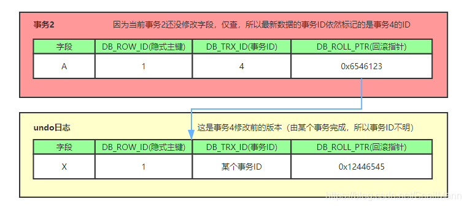

所以先拿该记录DB_TRX_ID字段记录的事务ID 4去跟Read View的的up_limit_id比较，看4是否小于up_limit_id(1)，所以不符合条件，继续判断 4 是否大于等于 low_limit_id(5)，也不符合条件，最后判断4是否处于trx_list中的活跃事务, 最后发现事务ID为4的事务不在当前活跃事务列表中, 符合可见性条件，所以事务4修改后提交的最新结果对事务2快照读时是可见的，所以事务2能读到的最新数据记录是事务4所提交的版本，而事务4提交的版本也是全局角度上最新的版本

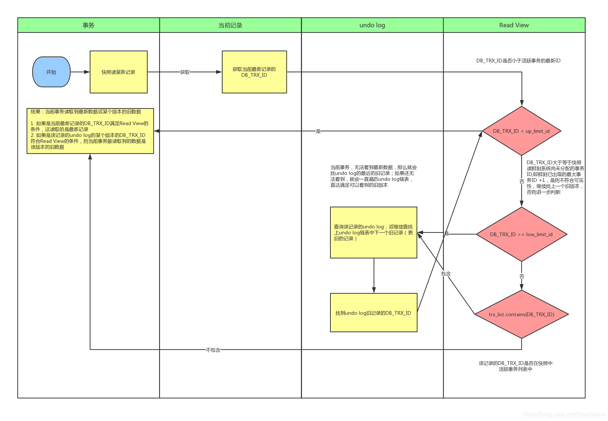

也正是Read View生成时机的不同，从而造成RC,RR级别下快照读的结果的不同


> MVCC版本查看，为什么还会出现幻读?

先解释一下什么是，幻读(间隙锁)

对“幻读”做一个说明：

1. 在可重复读隔离级别下，普通的查询是快照读，是不会看到别的事务插入的数据的。因此，幻读在“当前读”下才会出现。
2. session B的修改结果，被session A之后的select语句用“当前读”看到，不能称为幻读。 **幻读仅专指“新插入的行**”。

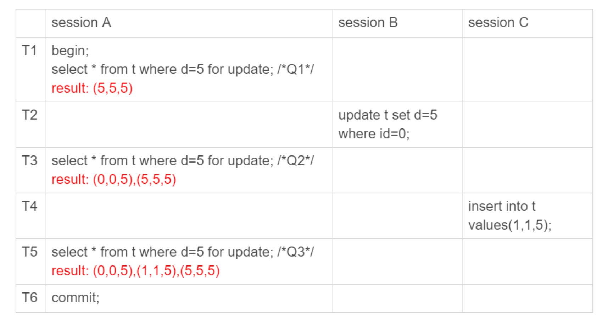

session A里执行了三次查询，分别是Q1、 Q2和Q3。 它们的SQL语句相同，都是select * from t where d=5 for update。 表示查所有d=5的行，而且使用的是当前读，并且加上写锁。 
 其中，Q3读到id=1这一行的现象，被称为“幻读”。 也就是说，幻读指的是一个事务在前后两次查询同一个范围的时候，后一次查询看到了前一次查询没有看到的行

幻读会导致数据一致性的问题。 锁的设计是为了保证数据的一致性。 而这个一致性，不止是数据库内部数据状态在此刻的一致性，还包含了数据和日志在逻辑上的一致性。

1. 在可重复读隔离级别下，普通的查询是快照读，是不会看到别的事务插入的数据的。 因此，幻读在“当前读”下才会出现。
2. 上面session B的修改结果，被session A之后的select语句用“当前读”看到，不能称为幻读。幻读仅专指“新插入的行”

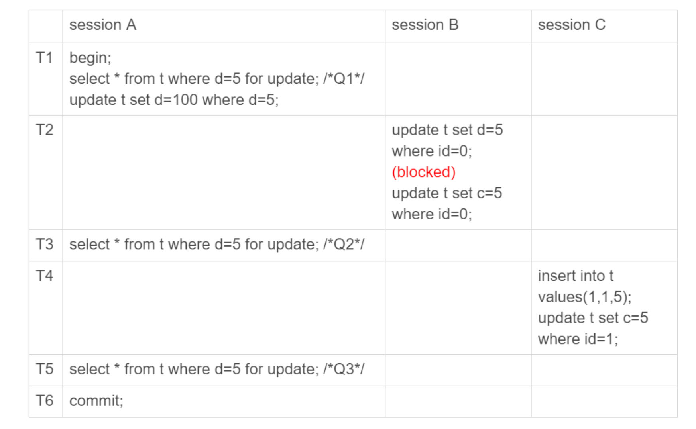

尝试解决幻读，把所有语句都上锁，查询语句改成`select * from t for update`。但是仍然无法解决插入新语句出现的幻读现象。


如何解决幻读？

InnoDB引入新的锁，也就是间隙锁(Gap Lock)。在一行行扫描的过程中，不仅将给行加上了行锁，还给行两边的空隙，也加上了间隙锁。

间隙锁之间的冲突：跟间隙锁存在冲突关系的，是“往这个间隙中插入一个记录”这个操作。 间隙锁之间都不存在冲突关系。

间隙锁和行锁合称next-key lock，每个next-key lock是前开后闭区间。

- 如果用`select * from t for update`要把整个表所有记录锁起来，就形成了7个next-key lock，分别是 (-∞,0]、 (0,5]、 (5,10]、 (10,15]、 (15,20]、 (20, 25]、 (25, +supremum]。
- InnoDB给每个索引加了一个不存在的最大值supremum。

间隙锁的引入，可能会导致同样的语句锁住更大的范围，这其实是影响了并发度的。


> sql慢查询（优化），如果没有索引怎么办？加了索引也比较慢怎么办？


> 什么是事务？事务ACID特性，隔离级别，隔离级别对应问题对其描述

事务指的是满足 ACID 特性的一组操作，可以通过 Commit 提交一个事务，也可以使用 Rollback 进行回滚。


**事务基本特性ACID**?：

- **A原子性(atomicity)** 指的是一个事务中的操作要么全部成功，要么全部失败。
- **C一致性(consistency)** 指的是数据库总是从一个一致性的状态转换到另外一个一致性的状态。比如A转账给B100块钱，假设中间sql执行过程中系统崩溃A也不会损失100块，因为事务没有提交，修改也就不会保存到数据库。
- **I隔离性(isolation)** 指的是一个事务的修改在最终提交前，对其他事务是不可见的。
- **D持久性(durability)** 指的是一旦事务提交，所做的修改就会永久保存到数据库中。

#### 

- **未提交读(READ UNCOMMITTED)** 事务中的修改，即使没有提交，对其它事务也是可见的。
- **提交读(READ COMMITTED)** 一个事务只能读取已经提交的事务所做的修改。换句话说，一个事务所做的修改在提交之前对其它事务是不可见的。
- **可重复读(REPEATABLE READ)** 保证在同一个事务中多次读取同样数据的结果是一样的。
- **可串行化(SERIALIZABLE)** 强制事务串行执行。

| 隔离级别 | 脏读 | 不可重复读 | 幻影读 |
| :------: | :--: | :--------: | :----: |
| 未提交读 |  √   |     √      |   √    |
|  提交读  |  ×   |     √      |   √    |
| 可重复读 |  ×   |     ×      |   √    |
| 可串行化 |  ×   |     ×      |   ×    |


> 能说下myisam 和 innodb的区别吗？

myisam引擎是5.1版本之前的默认引擎，支持全文检索、压缩、空间函数等，但是不支持事务和行级锁，所以一般用于有大量查询少量插入的场景来使用，而且myisam不支持外键，并且索引和数据是分开存储的。 

innodb是基于B+Tree索引建立的，和myisam相反它支持事务、外键，并且通过MVCC来支持高并发，索引和数据存储在一起。


> 了解mysql的索引吗？为什么要用b+树索引？树的高度是多少？ 

首先，索引是在**存储引擎层实现**的，而不是在服务器层实现的，所以不同存储引擎具有不同的索引类型和实现。

有哪些？

- **B+Tree 索引**
  - 是大多数 MySQL 存储引擎的默认索引类型。
- **哈希索引**
  - 哈希索引能以 O(1) 时间进行查找，但是失去了有序性；
  - InnoDB 存储引擎有一个特殊的功能叫“自适应哈希索引”，当某个索引值被使用的非常频繁时，会在 B+Tree 索引之上再创建一个哈希索引，这样就让 B+Tree 索引具有哈希索引的一些优点，比如快速的哈希查找。
- **全文索引**
  - MyISAM 存储引擎支持全文索引，用于查找文本中的关键词，而不是直接比较是否相等。查找条件使用 MATCH AGAINST，而不是普通的 WHERE。
  - 全文索引一般使用倒排索引实现，它记录着关键词到其所在文档的映射。
  - InnoDB 存储引擎在 MySQL 5.6.4 版本中也开始支持全文索引。
- **空间数据索引**
  - MyISAM 存储引擎支持空间数据索引(R-Tree)，可以用于地理数据存储。空间数据索引会从所有维度来索引数据，可以有效地使用任意维度来进行组合查询。


**什么是B+Tree?**

B+ Tree 是基于 B Tree 和叶子节点顺序访问指针进行实现，它具有 B Tree 的平衡性，并且通过顺序访问指针来提高区间查询的性能。在 B+ Tree 中，一个节点中的 key 从左到右非递减排列，如果某个指针的左右相邻 key 分别是 keyi 和 keyi+1，且不为 null，则该指针指向节点的所有 key 大于等于 keyi 且小于等于 keyi+1。


**为什么是B+Tree**?

- 为了减少磁盘读取次数，决定了树的高度不能高，所以必须是先B-Tree；
- 以页为单位读取使得一次 I/O 就能完全载入一个节点，且相邻的节点也能够被预先载入；所以数据放在叶子节点，本质上是一个Page页；
- 为了支持范围查询以及关联关系， 页中数据需要有序，且页的尾部节点指向下个页的头部；


# 数据结构和算法


# 操作系统

> 进程和线程的区别


> 进程线程都怎么通信


> 线程的状态


> 了解操作系统的锁吗？讲讲操作系统实现锁的底层原理


> 生产者和消费者模式怎么理解，举个例子


> 线程能不能start两次，线程池中的线程为什么能循环利用


> 利用多线程时最大的难点是什么，怎么解决多线程安全问题


# 计算机网络

> 计算机网络输入URL到看到网页


> 四次握手


> url解析过程


> 七层协议


> 三次握手过程？为什么不能两次握手


> TCP的底层原理知道吗？TCP是怎么实现通信的？ 


> TCP和HTTP有什么区别？ 


> 讲一下http：结构，和tcp关系等，状态码有什么


> HTTP和HTTPs的区别


> NIO和AIO


# 设计模式

> 你能说说设计模式吗


> 为什么设计模式更好，你能说说用和不用的区别吗


> 举个例子讲讲设计模式的好


> 设计模式？哪些框架有设计模式？每个模式是什么样的？


> 会什么设计模式，讲一下模板方法设计模式，应用


# 安全

> 讲讲JWT

# 杂项

## 最新技术

> 你有没有关注一下最新的技术？

## RBAC

> RBAC是什么？怎么实现的？


# 问题解答选取的github仓库

如果不是在github上查找到的答案会给予标注

1. https://github.com/Snailclimb/JavaGuide 「Java学习+面试指南」一份涵盖大部分 Java 程序员所需要掌握的核心知识。准备 Java 面试，首选 JavaGuide！ 
1. [Java 全栈知识体系](https://www.pdai.tech/)
1. https://github.com/rbmonster/learning-note java开发 面试八股文（个人的面试及工作总结）

