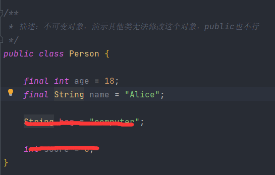

# 不可变性

* 如果对象在被创建后，状态就不能被修改，那么它就是不可变的
* 例子：person对象，age和name都不能边

```java
public class Person {

    final int age = 18;
    final String name = "Alice";

    int score = 0;
}
```

使用：显然是不可行的

```java
public class TestFinal {

    public static void main(String[] args) {
        Person person = new Person();

//        person.age = 19;
//        person.name = "Jack";
    }
}
```


* **具有不变形的对象一定是线程安全**的，我们不需要对其采取任何额外的安全措施，也能保证线程安全


# final

* 类防止被继承、方法防止被重写、变量防止被修改
* 天生是线程安全的，而不需要额外的同步开销


## 3种用法

* final修饰变量
* final修饰方法
* final修饰类


### 修饰变量

被final修饰的变量，意味着值不能修改。如果变量时对象，那么对象的引用不能变，但是对象自身的内容依然可以变化


* final instance variable（类中的final属性）
  * 在声明变量的等号右边直接赋值
  * 构造函数中赋值
  * 类的初始代码块中赋值

可以看到下面的函数，如果不满足右边赋值和构造函数中赋值，编译器就会报错


如何进行代码块赋值

```java
private final int a;

{
    a = 7;
}
```


* final static variable（类中的static final属性）
  * 两个赋值时机：除了在声明变量的等号右边直接赋值外，static final变量可以用 static 初始化代码块赋值，但是不能用普通的初始代码块赋值


* final local variable（方法中的final变量）
  * 和前面两种不同，由于这里的变量时方法里的，所以没有构造函数，也不存在初始化代码块
  * final local variable不规定赋值时机，只要求在使用前必须赋值，这个方法中的非final变量的要求也是一样的


### 修饰方法

* 不允许修饰构造方法
* 不可被重写，也就是不能被override，即便是子类有同样名字的方法，那也不是override，这个和static方法是一个道理

```java
public class FinalMethodDemo {

    public void drink() {

    }

    public final void eat() {

    }
}

class SubClass extends FinalMethodDemo {


    @Override
    public void drink() {
        super.drink();
        eat(); // 可以调用
    }

//    @Override
//    public void eat() {
//
//    }
}
```

* static不能被重写

```java
class SubClass extends FinalMethodDemo {


    @Override
    public void drink() {
        super.drink();
        eat(); // 可以调用
    }

    // 和final不一样的是，子类可以写同名方法，而不是覆盖的意思
    // 因为static在创建的时候就绑定了这个方法，不是后期动态绑定，不属于重写，对于Java来说是两个不同的静态方法
    public static void sleep() {

    }
}
```


### 修饰类

* 不可被继承
* 典型的String类就是final的，我们从没见过哪个类是继承String类的

> ```java
> public final class String
>     implements java.io.Serializable, Comparable<String>, CharSequence {
> ```


## 注意点

* final修饰对象的时候，只是对象的引用不可变，而对象本身的属性是可以变化的
* final使用原则：良好的编程习惯
  * 生成之后不再改变


## 不变性和final的关系

final修饰不意味着不可变

* 对于基本数据类型，确实被final修饰后就具有不可变性
* 对于对象类型，需要该对象保证自身被创建后，状态永远不会变才可以

怎么理解呢？只有类中的属性都是final才代表不可变性




如何利用final实现对象不可变

* 把所有属性都声明为final就行了吗？

```java
public class Person {

    final int age = 18;
    final String name = "Alice";
    final TestFinal testFinal = new TestFinal();
}
```

可以看到，即时声明了final的`TestFinal`，但是里面的属性有一个test还是能修改的，所以不构成条件

```java
public class TestFinal {

    public int test = 12;

    public static void main(String[] args) {

//        final Person person = new Person();
//        person = new Person(); // 此时不能更换引用
//        person.bag = "book";

//        Person person = new Person();
//        person.age = 19;
//        person.name = "Jack";


        final Person person =  new Person();
        person.testFinal.test = 20;
        System.out.println(person.testFinal.test);
        person.testFinal.test = 1000;
        System.out.println(person.testFinal.test);
    }
}
```


一个属性是对象类型的不可变对象的正确例子

```java
public class ImmutableDemo {

    private final Set<String> students = new HashSet<>();

    public ImmutableDemo() {
        students.add("李小美");
        students.add("王壮");
        students.add("徐福记");
    }

    public boolean isStudent(String name) {
        return students.contains(name);
    }
}
```


满足以下条件，对象才是不可变的

* 对象创建后，其状态就不能改变
* 所有属性都是final修饰的
* 对象创建过程中没有逃逸


# 把变量写在线程内部--栈封闭

* 在方法里新建的局部变量，实际上是存储在每个线程私有的栈空间，而每个栈的栈空间是不能被其他线程锁访问到的，所以不会有线程安全问题。这就是著名的“站封闭”技术，是“线程封闭”技术的一种情况

> 代码演示

```java
public class StackConfinement implements Runnable {

    int index = 0;

    public void inThread() {
        int neverGoOut = 0;

        for (int i = 0; i < 10000; i++) {
            neverGoOut++;
        }

        System.out.println("栈内保护的数字是线程安全的：" + neverGoOut);
    }

    @Override
    public void run() {
        for (int i = 0; i < 10000; i++) {
            index++;
        }
        inThread();
    }

    public static void main(String[] args) throws InterruptedException {
        StackConfinement r1 = new StackConfinement();
        Thread t1 = new Thread(r1);
        Thread t2 = new Thread(r1);
        t1.start();
        t2.start();
        t1.join();
        t2.join();
        System.out.println(r1.index);
    }
}
```

