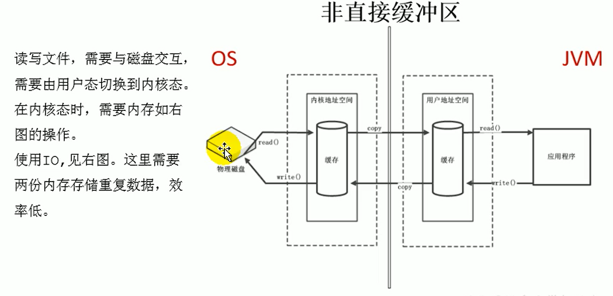
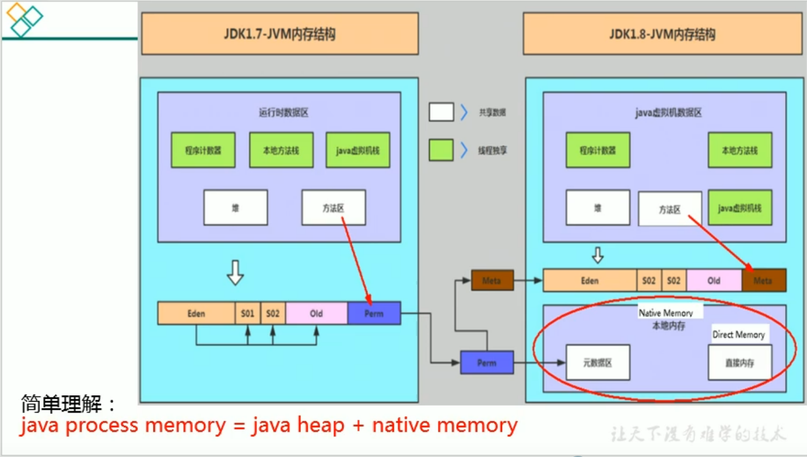

[TOC]


# 直接内存概述

- 不是虚拟机运行时数据区的一部分，也不是《Java虚拟机规范》中定义的内存区域
- 直接内存是在Java堆外的、直接向系统申请的内存区间
- 来源于NIO，通过存在堆中的`DirectByteBuffer`操作Native内存
- 通常，访问直接内存的速度会优于Java堆。即读写性能高   
  - 因此出于性能考虑，读写<font color='#e17055'>频繁的场合可能会考虑使用直接内存</font>
  - Java的NIO库允许Java程序使用直接内存，用于数据缓冲区


可以看到这个程序（PID 15236）占内存1063372 / 1024 / 1024 ≈ 1.0411 G


当释放完内存以后只占有 17392


# BIO 与 NIO

> 非直接缓冲区（BIO）

原来采用BIO的架构，在读写本地文件时，我们需要从用户态切换成内核态



> 直接缓冲区（NIO）

使用NIO时，如下图。操作系统划出的直接缓存区可以被Java代码直接访问，只有一份。NIO适合对大文件的读写操作


> 代码示例

```java
public class BufferTest1 {

    private static final String TO = "F:\\test\\异界BD中字.mp4";
    private static final int _100Mb = 1024 * 1024 * 100;

    public static void main(String[] args) {
        long sum = 0;
        String src = "F:\\test\\异界BD中字.mp4";
        for (int i = 0; i < 3; i++) {
            String dest = "F:\\test\\异界BD中字_" + i + ".mp4";
            // sum += io(src,dest); //54606
            sum += directBuffer(src, dest); //50244
        }

        System.out.println("总花费的时间为：" + sum);
    }

    private static long directBuffer(String src, String dest) {
        long start = System.currentTimeMillis();

        FileChannel inChannel = null;
        FileChannel outChannel = null;
        try {
            inChannel = new FileInputStream(src).getChannel();
            outChannel = new FileOutputStream(dest).getChannel();

            ByteBuffer byteBuffer = ByteBuffer.allocateDirect(_100Mb);
            while (inChannel.read(byteBuffer) != -1) {
                byteBuffer.flip(); //修改为读数据模式
                outChannel.write(byteBuffer);
                byteBuffer.clear(); //清空
            }
        } catch (IOException e) {
            e.printStackTrace();
        } finally {
            if (inChannel != null) {
                try {
                    inChannel.close();
                } catch (IOException e) {
                    e.printStackTrace();
                }

            }
            if (outChannel != null) {
                try {
                    outChannel.close();
                } catch (IOException e) {
                    e.printStackTrace();
                }
            }
        }

        long end = System.currentTimeMillis();
        return end - start;
    }

    private static long io(String src, String dest) {
        long start = System.currentTimeMillis();
      
        FileInputStream fis = null;
        FileOutputStream fos = null;
        try {
            fis = new FileInputStream(src);
            fos = new FileOutputStream(dest);
            byte[] buffer = new byte[_100Mb];
            while (true) {
                int len = fis.read(buffer);
                if (len == -1) {
                    break;
                }
                fos.write(buffer, 0, len);
            }
        } catch (IOException e) {
            e.printStackTrace();
        } finally {
            if (fis != null) {
                try {
                    fis.close();
                } catch (IOException e) {
                    e.printStackTrace();
                }

            }
            if (fos != null) {
                try {
                    fos.close();
                } catch (IOException e) {
                    e.printStackTrace();
                }

            }
        }

        long end = System.currentTimeMillis();

        return end - start;
    }
}
```

可以看到这个ByteBuffer的方法

```java
public static ByteBuffer allocateDirect(int capacity) {
    return new DirectByteBuffer(capacity);
}
```

DirectByteBuffer 类的构造器用到了 Unsafe 类分配本地内存

```java
DirectByteBuffer(int cap) {                   // package-private

    super(-1, 0, cap, cap);
    boolean pa = VM.isDirectMemoryPageAligned();
    int ps = Bits.pageSize();
    long size = Math.max(1L, (long)cap + (pa ? ps : 0));
    Bits.reserveMemory(size, cap);

    long base = 0;
    try {
        base = unsafe.allocateMemory(size);
    } catch (OutOfMemoryError x) {
        Bits.unreserveMemory(size, cap);
        throw x;
    }
    unsafe.setMemory(base, size, (byte) 0);
    if (pa && (base % ps != 0)) {
        // Round up to page boundary
        address = base + ps - (base & (ps - 1));
    } else {
        address = base;
    }
    cleaner = Cleaner.create(this, new Deallocator(base, size, cap));
    att = null;
}
```


# 直接内存与OOM

- 直接内存也可能导致`OutofMemoryError`异常
- 由于直接内存在Java堆外，因此它的大小不会直接受限于`-Xmx`指定的最大堆大小，但是系统内存是有限的，Java堆和直接内存的总和依然受限于操作系统能给出的最大内存
- 直接内存的缺点为：   
  - 分配回收成本较高
  - 不受JVM内存回收管理
- 直接内存大小可以通过`MaxDirectMemorySize`设置
- 如果不指定，默认与堆的最大值`-Xmx`参数值一致

> 代码示例

```java
/**
 * 本地内存的OOM:  OutOfMemoryError: Direct buffer memory
 */
public class BufferTest2 {
    private static final int BUFFER = 1024 * 1024 * 20; //20MB

    public static void main(String[] args) {
        ArrayList<ByteBuffer> list = new ArrayList<>();

        int count = 0;
        try {
            while(true){
                ByteBuffer byteBuffer = ByteBuffer.allocateDirect(BUFFER);
                list.add(byteBuffer);
                count++;
                try {
                    Thread.sleep(100);
                } catch (InterruptedException e) {
                    e.printStackTrace();
                }
            }
        } finally {
            System.out.println(count);
        }

    }
}
```

本地内存持续增长，直至程序抛出异常：`java.lang.OutOfMemoryError: Direct buffer memory`


> VM参数：-Xmx20m -XX:MaxDirectMemorySize=10m

抛出 OOM 异常


> JDK8 中元空间直接使用本地内存

java程序进程所占的内存空间 = 本地内存 + 堆空间



