## ♻️ JVM

回忆大纲图（放大看回忆的更加清楚噢）


### 图解JVM结构

#### 整体架构图：建议默写


#### 程序计数器

程序计数器是一块较小的内存空间，它可以看作是当前线程所执行的字节码的行号指示器。**字节码解释器工作时就是通过改变这个计数器的值来选取下一条需要执行的字节码指令，分支、循环、跳转、异常处理、线程恢复等基础功能都需要依赖这个计数器来完成**。

由于 Java 虚拟机的多线程是通过线程轮流切换、分配处理器执行时间的方式来实现的，在任何一个确定的时刻，一个处理器（对于多核处理器来说是一个内核）都只会执行一条线程中的指令。

**因此，为了线程切换后能恢复到正确的执行位置，每条线程都需要有一个独立的程序计数器，各个线程之间的计数器互不影响**。

那么程序计数器里存的到底是什么东西呢？

- 如果线程正在执行的是一个 Java 方法，这个计数器记录的是正在执行的虚拟机字节码指令的地址
- 如果正在执行的是本地（Native）方法，这个计数器值则应为空（Undefined）。至于什么是 Native 方法，在本地方法栈那一小节会详细解释

> 注意！此内存区域是唯一一个在《Java虚拟机规范》中没有规定任何 OutOfMemoryError（内存溢出）情况的区域。这个问题也算是一个比较常见的面试题了

#### 虚拟机栈

每个线程在创建的时候都会创建一个虚拟机栈，其内部保存一个个的栈帧(Stack Frame）

每个**栈帧**（Stack Frame）中存储着：

- 局部变量表（Local Variables）
- 操作数栈（Operand Stack）(或称为表达式栈)
- 动态链接（Dynamic Linking）：指向运行时常量池的方法引用
- 方法返回地址（Return Address）：方法正常退出或异常退出的地址
- 一些附加信息


#### 本地方法栈

本地方法栈和上面我们所说的虚拟机栈作用基本一样，区别只不过是本地方法栈为虚拟机使用到的 Native 方法服务，而虚拟机栈为虚拟机执行 Java 方法（也就是字节码）服务。

这里解释一下 **Native 方法**的概念，其实不仅 Java，很多语言中都有这个概念。

"A native method is a Java method whose implementation is provided by non-java code."

就是说一个 Native 方法其实就是一个接口，但是它的具体实现是在外部由非 Java 语言比如 C 或 C++ 等来写的。Java 通过 JNI  来调用本地方法， 而本地方法是以库文件的形式存放的（在 WINDOWS 平台上是 DLL 文件形式，在 UNIX 机器上是 SO 文件形式）。

所以同一个 Native 方法，如果用不同的虚拟机去调用它，那么得到的结果和运行效率可能是不一样的，因为不同的虚拟机对于某个 Native 方法都有自己的实现，比如 Object 类的 `hashCode` 方法。

**那么为什么需要 Native 方法呢**？

其主要原因就是 Java 虽然使用起来很方便，但是有些层次的任务用 Java 实现起来不容易，或者对程序的效率有比较高的要求时，Java  语言可能并不是最好的选择。所以 Native 方法使得 Java 程序能够超越 Java 运行时的界限，有效地扩充了 JVM。

> 与虚拟机栈一样，本地方法栈也会在栈深度溢出或者栈扩展失败时分别抛出 StackOverflowError 和 OutOfMemoryError 异常

#### 堆

Java 堆是虚拟机所管理的内存中最大的一块。**堆是被所有线程共享的一块内存区域，在虚拟机启动时创建。此内存区域的唯一目的就是存放对象实例，“几乎” 所有的对象实例都在这里分配内存**。

注意！这里我们用的是几乎，技术发展至今，**其实并非所有的对象实例都会分配到堆上**，比如逃逸技术，这个我们后续文章我再做解释~

堆是垃圾收集器管理的内存区域，因此一些资料中它也被称作 “GC 堆”（Garbage Collected Heap）。

对于堆这个概念小伙伴们肯定还听说过各种诸如新生代、老年代、永久代、Eden 空间、From Survivor 空间、To Survivor 空间等名词，需要注意的是，**这些区域划分仅仅是一部分垃圾收集器的共同特性或者说设计风格而已，只是为了通过这种分代设计来更好地回收内存，或者更快地分配内存，而非某个 Java 虚拟机具体实现的固有内存布局，更不是《Java虚拟机规范》里对 Java 堆的进一步细致划分**

根据《Java虚拟机规范》的规定，Java  堆可以处于物理上不连续的内存空间中，但在逻辑上它应该被视为连续的，这点就像我们用磁盘空间去存储文件一样，并不要求每个文件都连续存放。但对于大对象（典型的如数组对象），多数虚拟机实现出于实现简单、存储高效的考虑，很可能会要求连续的内存空间。

Java 堆既可以被实现成固定大小的，也可以是可扩展的，当前主流的 Java 虚拟机都是按照可扩展来实现的（通过参数 `-Xmx` 和 `-Xms` 设定）

> 如果在堆中没有内存来完成对象实例的分配，并且堆也无法再扩展时，JVM 就会抛出 OutOfMemoryError 异常

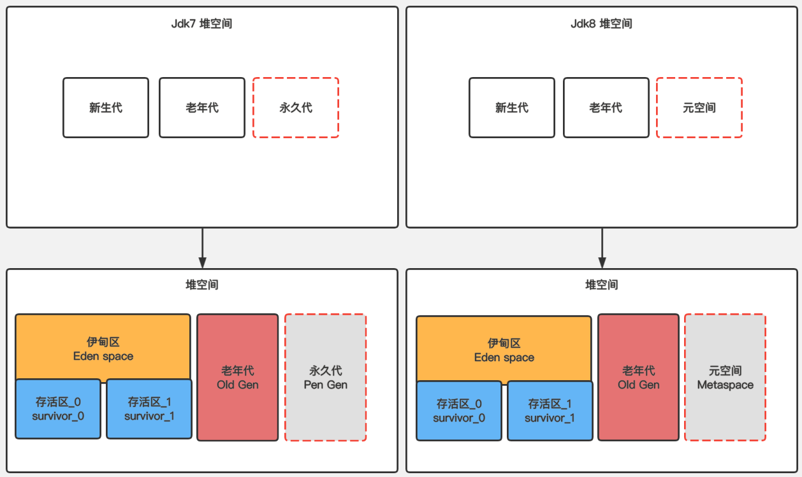


#### 方法区 

**方法区通俗点理解就是，在虚拟机完成类加载之后，存储这个类相关的类型信息、常量、静态变量、即时编译器编译后的代码缓存等数据**。

> It stores `per-class structures` such as the `run-time constant pool`, `field` and `method data`, and `the code for methods and constructors`, including the special methods used in class and instance initialization and interface initialization.  它存储每个类的结构，如运行时的常量池、字段和方法数据，以及方法和构造函数的代码，包括类和实例初始化和接口初始化中使用的特殊方法

举个简单的小例子：


方法区其实本身很好理解，但是《Java 虚拟机规范》/ 《深入理解 Java 虚拟机》提到的一句话：**方法区是堆的一个逻辑部分**，真的是让我困惑了很长时间。

下面我来结合我的理解给大家解释下，我觉得这个 “方法区是堆的一个逻辑部分” 应该适用于 JDK 8 以前，而不适用 JDK 8

先来看 JDK 8 之前:


可以看到，**JDK 8 之前，堆和方法区其实是连在一起的，或者说，方法区就是堆的一部分**。

但是呢，**方法区存储的东西又有些特别**，在过去自定义类加载器使用不普遍的时候，类几乎是 “静态的” 并且很少被卸载和回收，因此类也可以被看成 “永久的”（这也就是永久代的含义），另外由于类作为 JVM 实现的一部分，它们不由程序来创建，**所以为了和堆区分开来呢**，就给了 “方法区” 这样一个名字用来存储类的信息，也有人把方法区称为 “非堆”。

⭐ 需要注意的是，**无论是方法区还是非堆，其实都只是一个逻辑上的概念，在 JDK 8 之前，其具体的实现方法是永久代**。

永久代是 HotSpot 虚拟机给出的实现，但是对于其他虚拟机实现，譬如 BEA JRockit、IBM J9 等来说，是不存在永久代的概念的。


**永久代是一段连续的内存空间**，我们在 JVM 启动之前可以通过设置 `-XX:MaxPermSize` 的值来控制永久代的大小，32 位机器默认的永久代的大小为 64M，64 位的机器则为 85M。

**永久代的垃圾回收和老年代的垃圾回收是绑定的，一旦其中一个区域被占满，这两个区都要进行垃圾回收**。

显然这种设计并不是一个好的主意，由于我们可以通过 `‑XX:MaxPermSize` 设置永久代的大小，一旦类的元数据超过了设定的大小，程序就会耗尽内存，并出现内存溢出错误 (`java.lang.OutOfMemoryError: PermGen space`)。

**而且有极少数的方法**（例如适用 `String`的 `intern()`方法可以在运行过程中手动的将字符串添加到 字符串常量池中，在 JDK1.7 之前的 HotSpot 虚拟机中，字符串常量池被存储在永久代中）**会因永久代的原因而导致不同虚拟机下有不同的表现**（比如 JRockit 虚拟机就没有永久代的概念）

所以我们总结下 HotSpots 在 JDK 8 抛弃永久代，转而用元空间来实现方法区的**两大原因**：

1. 由于永久代的垃圾回收和老年代的垃圾回收是绑定的，一旦其中一个区域被占满，这两个区都要进行垃圾回收，增大了 OOM 发生的概率
2. 有少数的方法例如 `String` 的 `intern()` 方法会因永久代的原因而导致不同虚拟机下有不同的表现，不利于代码迁移

那么元空间到底是个啥，和方法区有啥区别？

**元空间与永久代之间最大的区别在于：元空间不再与堆连续，并且是存在于本地内存（Native memory）中的**。


运行时数据区域的对比如下图：

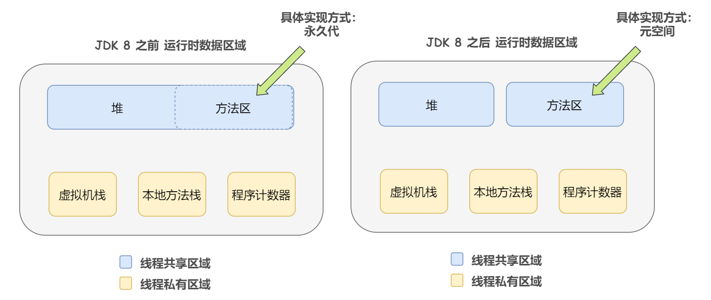

> **元空间存在于本地内存，意味着只要本地内存足够，它就不会 OOM**，不会出现像永久代中的 `java.lang.OutOfMemoryError: PermGenspace`


##### 运行时常量池

**运行时常量池是方法区的一部分**。上面我们说过方法区包含类信息，而描述类信息的 Class 文件中除了有类的版本、字段、方法、接口等描述信息外，还有一项信息是**常量池表 (Constant Pool Table)**，用于存放**编译期**生成的各种字面量（字面量相当于 Java 语言层面常量的概念，如文本字符串，声明为 final 的常量值等）与符号引用。有一些文章会把 class 常量池表称为**静态常量池**。

都是常量池，常量池表和运行时常量池有啥关系吗？运行时常量池是干嘛的呢？

**运行时常量池可以在运行期间将 class 常量池表中的符号引用解析为直接引用**。简单来说，class 常量池表就相当于一堆索引，运行时常量池根据这些索引来查找对应方法或字段所属的类型信息和名称及描述符信息

为什么需要常量池这个东西呢？主要是为了避免频繁的创建和销毁对象而影响系统性能，其实现了对象的共享。以**字符串常量池**为例，字符串 `String` 既然作为 `Java` 中的一个类，那么它和其他的对象分配一样，需要耗费高昂的时间与空间代价，作为最基础最常用的数据类型，大量频繁的创建字符串，将会极大程度的影响程序的性能。为此，JVM 为了提高性能和减少内存开销，在实例化字符串常量的时候进行了一些优化：

- 为字符串开辟了一个**字符串常量池 String Pool**，可以理解为缓存区
- 创建字符串常量时，首先检查字符串常量池中是否存在该字符串
- **若字符串常量池中存在该字符串，则直接返回该引用实例，无需重新实例化**；若不存在，则实例化该字符串并放入池中。

需要注意的是，字符串常量池的位置在 JDK 1.7 前后有所变化，可以参考下面这张表：


### ⭐️类的生命周期、类加载的过程

#### 类的生命周期

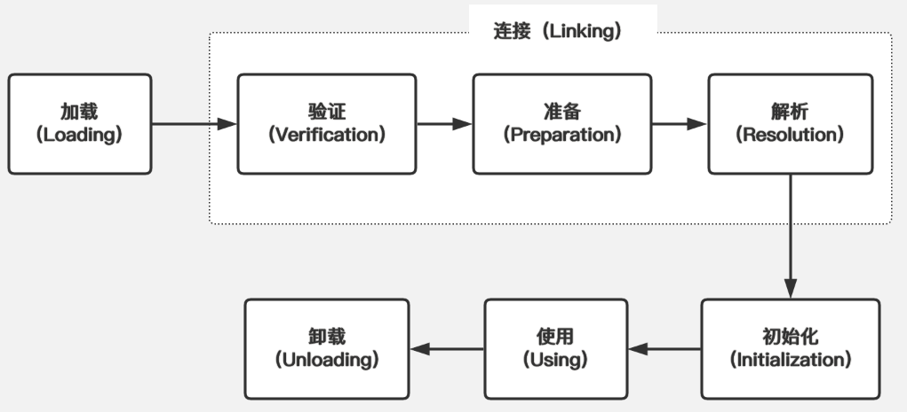

#### 类的加载过程

粗略


详细过程


### JDK 中有哪些默认的类加载器

> 这里参考了[JVM 底层原理最全知识总结](https://doocs.github.io/jvm/)

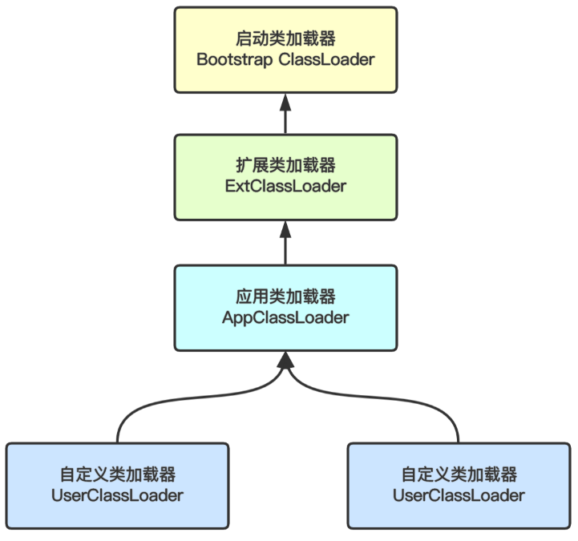

系统提供了 3 种类加载器：

- 启动类加载器（Bootstrap ClassLoader）： 负责将存放在 `<JAVA_HOME>\lib` 目录中的，并且能被虚拟机识别的（仅按照文件名识别，如 rt.jar，名字不符合的类库即使放在 lib 目录中也不会被加载）类库加载到虚拟机内存中。
- 扩展类加载器（Extension ClassLoader）： 负责加载 `<JAVA_HOME>\lib\ext` 目录中的所有类库，开发者可以直接使用扩展类加载器。
- 应用程序类加载器（Application ClassLoader）： 由于这个类加载器是 ClassLoader 中的 `getSystemClassLoader()` 方法的返回值，所以一般也称它为“系统类加载器”。它负责加载用户类路径（classpath）上所指定的类库，开发者可以直接使用这个类加载器，如果应用程序中没有自定义过自己的类加载器，一般情况下这个就是程序中默认的类加载器。

### 如何对栈进行参数调优

* 可以通过-Xss：调整每个线程栈空间的大小
* -XXThreadStackSize：设置线程栈的大小

### 说一下方法区和永久代的关系

方法区和永久代以及元空间的关系很像 Java  中接口和类的关系，类实现了接口，这里的类就可以看作是永久代和元空间，接口可以看作是方法区，也就是说永久代以及元空间是 HotSpot  虚拟机对虚拟机规范中方法区的两种实现方式。并且，永久代是 JDK 1.8 之前的方法区实现，JDK 1.8 及以后方法区的实现变成了元空间。


### 如何判断对象是否死亡

#### 引用计数法

在对象头维护着一个 counter 计数器，对象被引用一次则计数器 +1；若引用失效则计数器 -1。当计数器为 0 时，就认为该对象无效了。

引用计数算法的实现简单，判定效率也很高，在大部分情况下它都是一个不错的算法。但是主流的 Java 虚拟机里没有选用引用计数算法来管理内存，主要是因为它很难解决对象之间循环引用的问题。（虽然循环引用的问题可通过 Recycler 算法解决，但是在多线程环境下，引用计数变更也要进行昂贵的同步操作，性能较低，早期的编程语言会采用此算法。）

#### 可达性分析

可达性分析是通过一系列被称为 `GC Roots` 的根对象作为起始节点集，从这些节点开始，根据引用关系向下搜索，搜索过程所走过的路径被称为引用链（Reference Chain），如果某个对象到 `GC Roots` 间没有任何引用链相连，这代表 `GC Roots` 到该对象不可达， 此时证明此该对象不可能再被使用。

GC Roots 是指：

- **虚拟机栈**（栈帧中的本地变量表）中引用的对象
- **本地方法栈**中引用的对象
- **方法区**中**常量**引用的对象
- 方法区中类**静态**属性引用的对象

GC Roots 并不包括堆中对象所引用的对象，这样就不会有循环引用的问题。


☠️要真正宣告一个对象死亡，需要经过至少✌️次标记过程：

- 1️⃣如果对象在进行可达性分析后发现 `GC Roots` 不可达，将会进行第一次标记；
- 2️⃣随后进行一次筛选，筛选的条件是此对象是否有必要执行 `finalized()` 方法。如果对象没有覆盖 `finalized()` 方法，或者 `finalized()` 已经被虚拟机调用过，这两种情况都会视为没有必要执行。如果判定结果是有必要执行，此时对象会被放入名为 `F-Queue` 的队列，等待 Finalizer 线程执行其 `finalized()` 方法。在这个过程中，收集器会进行第二次小规模的标记，如果对象在 `finalized()` 方法中重新将自己与引用链上的任何一个对象进行了关联，如将自己（this 关键字）赋值给某个类变量或者对象的成员变量，此时它就实现了自我拯救，则第二次标记会将其移除 “即将回收” 的集合，否则该对象就将被真正回收，走向死亡。

### ⭐️虚引用与软引用和弱引用的区别

* **虚引用**：虚引用必须和引用队列（ReferenceQueue）联合使用。当垃圾回收器准备回收一个对象时，如果发现它还有虚引用，就会在回收对象的内存之前，把这个虚引用加入到与之关联的引用队列中。程序可以通过判断引用队列中是否已经加入了虚引用，来了解被引用的对象是否将要被垃圾回收。程序如果发现某个虚引用已经被加入到引用队列，那么就可以在所引用的对象的内存被回收之前采取必要的行动。

  * **虚引用主要用来跟踪对象被垃圾回收的活动**。
* **软引用**：如果内存空间足够，垃圾回收器就不会回收它，如果内存空间不足了，就会回收这些对象的内存

  * 实现内存敏感的高速缓存
* **弱引用**：只具有弱引用的对象拥有更短暂的生命周期。在垃圾回收器线程扫描它所管辖的内存区域的过程中，一旦发现了只具有弱引用的对象，不管当前内存空间足够与否，都会回收它的内存。不过，由于垃圾回收器是一个优先级很低的线程， 因此不一定会很快发现那些只具有弱引用的对象。

### 如何判断一个常量是废弃常量

1. JDK1.7 之前运行时常量池逻辑包含字符串常量池存放在方法区, 此时 hotspot 虚拟机对方法区的实现为永久代
2. JDK1.7 字符串常量池被从方法区拿到了堆中, 这里没有提到运行时常量池,也就是说字符串常量池被单独拿到堆,运行时常量池剩下的东西还在方法区, 也就是 hotspot 中的永久代
3. JDK1.8 hotspot 移除了永久代用元空间(Metaspace)取而代之, 这时候字符串常量池还在堆, 运行时常量池还在方法区, 只不过方法区的实现从永久代变成了元空间(Metaspace)

假如在字符串常量池中存在字符串 "abc"，如果当前没有任何 String 对象引用该字符串常量的话，就说明常量 "abc" 就是废弃常量，如果这时发生内存回收的话而且有必要的话，"abc" 就会被系统清理出常量池了。

### 双亲委派模型？如果我们不想用双亲委派模型怎么办？

每一个类都有一个对应它的类加载器。系统中的 ClassLoader 在协同工作的时候会默认使用 **双亲委派模型** 。即在类加载的时候，系统会首先判断当前类是否被加载过。已经被加载的类会直接返回，否则才会尝试加载。加载的时候，首先会把该请求委派给父类加载器的 `loadClass()` 处理，因此所有的请求最终都应该传送到顶层的启动类加载器 `BootstrapClassLoader` 中。当父类加载器无法处理时，才由自己来处理。当父类加载器为 null 时，会使用启动类加载器 `BootstrapClassLoader` 作为父类加载器。

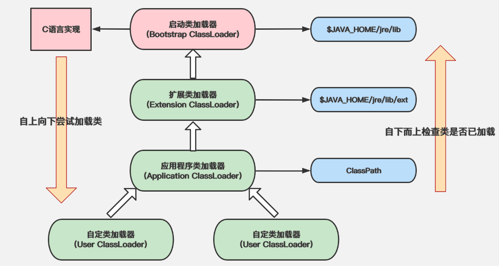

**如果我们不想用双亲委派模型怎么办**

自定义加载器的话，需要继承 `ClassLoader` 。如果我们不想打破双亲委派模型，就重写 `ClassLoader` 类中的 `findClass()` 方法即可，无法被父类加载器加载的类最终会通过这个方法被加载。但是，如果想打破双亲委派模型则需要重写 `loadClass()` 方法

### 如何判断一个类是无用的类

- 该类所有的实例都已经被回收，也就是 Java 堆中不存在该类的任何实例。
- 加载该类的 `ClassLoader` 已经被回收。
- 该类对应的 `java.lang.Class` 对象没有在任何地方被引用，无法在任何地方通过反射访问该类的方法。

### ⭐️垃圾收集有哪些算法，各自的特点

- 标记-清除算法
- 标记-复制算法
- 标记-整理算法

#### 标记-清除算法，Mark-Sweep

它是最基础的垃圾收集算法，收集过程分为两个阶段：首先标记出所有需要回收的对象，在标记完成后，统一回收掉所有被标记的对象；也可以反过来，标记存活对象，统一回收所有未被标记的对象。


它主要有以下两个缺点：

- 执行效率不稳定：如果 Java 堆上包含大量需要回收的对象，则需要进行大量标记和清除动作；
- 内存空间碎片化：标记清除后会产生大量不连续的空间，从而可能导致无法为大对象分配足够的连续内存。


#### 标记-复制算法，Mark-Copy

标记-复制算法基于 ”半区复制“  算法：它将可用内存按容量划分为大小相等的两块，每次只使用其中一块，当这一块的内存使用完了，就将还存活着的对象复制到另外一块上面，然后再把已经使用过的那块内存空间一次性清理掉。其优点在于避免了内存空间碎片化的问题，其缺点如下：

- 如果内存中多数对象都是存活的，这种算法将产生大量的复制开销；
- 浪费内存空间，内存空间变为了原有的一半。


基于新生代 “朝生夕灭” 的特点，大多数虚拟机都不会按照 1:1 的比例来进行内存划分，例如 HotSpot 虚拟机会将内存空间划分为一块较大的 `Eden` 和 两块较小的 `Survivor` 空间，它们之间的比例是 8:1:1 。 每次分配时只会使用 `Eden` 和其中的一块 `Survivor` ，发生垃圾回收时，只需要将存活的对象一次性复制到另外一块 `Survivor` 上，这样只有 10% 的内存空间会被浪费掉。当 `Survivor` 空间不足以容纳一次 `Minor GC` 时，此时由其他内存区域（通常是老年代）来进行分配担保。


#### 标记-整理算法，Mark-Compact

标记-整理算法是在标记完成后，让所有存活对象都向内存的一端移动，然后直接清理掉边界以外的内存。其优点在于可以避免内存空间碎片化的问题，也可以充分利用内存空间；其缺点在于根据所使用的收集器的不同，在移动存活对象时可能要全程暂停用户程序：


#### 🙅【Ignore】标记 - 压缩（整理）算法，Mark - Compact

- 第一阶段和标记清除算法一样，从根节点开始标记所有被引用对象
- 第二阶段将所有的存活对象压缩到内存的一端，按顺序排放。
- 之后，清理边界外所有的空间。

> 标记清除和标记压缩的区别

* 标记 - 压缩算法的最终效果等同于标记 - 清除算法执行完成后，再进行一次内存碎片整理，因此，也可以把它称为**标记 - 清除 - 压缩（Mark-Sweep-Compact）算法。**
* 二者的本质差异在于标记 - 清除算法是一种**非移动式的回收算法**，标记 - 压缩是**移动式的**。是否移动回收后的存活对象是一项优缺点并存的风险决策。
* 可以看到，标记的存活对象将会被整理，按照内存地址依次排列，而未被标记的内存会被清理掉。如此一来，当我们需要给新对象分配内存时，JVM 只需要持有一个内存的起始地址即可，这比维护一个空闲列表显然少了许多开销

> 标记压缩算法内部使用指针碰撞

如果内存空间以规整和有序的方式分布，即已用和未用的内存都各自一边，彼此之间维系着一个记录下一次分配起始点的标记指针，当为新对象分配内存时，只需要通过修改指针的偏移量将新对象分配在第一个空闲内存位置上，这种分配方式就叫做指针碰撞（Bump the Pointer）


> 优点

- 消除了标记 - 清除算法当中，内存区域分散的缺点，我们需要给新对象分配内存时，JVM 只需要持有一个内存的起始地址即可。
- 消除了复制算法当中，内存减半的高额代价。

> 缺点

- 从效率上来说，标记 - 整理算法要低于复制算法，甚至要低于标记 - 清除算法
- 移动对象的同时，如果对象被其他对象引用，则还需要调整引用的地址
- 移动过程中，需要全程暂停用户应用程序。即：STW

### HotSpot 为什么要分为新生代和老年代

为了进行高效的垃圾回收，虚拟机把堆内存**逻辑上**划分成三块区域（分代的唯一理由就是优化 GC 性能）

### ⭐️常见的垃圾回收器有哪些

#### Serial 收集器

Serial（串行）收集器是最基本、历史最悠久的垃圾收集器了。大家看名字就知道这个收集器是一个单线程收集器了。它的 **“单线程”** 的意义不仅仅意味着它只会使用一条垃圾收集线程去完成垃圾收集工作，更重要的是它在进行垃圾收集工作的时候必须暂停其他所有的工作线程（ **"Stop The World"** ），直到它收集结束。

👶**新生代采用标记-复制算法，👴老年代采用标记-整理算法。**


#### ParNew 收集器

**ParNew 收集器其实就是 Serial 收集器的多线程版本，除了使用多线程进行垃圾收集外，其余行为（控制参数、收集算法、回收策略等等）和 Serial 收集器完全一样。**

👶**新生代采用标记-复制算法，👴老年代采用标记-整理算法。**


#### Parallel Scavenge 收集器

Parallel Scavenge 收集器也是使用标记-复制算法的多线程收集器，它看上去几乎和 ParNew 都一样。 **那么它有什么特别之处呢？**

```text
-XX:+UseParallelGC

    使用 Parallel 收集器+ 老年代串行

-XX:+UseParallelOldGC

    使用 Parallel 收集器+ 老年代并行
```

**Parallel Scavenge 收集器关注点是吞吐量（高效率的利用 CPU）。CMS 等垃圾收集器的关注点更多的是用户线程的停顿时间（提高用户体验）。所谓吞吐量就是 CPU 中用于运行用户代码的时间与 CPU 总消耗时间的比值。** Parallel Scavenge  收集器提供了很多参数供用户找到最合适的停顿时间或最大吞吐量，如果对于收集器运作不太了解，手工优化存在困难的时候，使用 Parallel  Scavenge 收集器配合自适应调节策略，把内存管理优化交给虚拟机去完成也是一个不错的选择。

**新生代采用标记-复制算法，老年代采用标记-整理算法。**


**这是 JDK1.8 默认收集器**

使用 java -XX:+PrintCommandLineFlags -version 命令查看

```text
-XX:InitialHeapSize=262921408 -XX:MaxHeapSize=4206742528 -XX:+PrintCommandLineFlags -XX:+UseCompressedClassPointers -XX:+UseCompressedOops -XX:+UseParallelGC
java version "1.8.0_211"
Java(TM) SE Runtime Environment (build 1.8.0_211-b12)
Java HotSpot(TM) 64-Bit Server VM (build 25.211-b12, mixed mode)
```

JDK1.8  默认使用的是 Parallel Scavenge + Parallel Old，如果指定了-XX:+UseParallelGC  参数，则默认指定了-XX:+UseParallelOldGC，可以使用-XX:-UseParallelOldGC 来禁用该功能

#### Serial Old 收集器

**Serial 收集器的👴老年代版本**，它同样是一个单线程收集器。它主要有两大用途：一种用途是在 JDK1.5 以及以前的版本中与 Parallel Scavenge 收集器搭配使用，另一种用途是作为 CMS 收集器的后备方案。


#### Paralled Old 收集器

**Parallel Scavenge 收集器的👴老年代版本**。使用多线程和“标记-整理”算法。在注重吞吐量以及 CPU 资源的场合，都可以优先考虑 Parallel Scavenge 收集器和 Parallel Old 收集器。


#### CMS 收集器

**CMS（Concurrent Mark Sweep）收集器是一种以获取最短回收停顿时间为目标的收集器。它非常符合在注重用户体验的应用上使用。**

**CMS（Concurrent Mark Sweep）收集器是 HotSpot 虚拟机第一款真正意义上的并发收集器，它第一次实现了让垃圾收集线程与用户线程（基本上）同时工作。**

从名字中的**Mark Sweep**这两个词可以看出，CMS 收集器是一种 **“标记-清除”算法**实现的，它的运作过程相比于前面几种垃圾收集器来说更加复杂一些。整个过程分为四个步骤：

1. **初始标记 (inital mark)**：标记 `GC Roots` 能直接关联到的对象，耗时短但需要暂停用户线程；
2. **并发标记 (concurrent mark)**：从 `GC Roots` 能直接关联到的对象开始遍历整个对象图，耗时长但不需要暂停用户线程；
3. **重新标记 (remark)**：采用增量更新算法，对并发标记阶段因为用户线程运行而产生变动的那部分对象进行重新标记，耗时比初始标记稍长且需要暂停用户线程；
4. **并发清除 (inital sweep)**：并发清除掉已经死亡的对象，耗时长但不需要暂停用户线程。


从它的名字就可以看出它是一款优秀的垃圾收集器，主要优点：**并发收集、低停顿**。但是它有下面三个明显的缺点：

- **对 CPU 资源敏感；**
- **无法处理浮动垃圾；**
- **它使用的回收算法-“标记-清除”算法会导致收集结束时会有大量空间碎片产生。**

> CMS通常有两个阶段会进行STW

第一阶段和第三阶段

* **初始标记（Initial-Mark）阶段**：在这个阶段中，程序中所有的工作线程 (用户线程) 都将会因为  “Stop-The-World” 机制而出现短暂的暂停，这个阶段的主要任务仅仅只是标记出 GC Roots  能直接关联到的对象。一旦标记完成之后就会恢复之前被暂停的所有应用线程。由于直接关联对象比较小，所以这里的速度非常快。

* **重新标记（Remark）阶段**：由于在并发标记阶段中，程序的工作线程会和垃圾收集线程同时运行或者交叉运行，因此为了修正并发标记期间，因用户程序继续运作而导致标记产生变动的那一部分对象的标记记录，这个阶段的停顿时间通常会比初始标记阶段稍长一些，但也远比并发标记阶段的时间短。


#### G1 收集器

Garbage First（简称 G1）是一款面向服务端的垃圾收集器，也是 JDK 9  服务端模式下默认的垃圾收集器，它的诞生具有里程碑式的意义。G1 虽然也遵循分代收集理论，但不再以固定大小和固定数量来划分分代区域，而是把连续的  Java 堆划分为多个大小相等的独立区域（Region）。每一个 Region 都可以根据不同的需求来扮演新生代的 `Eden` 空间、`Survivor` 空间或者老年代空间，收集器会根据其扮演角色的不同而采用不同的收集策略。


上面还有一些 Region 使用 H 进行标注，它代表 Humongous，表示这些 Region 用于存储大对象（humongous object，H-obj），即大小大于等于 region 一半的对象。G1 收集器的运行大致可以分为以下四个步骤：

1. **初始标记 (Inital Marking)**：标记 `GC Roots` 能直接关联到的对象，并且修改 TAMS（Top at Mark Start）指针的值，让下一阶段用户线程并发运行时，能够正确的在 Reigin 中分配新对象。G1 为每一个 Reigin 都设计了两个名为 TAMS  的指针，新分配的对象必须位于这两个指针位置以上，位于这两个指针位置以上的对象默认被隐式标记为存活的，不会纳入回收范围；
2. **并发标记 (Concurrent Marking)**：从 `GC Roots` 能直接关联到的对象开始遍历整个对象图。遍历完成后，还需要处理 SATB  记录中变动的对象。SATB（snapshot-at-the-beginning，开始阶段快照）能够有效的解决并发标记阶段因为用户线程运行而导致的对象变动，其效率比 CMS 重新标记阶段所使用的增量更新算法效率更高；
3. **最终标记 (Final Marking)**：对用户线程做一个短暂的暂停，用于处理并发阶段结束后仍遗留下来的少量的 STAB 记录。虽然并发标记阶段会处理 SATB 记录，但由于处理时用户线程依然是运行中的，因此依然会有少量的变动，所以需要最终标记来处理；
4. **筛选回收 (Live Data Counting and Evacuation)**：负责更新 Regin 统计数据，按照各个 Regin 的回收价值和成本进行排序，在根据用户期望的停顿时间进行来指定回收计划，可以选择任意多个 Regin 构成回收集。然后将回收集中 Regin 的存活对象复制到空的 Regin 中，再清理掉整个旧的 Regin  。此时因为涉及到存活对象的移动，所以需要暂停用户线程，并由多个收集线程并行执行。


#### ZGC 收集器

与 CMS 中的 ParNew 和 G1 类似，ZGC 也采用标记-复制算法，不过 ZGC 对该算法做了重大改进。

在 ZGC 中出现 Stop The World 的情况会更少！

> 拓展


- 两个收集器间有连线，表明它们可以搭配使用：Serial/Serial Old、Serial/CMS、ParNew/Serial  Old、ParNew/CMS、Parallel Scavenge/Serial Old、Parallel Scavenge/Parallel  Old、G1。
- 其中 Serial Old 作为 CMS 出现"Concurrent Mode Failure"失败的后备预案。
- **（红色虚线）**由于维护和兼容性测试的成本，在 JDK 8 时将 Serial + CMS、ParNew + Serial Old 这两个组合声明为废弃（JEP173），并在 JDK 9 中完全取消了这些组合的支持（JEP214），即：移除。
- **（绿色虚线）**JDK 14 中：弃用 Parallel Scavenge 和 Serialold GC 组合（JEP366）。
- **（青色虚线）**JDK 14 中：删除 CMS 垃圾回收器（JEP363）。

### Minor Gc 和 Full GC 有什么不同呢

新生代收集（Minor GC / Young GC）：只对新生代进行垃圾收集

整堆收集 (Full GC)：收集整个 Java 堆和方法区

> 拓展1：有哪些常见的 GC？

针对 HotSpot VM 的实现，它里面的 GC 其实准确分类只有两大种：

部分收集 (Partial GC)：

- 新生代收集（Minor GC / Young GC）：只对新生代进行垃圾收集；
- 老年代收集（Major GC / Old GC）：只对老年代进行垃圾收集。需要注意的是 Major GC 在有的语境中也用于指代整堆收集；
- 混合收集（Mixed GC）：对整个新生代和部分老年代进行垃圾收集。

整堆收集 (Full GC)：收集整个 Java 堆和方法区。

> 拓展2：谈谈你对 Minor GC、还有 Full GC 的理解。Minor GC 与 Full GC 分别在什么时候发生？ Minor GC 会发生 STW(stop the world) 现象吗？

 **Minor GC**

* 当年轻代空间不足时，就会触发Minor GC，这里的年轻代满指的是 `Eden区满`，Survivor区满不会触发GC。（每次Minor GC会清理年轻代的内存）
* 因为Java对象大多都具备朝生夕灭的特性，所以**Minor GC非常频繁**，一般回收速度也比较快。这一定义既清晰又易于理解。
* Minor GC会引发 `STW`，`暂停其它用户的线程，等待垃圾回收线程结束，用户线程才恢复运行`

**Major GC**

* 指发生在老年代的GC，对象从老年代消失时，我们说 “Major Gc” 或 “Full GC” 发生了
* 出现了MajorGc，经常会伴随至少一次的Minor GC
  * 但非绝对的，在Parallel Scavenge收集器的收集策略里就有直接进行Major GC的策略选择过程
  * 也就是在老年代空间不足时，会先尝试触发Minor GC，如果之后空间还不足，则触发Major GC
* **Major GC的速度一般会比Minor GC慢10倍以上**，STW的时间更长
* 如果Major GC后，内存还不足，就报OOM了

**Full GC**

* 调用System.gc( )时，系统建议执行Full GC，但是不必然执行
* 老年代空间不足
* 方法区空间不足
* **通过Minor GC后进入老年代的平均大小 大于 老年代的可用内存**
* 由Eden区、survivor space0（From Space）区 向survivor space1（To Space）区复制时，对象大小大于To Space可用内存，则把该对象转存到老年代，且老年代的可用内存 小于 该对象大小

### ⭐️对象的创建过程

#### 概述

首先在文件内创建一个空对象

```java
public class VM {
}
```

再随便new一个空对象，就可以看到它的字节码

```java
public class newObject {

    public static void main(String[] args) {
        VM vm = new VM();
    }
}
```

```java
0 new #2 <cn/zhiyucs/test/VM>
3 dup
4 invokespecial #3 <cn/zhiyucs/test/VM.<init> : ()V>
7 astore_1
8 return
```

**new指令**相当于去对应的内存空间申请一块内存大小 用于存放对象数据 对象的大小是可以确定的 比如int占用4个字节 引用也占用4个字节 所以这个时候申请的内存空间大小是固定的

**dup**相当于将对应的内存地址的引用复制了一份压到栈中，那么对应栈中会有2个对象的引用，这2个对象的引用一个用于操作对象赋值，一个用于对象的方法调用

**invokespecial指令**是调用对象的构造器初始化对象我这里使用的是默认构造器空参构造一般用于初始化对象数据，在 `new`的时候JVM会给对象的全局变量赋默认值

**astore指令**就是将对应对象的引用存储到局部变量表中

#### 从JVM层面分析

##### 1️⃣类加载

具体来说，当 Java 虚拟机遇到一条字节码 new 指令时：

1）首先检查根据 class 文件中的常量池表（Constant Pool Table）能否找到这个类对应的符号引用

> 此处可以回顾一波**常量池表 (Constant Pool Table)** 的概念：
>
> 用于存放**编译期**生成的各种字面量（字面量相当于 Java 语言层面常量的概念，如文本字符串，声明为 final 的常量值等）与符号引用。有一些文章会把 class 常量池表称为**静态常量池**。
>
> 都是常量池，常量池表和方法区中的运行时常量池有啥关系吗？运行时常量池是干嘛的呢？
>
> **运行时常量池可以在运行期间将 class 常量池表中的符号引用解析为直接引用**。简单来说，class 常量池表就相当于一堆索引，运行时常量池根据这些索引来查找对应方法或字段所属的类型信息和名称及描述符信息

2）然后去方法区中的运行时常量池中查找该符号引用所指向的类是否已被 JVM 加载、解析和初始化过

- 如果没有，那就先执行相应的类加载过程
- 如果有，那么进入下一步，为新生对象分配内存

##### 2️⃣分配内存（对象在堆上分配的两种方式）

根据堆中的内存是否规整，有两种划分方式，或者说对象在堆上的分配有两种方式：

1）**假设 Java 堆中内存是绝对规整的**，所有被使用过的内存都被放在一边，空闲的内存被放在另一边，中间放着一个指针作为分界点的指示器，那所分配内存就仅仅是把这个指针 向 空闲空间方向 挪动一段与对象大小相等的距离，这种分配方式称为 **指针碰撞**（Bump The Pointer）

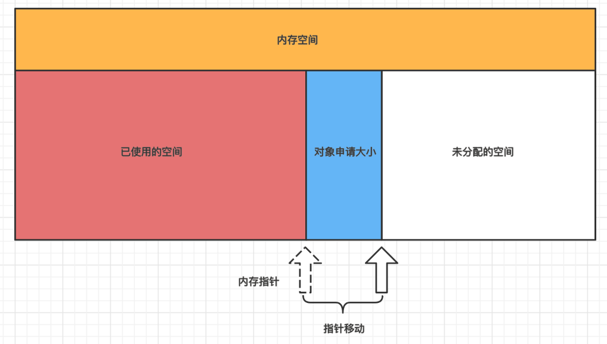

2）**如果 Java 堆中的内存并不是规整的**，已被使用的内存和空闲的内存相互交错在一起，那就没有办法简单地进行指针碰撞了，虚拟机就必须维护一个列表，记录哪些内存块是可用的，在分配的时候从列表中找到一块足够大的连续空间划分给这个对象，并更新列表上的记录，这种分配方式称为 **空闲列表**（Free List）。

> 选择哪种分配方式由 Java 堆是否规整决定，那又有同学会问了，堆是否规整又由谁来决定呢？
>
> Java 堆是否规整由所采用的垃圾收集器是否带有空间压缩整理（Compact）的能力决定的（或者说由垃圾收集器采用的垃圾收集算法来决定的，具体垃圾收集算法见后续文章）：
>
> - 因此，当使用 Serial、ParNew 等带压缩整理过程的收集器时，系统采用的分配算法是指针碰撞，既简单又高效
> - 而当使用 CMS 这种基于清除（Sweep）算法的收集器时，理论上就只能采用较为复杂的空闲列表来分配内存


##### 3️⃣初始化零值

举个🌰

```java
public class VM  {

    private int value = 100;
    private Object data;

}
```

比如我们对象中 定义了 `value`和 `data`

JVM为了实现我们不做赋值操作的对象也可以拿来直接使用在申请空间的会给对象赋值为 `null`，**基本数据类型会赋值为默认值,引用数据为赋值为null**

比如上面代码 `value`会赋值为 `0` ,`data`会赋值为 `null` ,这里是赋为默认值，不是赋值

这步操作保证了对象的实例字段在 Java 代码中可以不赋初始值就直接使用，使程序能访问到这些字段的数据类型所对应的零值。

> 如果使用了 TLAB 的话，初始化零值这项工作可以提前至 TLAB 分配时就顺便进行了

##### 4️⃣设置对象头

对象在内存中的布局可以分为 3 块区域：对象头（Object Header）、实例数据和对齐填充

对齐填充并不是什么有意义的数据，实例数据我们在上一步操作中进行了初始化零值，那么对于剩下的对象头中的信息来说，自然不必多说，也是要进行一些赋值操作的：例如这个对象是哪个类的实例、如何才能找到类的元数据信息、对象的哈希码、对象的 GC 分代年龄等信息。根据虚拟机当前运行状态的不同，如是否启用偏向锁等，对象头会有不同的设置方式。

> 对象头


##### 5️⃣执行init

上面四个步骤都走完之后，从 JVM 的视角来看，其实一个新的对象已经成功诞生了。

但是从我们程序员的视角来看，这个对象确实是创建出来了，但是还没按照我们定义的构造函数来进行赋值呢，所有的字段都还是默认的零值啊。

构造函数即 Class 文件中的 `<init>()` 方法，一般来说，new 指令之后会接着执行 `<init>()` 方法，按照构造函数的意图对这个对象进行初始化，这样一个真正可用的对象才算完全地被构造出来了

举个🌰，上述代码编译成字节码之后

```java
 0 aload_0
 1 invokespecial #1 <java/lang/Object.<init> : ()V>
 4 aload_0
 5 bipush 100
 7 putfield #2 <cn/zhiyucs/test/VM.value : I>
 10 return
```

##### 🤏总览


> 对象创建时候的并发安全问题

另外，在为对象创建内存的时候，还需要考虑一个问题：**并发安全问题**。

对象创建在虚拟机中是非常频繁的行为，以上面介绍的指针碰撞法为例，即使只修改一个指针所指向的位置，在并发情况下也并不是线程安全的，可能出现某个线程正在给对象 A 分配内存，指针还没来得及修改，另一个线程创建了对象 B 又同时使用了原来的指针来分配内存的情况。

解决这个问题有两种可选方案：

- 方案 1：**CAS + 失败重试**：CAS 大伙应该都熟悉，比较并交换，乐观锁方案，如果失败就重试，直到成功为止
- 方案 2：**本地线程分配缓冲**（Thread Local Allocation Buffer，`TLAB`）：每个线程在堆中预先分配一小块内存，每个线程拥有的这一小块内存就称为 TLAB。哪个线程要分配内存了，就在哪个线程的 TLAB 中进行分配，这样各个线程之间互不干扰。如果某个线程的 TLAB  用完了，那么虚拟机就需要为它分配新的 TLAB，这时才需要进行同步锁定。可以通过 `-XX：+/-UseTLAB` 参数来设定是否使用 TLAB。

### 对象访问方式

或是这样问你：👩‍💻对象的访问定位的两种方式知道吗？各有什么优缺点

#### 句柄池

如果使用句柄的话，那么Java堆中将会划分出一块内存来作为句柄池，reference 中存储的就是对象的句柄地址，而句柄中包含了对象实例数据与类型数据各自的具体地址信息


缺点 显然而见 需要单独开辟一块空间记录句柄池存储,并且访问的时候需要中转 访问效率偏低一点

优点 当对象数据变更的时候比如垃圾回收器 需要整理对象 需要移动复制，Stack栈空间中的引用 是不需要修改的 只需要修改句柄池中的引用

#### 直接引用

如果使用直接指针访问，那么 Java 堆对象的布局中就必须考虑如何放置访问类型数据的相关信息，而reference 中存储的直接就是对象的地址。


缺点 当对象数据变更引用的时候 需要修改Stack的指针

优点 不需要额外的开辟一块空间存储引用，在原有对象头中添加指针指向即可，访问对象实体数据的时候效率高

### 安全点和安全区各代表什么？

> 本节内容摘自周志明老师的《深入理解Java虚拟机》内容

#### OopMap

由于目前主流Java虚拟机使用的都是准确式垃圾收集（这个概念在第1章介绍Exact VM相对于Classic VM的改进时介绍过），所以当用户线程停顿下来之后，其实并不需要一个不漏地检查完所有执行上下文和全局的引用位置，虚拟机应当是有办法直接得到哪些地方存放着对象引用的。在HotSpot的解决方案里，是使用一组称为OopMap（Oop是普通对象指针的意思：ordinary object pointer）的数据结构来达到这个目的。一旦类加载动作完成的时候，HotSpot就会把对象内什么偏移量上是什么类型的数据计算出来，在即时编译过程中，也会在特定的位置记录下栈里和寄存器里哪些位置是引用。这样收集器在扫描时就可以直接得知这些信息了，并不需要真正一个不漏地从方法区等GC Roots开始查找。因此，在 HotSpot 中采取了空间换时间的方法，使用 OopMap 来存储栈上的对象引用的信息。

在 GC Roots 枚举时，只需要遍历每个栈桢的 OopMap，通过 OopMap 存储的信息，快捷地找到 GC Roots。

OopMap 中存储了两种对象的引用：

> ◉ 栈里和寄存器内的引用
> 在即时编译中，在特定的位置记录下栈里和寄存器里哪些位置是引用
>
> ◉ 对象内的引用
> 类加载动作完成时，HotSpot 就会计算出对象内什么偏移量上是什么类型的数据
> 注：把存储单元的实际地址与其所在段的段地址之间的距离称为段内偏移，也称为有效地址或偏移量，因此，实际地址=所在段的起始地址+偏移量

在 JVM中，一个线程为一个栈，一个栈由多个栈桢组成，一个栈桢对应一个方法，一个栈帧可能有多个 OopMap。

假设，这两个方法都只有一个 OopMap，并且是在方法返回之前：

```java
// 方法1存储在栈帧3
public void testMethod1() {
    // 栈里和寄存器内的引用
    DemoD demoD = new DemoD();
}

// 方法2存储在栈帧8
public void testMethod2() {
    // 栈里和寄存器内的引用
    DemoA demoA = new DemoA();
    // 对象内的引用
    demoA.setDemoC(new DemoC());
    
    // 栈里和寄存器内的引用
    DemoA demoB = new DemoB();
} 
```

那么 testMethod1() 和 testMethod2() 的 OopMap 如下图所示：

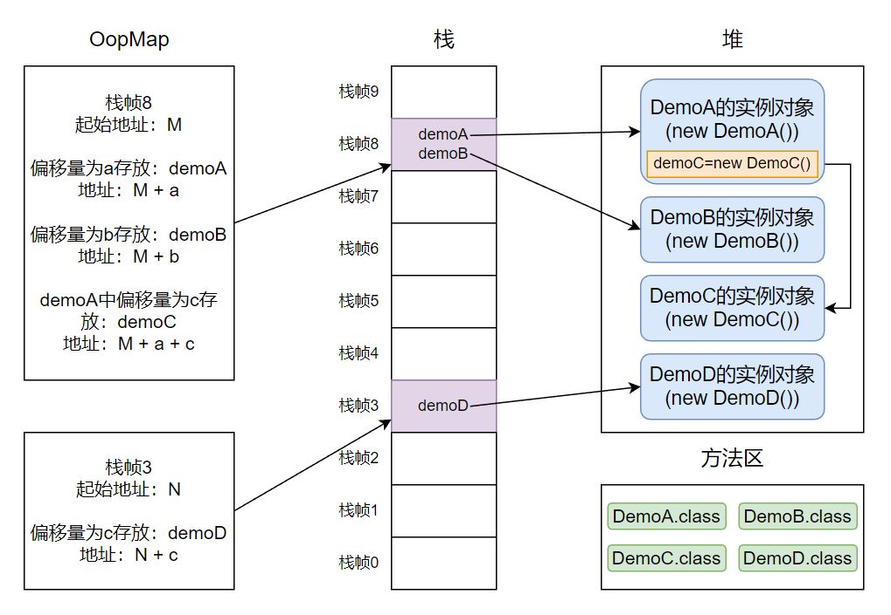


#### 安全点

在 OopMap 的协助下，HotSpot 可以快速完成根节点枚举了，但一个很现实的问题随之而来：由于引用关系可能会发生变化，这就会导致  OopMap 内容变化的指令非常多，如果为每一条指令都生成对应的  OopMap，那将会需要大量的额外存储空间，这样垃圾收集伴随而来的空间成本就会变得无法忍受的高昂。

所以实际上 HotSpot 也确实没有为每条指令都生成 OopMap，只是在 “特定的位置” 生成 OopMap，换句话说，只有在某些 ”特定的位置“ 上才会把对象引用的相关信息给记录下来，这些位置也被称为**安全点**（Safepoint）。

有了安全点的设定，也就决定了用户程序执行时并不是随便哪个时候都能够停顿下来开始 GC 的，而是强制要求**程序必须执行到达安全点后才能够进行 GC**（因为不到达安全点话，没有 OopMap，虚拟机就没法快速知道对象引用的位置呀，没法进行根节点枚举）。


因此，**安全点的设定既不能太少以至于让垃圾收集器等待时间过长，也不能太多以至于频繁进行垃圾收集从而导致运行时的内存负荷大幅增大**。所以，安全点的选定基本上是以 “**是否具有让程序长时间执行的特征**” 为标准进行选定的，最典型的就是**指令序列的复用**：例如方法调用、循环跳转、异常跳转等，所以只有具有这些功能的指令才会产生安全点。

对于安全点，另外一个需要考虑的问题是，**如何在 GC 发生时让所有用户线程都执行到最近的安全点，然后停顿下来呢？**。这里有两种方案可供选择：

1. **抢先式中断**（Preemptive Suspension）：这种思路很简单，就是在 GC 发生时，系统先把所有用户线程全部中断掉。然后如果发现有用户线程中断的位置不在安全点上，就恢复这条线程执行，直到跑到安全点上再重新中断。

   抢先式中断的最大问题是时间成本的不可控，进而导致性能不稳定和吞吐量的波动，特别是在高并发场景下这是非常致命的，所以现在几乎没有虚拟机实现采用抢先式中断来暂停线程响应 GC 事件

2. **主动式中断**（Voluntary Suspension）：主动式中断不会直接中断线程，而是全局设置一个标志位，用户线程会不断的轮询这个标志位，当发现标志位为真时，线程会在最近的一个安全点主动中断挂起。现在的虚拟机基本都是用这种方式

#### 安全区域 Safe Region

安全点机制保证了程序执行时，在不太长的时间内就会遇到可进入垃圾收集过程的安全点。

对于主动式中断来说，用户线程需要不断地去轮询标志位，那对于那些处于 sleep 或者 blocked 状态的线程（不在活跃状态的线程）来说怎么办？

这些不在活跃状态的线程没有获得 CPU 时间，没法去轮询标志位，自然也就没法找到最近的安全点主动中断挂起了。

换句话说，对于这些不活跃的线程，我们没法掌控它们醒过来的时间。很可能其他线程都已经通过轮询标志位到达安全点被中断了，然后虚拟机开始根节点枚举了（根节点枚举需要暂停所有用户线程），但是这时候那些本不活跃的用户线程又醒过来了开始执行，破坏了对象之间的引用关系，那显然是不行的。

对于这种情况，就必须引入**安全区域**（Safe Region）来解决。

安全区域的定义是这样的：确保在某一段代码片段之中，引用关系不会发生变化，因此，在这个区域中的任意地方开始 GC 都是安全的。

可以简单地把安全区域看作**被拉长了的安全点**。

**当用户线程执行到安全区域里面的代码时，首先会标识自己已经进入了安全区域。那样当这段时间里虚拟机要发起 GC  时，就不必去管这些在安全区域内的线程了。**

当安全区域中的线程被唤醒并离开安全区域时，它需要检查下主动式中断策略的标志位是否为真（虚拟机是否处于  STW 状态

* 如果为真则继续挂起等待（防止根节点枚举过程中这些被唤醒线程的执行破坏了对象之间的引用关系）
* 如果为假则标识还没开始 STW 或者 STW 刚刚结束，那么线程就可以被唤醒然后继续执行。

### 三色标记法

可达性分析可以分成两个阶段

1. 根节点枚举
2. 从根节点开始遍历对象图

在可达性分析中，第一阶段 ”根节点枚举“ 是必须 STW  的，不然如果分析过程中用户进程还在运行，就可能会导致根节点集合的对象引用关系不断变化，这样可达性分析结果的准确性显然也就无法保证了；而第二阶段  ”从根节点开始遍历对象图“，如果不进行 STW 的话，会导致一些问题，由于第二阶段时间比较长，长时间的 STW  很影响性能，所以大佬们设计了一些解决方案，从而使得这个第二阶段可以不用 STW，大幅减少时间

#### 前言

事实上，GC Roots 相比起整个 Java 堆中全部的对象毕竟还算是极少数，且在各种优化技巧（比如 OopMap）的加持下，它带来的停顿已经是非常短暂且相对固定的了，也就是说，**“根节点枚举” 阶段的停顿时间不会随着堆容量的增长而增加**。

当我们枚举完了所有的 GC Roots，就得进入第二阶段继续往下遍历对象图了，这一步骤同样需要 STW，并且停顿时间与 Java 堆容量直接成正比例关系：堆越大，存储的对象越多，对象图结构越复杂，要标记更多对象而产生的停顿时间自然就更长，这是理所当然的事情

也就是说，**“从根节点开始遍历对象图” 阶段的停顿时间随着堆容量的增长而增加**。

要知道包含“标记”阶段（也就是可达性分析）是所有追踪式垃圾收集算法的共同特征，如果这个阶段会随着堆变大而等比例增加停顿时间，其影响就会波及几乎所有的垃圾收集器。如果能够减少这部分停顿时间的话，那收益也将会是巨大的

想降低 STW 时间甚至是避免 STW，我们就**要先搞清楚为什么必须在一个能保障一致性的快照上才能进行对象图的遍历**？

为了能解释清楚这个问题，大佬们引入了三色标记法（Tri-color Marking）这个工具

> 需要注意的是，三色标记法只是辅助我们分析的工具，并不是某个垃圾收集器具体使用的算法！！！！！更不是降低 STW 时间 or 消除 STW 的方法，具体解决方法下面还会介绍
>
> 在这里，三色标记法可以帮助我们搞清楚在可达性分析的第二阶段（也就是遍历对象图），如果用户线程和垃圾收集线程同时进行，会出现什么问题

#### 辅助分析的工具：三色标记法

所谓三色标记法，就是把遍历对象图过程中遇到的对象，按照 “是否访问过” 这个条件标记成以下三种颜色：

- **白色**：表示对象尚未被垃圾收集器访问过。显然在可达性分析刚刚开始的阶段，所有的对象都是白色的，若在分析结束的阶段，仍然是白色的对象，即代表不可达（可达性分析到不了的对象，就是死亡对象，需要被回收）

- **黑色**：表示对象已经被垃圾收集器访问过，且这个对象的所有引用都已经扫描过。黑色的对象代表已经扫描过，它是安全存活的，如果有其他对象引用指向了黑色对象，无须重新扫描一遍。黑色对象不可能直接（不经过灰色对象）指向某个白色对象。

- **灰色**：表示对象已经被垃圾收集器访问过，但这个对象上至少存在一个引用还没有被扫描过

  > 灰色可能不好理解，这里举个例子：A(GC roots) → B → C，如果 B 已经被扫描过，但是 B 的引用 C 还没有被扫描过，那么 B 就是灰色的，C 由于还没有被扫描，所以是白色的

所以对象图遍历的过程，其实就是由灰色从黑向白推进的过程，灰色是黑和白的分界线。

下面我们就用三色标记法来分析下，如果在对象图遍历这个阶段用户线程与收集器并发工作会出现什么问题

#### 问题 1：浮动垃圾

所谓浮动垃圾，就是由于垃圾收集和用户线程是并行的，这个对象实际已经死亡了，已经没有其他人引用它了，但是**被垃圾收集器错误地标记成了存活对象**

举个例子，a 引用了 b，此时 b 被扫描为可达，但是用户线程随后又执行了 a.b = null，这个时候其实 b 已经是死亡的垃圾对象了，但是由于**黑色对象不会被重新扫描**，所以在垃圾收集里 b 依然作为存活对象被标记成黑色，因此就成了浮动垃圾。如下图所示：


浮动垃圾当然不是一件好事，但其实是可以容忍的，因为这只不过产生了一点逃过本次收集的浮动垃圾而已，反正还会有下一次垃圾收集，到时候就会被标记为垃圾被清理掉了

#### 问题 2：对象消失

对象消失和浮动垃圾恰恰相反，对象消失是**把原本存活的对象错误标记为已消亡**，这就是非常致命的后果了，程序肯定会因此发生错误，下面表演示了这样的致命错误具体是如何产生的

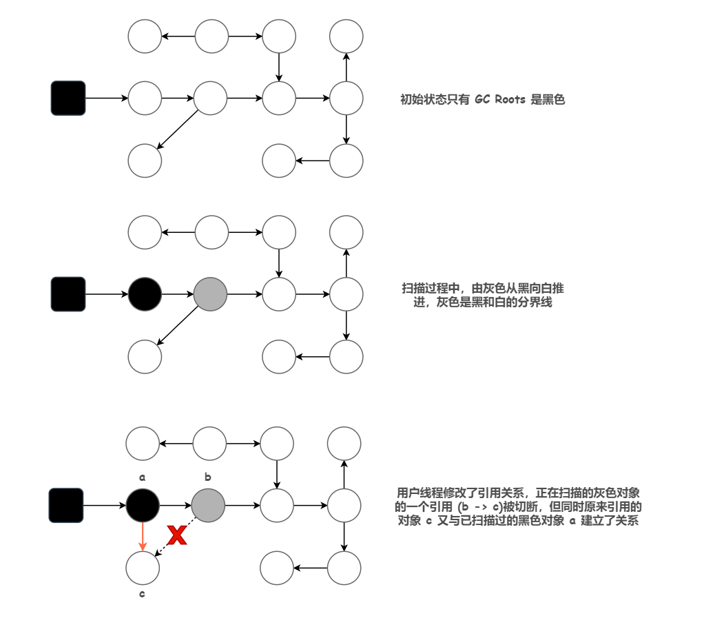

如上图所示，b -> c 的引用被切断，但同时用户线程建立了一个新的从 a -> c 的引用，由于已经遍历到了  b，不可能再回去遍历 a（黑色对象不会被重新扫描），再遍历 c，所以这个 c  实际是存活的对象，但由于没有被垃圾收集器扫描到，被错误地标记成了白色。

总结下对象消失问题的两个条件：

1. 插入了一条或多条从黑色对象到白色对象的新引用
2. 删除了全部从灰色对象到该白色对象的直接或间接引用

Wilson 于 1994 年在理论上证明了，当且仅当以上两个条件同时满足时，才会产生 “对象消失” 的问题，即原本应该是黑色的对象被误标为白色

#### 遍历对象图不需要 STW 的解决方案

如上所述，如果遍历对象图的过程不 STW 的话，第一个浮动垃圾的问题很好处理，但是第二个对象消失问题就很棘手了。

但是呢，遍历对象图的过程又实在太长，设计 JVM 的大佬们不得不想出一些办法来解决对象消失问题，使得在遍历对象图的过程中不用进行 STW（也就是用户线程和对象线程可以同时工作），从而提升可达性分析的效率

上面总结了对象消失问题的两个条件，所以说，如果我们想要解决并发扫描时的对象消失问题，只需破坏这两个条件的任意一个即可。由此分别产生了两种解决方案：

1. **增量更新**（Incremental Update）：增量更新破坏的是第一个条件，当黑色对象插入新的指向白色对象的引用关系时（就是上图中的 a -> c  引用关系），就将这个新插入的引用记录下来，等并发扫描结束之后，再将这些记录过的引用关系中的黑色对象（a）为根，重新扫描一次。这可以简化理解为，**黑色对象一旦新插入了指向白色对象的引用之后，它就变回灰色对象了**。
2. **原始快照**（Snapshot At The Beginning，SATB）：原始快照要破坏的是第二个条件，当灰色对象要删除指向白色对象的引用关系时（上图中的 b -> c  引用关系），就将这个要删除的引用记录下来，在并发扫描结束之后，再将这些记录过的引用关系中的灰色对象（b）为根，重新扫描一次。这也可以简化理解为，**无论引用关系删除与否，都会按照刚刚开始扫描那一刻的对象图快照来进行搜索**。

在 HotSpot 虚拟机中，增量更新和原始快照这两种解决方案都有实际应用，CMS 是基于增量更新来做并发标记的，G1、Shenandoah 则是用原始快照来实现


### 什么是字节码？类文件结构的组成了解吗？

**Java 字节码**（英语：Java bytecode）是[Java虚拟机](https://zh.wikipedia.org/wiki/Java虚拟机)执行的一种[指令](https://zh.wikipedia.org/wiki/指令)格式。大多数[操作码](https://zh.wikipedia.org/w/index.php?title=操作码&action=edit&redlink=1)都是一个[字节](https://zh.wikipedia.org/wiki/字节)长，而有些操作需要参数，导致了有一些多字节的操作码。而且并不是所有可能的256个操作码都被使用；其中有51个操作码被保留做将来使用。除此之外，原始[Java平台](https://zh.wikipedia.org/wiki/Java平台)开发商，[太阳微系统](https://zh.wikipedia.org/wiki/昇陽微系統)，额外保留了3个代码永久不使用。

> 一个[Java](https://zh.wikipedia.org/wiki/Java)程序员并不需要理解所有的Java字节码。但是，就像[IBM](https://zh.wikipedia.org/wiki/IBM) developerWorks周刊建议的那样：“理解字节码以及理解Java编译器如何生成Java字节码与学习[汇编](https://zh.wikipedia.org/wiki/汇编语言)知识对于[C](https://zh.wikipedia.org/wiki/C)/[C++](https://zh.wikipedia.org/wiki/C%2B%2B)程序员有一样的意义。”


#### Class 文件结构总结

根据 Java 虚拟机规范，Class 文件通过 `ClassFile` 定义，有点类似 C 语言的结构体。

`ClassFile` 的结构如下：

```java
ClassFile {
    u4             magic; //Class 文件的标志
    u2             minor_version;//Class 的小版本号
    u2             major_version;//Class 的大版本号
    u2             constant_pool_count;//常量池的数量
    cp_info        constant_pool[constant_pool_count-1];//常量池
    u2             access_flags;//Class 的访问标记
    u2             this_class;//当前类
    u2             super_class;//父类
    u2             interfaces_count;//接口
    u2             interfaces[interfaces_count];//一个类可以实现多个接口
    u2             fields_count;//Class 文件的字段属性
    field_info     fields[fields_count];//一个类可以有多个字段
    u2             methods_count;//Class 文件的方法数量
    method_info    methods[methods_count];//一个类可以有个多个方法
    u2             attributes_count;//此类的属性表中的属性数
    attribute_info attributes[attributes_count];//属性表集合
}
```

通过分析 `ClassFile` 的内容，我们便可以知道 class 文件的组成。

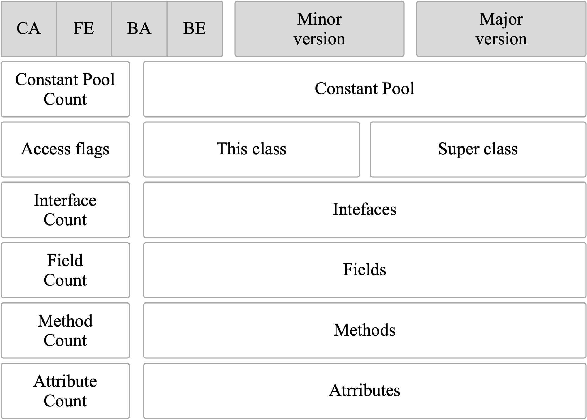

下面这张图是通过 IDEA 插件 `jclasslib` 查看的，你可以更直观看到 Class 文件结构。


使用 `jclasslib` 不光可以直观地查看某个类对应的字节码文件，还可以查看类的基本信息、常量池、接口、属性、函数等信息。

下面详细介绍一下 Class 文件结构涉及到的一些组件。

#### 魔数（Magic Number）

```java
    u4             magic; //Class 文件的标志
```

每个 Class 文件的头 4 个字节称为魔数（Magic Number）,它的唯一作用是**确定这个文件是否为一个能被虚拟机接收的 Class 文件**。

程序设计者很多时候都喜欢用一些特殊的数字表示固定的文件类型或者其它特殊的含义。

#### Class 文件版本号（Minor&Major Version）

```java
    u2             minor_version;//Class 的小版本号
    u2             major_version;//Class 的大版本号
```

紧接着魔数的四个字节存储的是 Class 文件的版本号：第 5 和第 6 位是**次版本号**，第 7 和第 8 位是**主版本号**。

每当 Java 发布大版本（比如 Java 8，Java9）的时候，主版本号都会加 1。你可以使用 `javap -v` 命令来快速查看 Class 文件的版本号信息。

高版本的 Java 虚拟机可以执行低版本编译器生成的 Class 文件，但是低版本的 Java 虚拟机不能执行高版本编译器生成的 Class 文件。所以，我们在实际开发的时候要确保开发的的 JDK 版本和生产环境的 JDK 版本保持一致。

#### 常量池（Constant Pool）

```java
    u2             constant_pool_count;//常量池的数量
    cp_info        constant_pool[constant_pool_count-1];//常量池
```

紧接着主次版本号之后的是常量池，常量池的数量是 `constant_pool_count-1`（**常量池计数器是从 1 开始计数的，将第 0 项常量空出来是有特殊考虑的，索引值为 0 代表“不引用任何一个常量池项”**）。

常量池主要存放两大常量：字面量和符号引用。字面量比较接近于 Java 语言层面的的常量概念，如文本字符串、声明为 final 的常量值等。而符号引用则属于编译原理方面的概念。包括下面三类常量：

- 类和接口的全限定名
- 字段的名称和描述符
- 方法的名称和描述符

常量池中每一项常量都是一个表，这 14 种表有一个共同的特点：**开始的第一位是一个 u1 类型的标志位 -tag 来标识常量的类型，代表当前这个常量属于哪种常量类型．**

|               类型               | 标志（tag） |          描述          |
| :------------------------------: | :---------: | :--------------------: |
|        CONSTANT_utf8_info        |      1      |   UTF-8 编码的字符串   |
|      CONSTANT_Integer_info       |      3      |       整形字面量       |
|       CONSTANT_Float_info        |      4      |      浮点型字面量      |
|        CONSTANT_Long_info        |     ５      |      长整型字面量      |
|       CONSTANT_Double_info       |     ６      |   双精度浮点型字面量   |
|       CONSTANT_Class_info        |     ７      |   类或接口的符号引用   |
|       CONSTANT_String_info       |     ８      |    字符串类型字面量    |
|      CONSTANT_Fieldref_info      |     ９      |     字段的符号引用     |
|     CONSTANT_Methodref_info      |     10      |   类中方法的符号引用   |
| CONSTANT_InterfaceMethodref_info |     11      |  接口中方法的符号引用  |
|    CONSTANT_NameAndType_info     |     12      |  字段或方法的符号引用  |
|     CONSTANT_MothodType_info     |     16      |      标志方法类型      |
|    CONSTANT_MethodHandle_info    |     15      |      表示方法句柄      |
|   CONSTANT_InvokeDynamic_info    |     18      | 表示一个动态方法调用点 |

`.class` 文件可以通过`javap -v class类名` 指令来看一下其常量池中的信息(`javap -v class类名-> temp.txt` ：将结果输出到 temp.txt 文件)。

#### 访问标志(Access Flags)

在常量池结束之后，紧接着的两个字节代表访问标志，这个标志用于识别一些类或者接口层次的访问信息，包括：这个 Class 是类还是接口，是否为 `public` 或者 `abstract` 类型，如果是类的话是否声明为 `final` 等等。

类访问和属性修饰符:

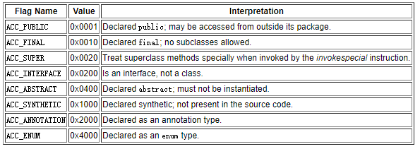

我们定义了一个 Employee 类

```java
package top.snailclimb.bean;
public class Employee {
   ...
}
```

通过`javap -v class类名` 指令来看一下类的访问标志。


#### 当前类（This Class）、父类（Super Class）、接口（Interfaces）索引集合

```java
    u2             this_class;//当前类
    u2             super_class;//父类
    u2             interfaces_count;//接口
    u2             interfaces[interfaces_count];//一个类可以实现多个接口
```

类索引用于确定这个类的全限定名，父类索引用于确定这个类的父类的全限定名，由于 Java 语言的单继承，所以父类索引只有一个，除了 `java.lang.Object` 之外，所有的 java 类都有父类，因此除了 `java.lang.Object` 外，所有 Java 类的父类索引都不为 0。

接口索引集合用来描述这个类实现了那些接口，这些被实现的接口将按 `implements` (如果这个类本身是接口的话则是`extends`) 后的接口顺序从左到右排列在接口索引集合中。

#### 字段表集合（Fields）

```java
    u2             fields_count;//Class 文件的字段的个数
    field_info     fields[fields_count];//一个类会可以有个字段
```

字段表（field info）用于描述接口或类中声明的变量。字段包括类级变量以及实例变量，但不包括在方法内部声明的局部变量。

**field info(字段表) 的结构:**


- **access_flags:** 字段的作用域（`public` ,`private`,`protected`修饰符），是实例变量还是类变量（`static`修饰符）,可否被序列化（transient 修饰符）,可变性（final）,可见性（volatile 修饰符，是否强制从主内存读写）。
- **name_index:** 对常量池的引用，表示的字段的名称；
- **descriptor_index:** 对常量池的引用，表示字段和方法的描述符；
- **attributes_count:** 一个字段还会拥有一些额外的属性，attributes_count 存放属性的个数；
- **attributes[attributes_count]:** 存放具体属性具体内容。

上述这些信息中，各个修饰符都是布尔值，要么有某个修饰符，要么没有，很适合使用标志位来表示。而字段叫什么名字、字段被定义为什么数据类型这些都是无法固定的，只能引用常量池中常量来描述。

**字段的 access_flag 的取值:**


#### 方法表集合（Methods）

```java
    u2             methods_count;//Class 文件的方法的数量
    method_info    methods[methods_count];//一个类可以有个多个方法
```

methods_count 表示方法的数量，而 method_info 表示方法表。

Class 文件存储格式中对方法的描述与对字段的描述几乎采用了完全一致的方式。方法表的结构如同字段表一样，依次包括了访问标志、名称索引、描述符索引、属性表集合几项。

**method_info(方法表的) 结构:**


方法表的 access_flag 取值：


注意：因为`volatile`修饰符和`transient`修饰符不可以修饰方法，所以方法表的访问标志中没有这两个对应的标志，但是增加了`synchronized`、`native`、`abstract`等关键字修饰方法，所以也就多了这些关键字对应的标志。

#### 属性表集合（Attributes）

```java
   u2             attributes_count;//此类的属性表中的属性数
   attribute_info attributes[attributes_count];//属性表集合
```

在  Class 文件，字段表，方法表中都可以携带自己的属性表集合，以用于描述某些场景专有的信息。与 Class  文件中其它的数据项目要求的顺序、长度和内容不同，属性表集合的限制稍微宽松一些，不再要求各个属性表具有严格的顺序，并且只要不与已有的属性名重复，任何人实现的编译器都可以向属性表中写 入自己定义的属性信息，Java 虚拟机运行时会忽略掉它不认识的属性。


### OOM 常见原因及解决方法

> 节选自：StabilityGuide 

当 JVM 内存严重不足时，就会抛出 java.lang.OutOfMemoryError 错误。本文总结了常见的 OOM 原因及其解决方法，如下图所示。如有遗漏或错误，欢迎补充指正。

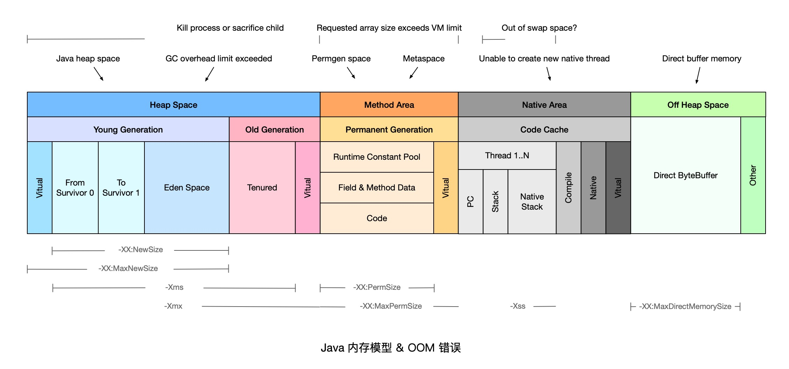

#### Java heap space

当堆内存（Heap Space）没有足够空间存放新创建的对象时，就会抛出 `java.lang.OutOfMemoryError: Java heap space` 错误（根据实际生产经验，可以对程序日志中的 OutOfMemoryError 配置关键字告警，一经发现，立即处理）

##### 原因分析

`Java heap space` 错误产生的常见原因可以分为以下几类：

- 请求创建一个超大对象，通常是一个大数组。
- 超出预期的访问量/数据量，通常是上游系统请求流量飙升，常见于各类促销/秒杀活动，可以结合业务流量指标排查是否有尖状峰值。
- 过度使用终结器（Finalizer），该对象没有立即被 GC。
- 内存泄漏（Memory Leak），大量对象引用没有释放，JVM 无法对其自动回收，常见于使用了 File 等资源没有回收。

##### 解决方案

针对大部分情况，通常只需要通过 `-Xmx` 参数调高 JVM 堆内存空间即可。如果仍然没有解决，可以参考以下情况做进一步处理：

- 如果是超大对象，可以检查其合理性，比如是否一次性查询了数据库全部结果，而没有做结果数限制。
- 如果是业务峰值压力，可以考虑添加机器资源，或者做限流降级。
- 如果是内存泄漏，需要找到持有的对象，修改代码设计，比如关闭没有释放的连接。

#### GC overhead limit exceeded

当 Java 进程花费 98% 以上的时间执行 GC，但只恢复了不到 2% 的内存，且该动作连续重复了 5 次，就会抛出 `java.lang.OutOfMemoryError:GC overhead limit exceeded` 错误。简单地说，就是应用程序已经基本耗尽了所有可用内存， GC 也无法回收。

此类问题的原因与解决方案跟 `Java heap space` 非常类似，可以参考上文。

#### Permgen space

该错误表示永久代（Permanent Generation）已用满，通常是因为加载的 class 数目太多或体积太大。

##### 原因分析

永久代存储对象主要包括以下几类：

- 加载/缓存到内存中的 class 定义，包括类的名称，字段，方法和字节码；
- 常量池；
- 对象数组/类型数组所关联的 class；
- JIT 编译器优化后的 class 信息。

PermGen 的使用量与加载到内存的 class 的数量/大小正相关。

##### 解决方案

根据 Permgen space 报错的时机，可以采用不同的解决方案，如下所示：

- 程序启动报错，修改 `-XX:MaxPermSize` 启动参数，调大永久代空间。
- 应用重新部署时报错，很可能是没有应用没有重启，导致加载了多份 class 信息，只需重启 JVM 即可解决。
- 运行时报错，应用程序可能会动态创建大量 class，而这些 class 的生命周期很短暂，但是 JVM 默认不会卸载 class，可以设置 `-XX:+CMSClassUnloadingEnabled` 和 `-XX:+UseConcMarkSweepGC` 这两个参数允许 JVM 卸载 class。

如果上述方法无法解决，可以通过 jmap 命令 dump 内存对象 `jmap -dump:format=b,file=dump.hprof <process-id>` ，然后利用 [Eclipse MAT](https://www.eclipse.org/mat/) 功能逐一分析开销最大的 classloader 和重复 class。

#### Metaspace

DK 1.8 使用 Metaspace 替换了永久代（Permanent Generation），该错误表示 Metaspace 已被用满，通常是因为加载的 class 数目太多或体积太大。

此类问题的原因与解决方法跟 `Permgen space` 非常类似，可以参考上文。需要特别注意的是调整 Metaspace 空间大小的启动参数为 `-XX:MaxMetaspaceSize`。

#### Unable to create new native thread

每个 Java 线程都需要占用一定的内存空间，当 JVM 向底层操作系统请求创建一个新的 native 线程时，如果没有足够的资源分配就会报此类错误。

##### 原因分析

JVM 向 OS 请求创建 native 线程失败，就会抛出 `Unable to create new native thread`，常见的原因包括以下几类：

- 线程数超过操作系统最大线程数 ulimit 限制。
- 线程数超过 kernel.pid_max（只能重启）。
- native 内存不足。

该问题发生的常见过程主要包括以下几步：

1. JVM 内部的应用程序请求创建一个新的 Java 线程；
2. JVM native 方法代理了该次请求，并向操作系统请求创建一个 native 线程；
3. 操作系统尝试创建一个新的 native 线程，并为其分配内存；
4. 如果操作系统的虚拟内存已耗尽，或是受到 32 位进程的地址空间限制，操作系统就会拒绝本次 native 内存分配；
5. JVM 将抛出 `java.lang.OutOfMemoryError: Unable to create new native thread` 错误。

##### 解决方案

- 升级配置，为机器提供更多的内存；
- 降低 Java Heap Space 大小；
- 修复应用程序的线程泄漏问题；
- 限制线程池大小；
- 使用 -Xss 参数减少线程栈的大小；
- 调高 OS 层面的线程最大数：执行 `ulimia -a` 查看最大线程数限制，使用 `ulimit -u xxx` 调整最大线程数限制。

```
ulimit -a
.... 省略部分内容 .....
max user processes              (-u) 16384
```

#### Out of swap space？

该错误表示所有可用的虚拟内存已被耗尽。虚拟内存（Virtual Memory）由物理内存（Physical Memory）和交换空间（Swap Space）两部分组成。当运行时程序请求的虚拟内存溢出时就会报 `Out of swap space?` 错误。

##### 原因分析

该错误出现的常见原因包括以下几类：

- 地址空间不足；
- 物理内存已耗光；
- 应用程序的本地内存泄漏（native leak），例如不断申请本地内存，却不释放。
- 执行 `jmap -histo:live <pid>` 命令，强制执行 Full GC；如果几次执行后内存明显下降，则基本确认为 Direct ByteBuffer 问题。

##### 解决方案

根据错误原因可以采取如下解决方案：

- 升级地址空间为 64 bit；
- 使用 [Arthas](https://github.com/alibaba/arthas) 检查是否为 Inflater/Deflater 解压缩问题，如果是，则显式调用 end 方法。
- Direct ByteBuffer 问题可以通过启动参数 `-XX:MaxDirectMemorySize` 调低阈值。
- 升级服务器配置/隔离部署，避免争用。

#### Kill process or sacrifice child

有一种内核作业（Kernel Job）名为 Out of Memory Killer，它会在可用内存极低的情况下“杀死”（kill）某些进程。OOM Killer 会对所有进程进行打分，然后将评分较高的进程“杀死”，具体的评分规则可以参考 [Surviving the Linux OOM Killer](https://dev.to/rrampage/surviving-the-linux-oom-killer-2ki9)。

不同于其他的 OOM 错误，`Kill process or sacrifice child` 错误不是由 JVM 层面触发的，而是由操作系统层面触发的。当系统空闲内存突然大幅被释放，有较大概率触发了 OOM Killer 杀掉了某些进程。


##### 原因分析

默认情况下，Linux 内核允许进程申请的内存总量大于系统可用内存，通过这种“错峰复用”的方式可以更有效的利用系统资源。

然而，这种方式也会无可避免地带来一定的“超卖”风险。例如某些进程持续占用系统内存，然后导致其他进程没有可用内存。此时，系统将自动激活 OOM Killer，寻找评分高的进程，并将其“杀死”，释放内存资源。

##### 解决方案

- 升级服务器配置/隔离部署，避免争用。
- [OOM Killer 调优](https://access.redhat.com/documentation/en-us/red_hat_enterprise_linux/6/html/performance_tuning_guide/s-memory-captun)。

#### Requested array size exceeds VM limit

JVM 限制了数组的最大长度，该错误表示程序请求创建的数组超过最大长度限制。

JVM 在为数组分配内存前，会检查要分配的数据结构在系统中是否可寻址，通常为 `Integer.MAX_VALUE - 2`。

此类问题比较罕见，通常需要检查代码，确认业务是否需要创建如此大的数组，是否可以拆分为多个块，分批执行。

#### Direct buffer memory

Java 允许应用程序通过 Direct ByteBuffer 直接访问堆外内存，许多高性能程序通过 Direct ByteBuffer 结合内存映射文件（Memory Mapped File）实现高速 IO。

##### 原因分析

Direct ByteBuffer 的默认大小为 64 MB，一旦使用超出限制，就会抛出 `Direct buffer memory` 错误。

##### 解决方案

- Java 只能通过 ByteBuffer.allocateDirect 方法使用 Direct ByteBuffer，因此，可以通过 [Arthas](https://github.com/alibaba/arthas) 等在线诊断工具拦截该方法进行排查。
- 检查是否直接或间接使用了 NIO，如 netty，jetty 等。
- 通过启动参数 `-XX:MaxDirectMemorySize` 调整 Direct ByteBuffer 的上限值。
- 检查 JVM 参数是否有 `-XX:+DisableExplicitGC` 选项，如果有就去掉，因为该参数会使 `System.gc()` 失效。
- 检查堆外内存使用代码，确认是否存在内存泄漏；或者通过反射调用 `sun.misc.Cleaner` 的 `clean()` 方法来主动释放被 Direct ByteBuffer 持有的内存空间。
- 内存容量确实不足，升级配置。

