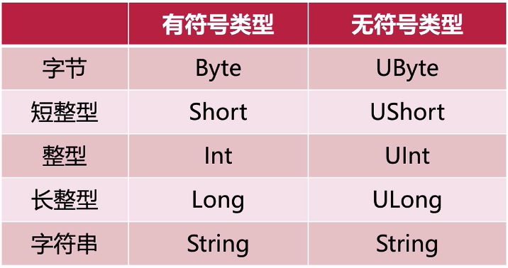
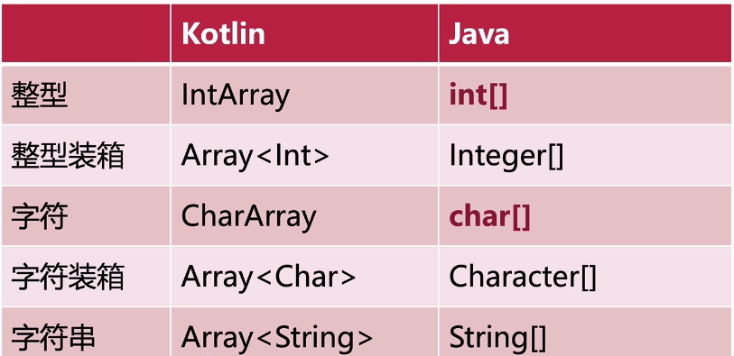
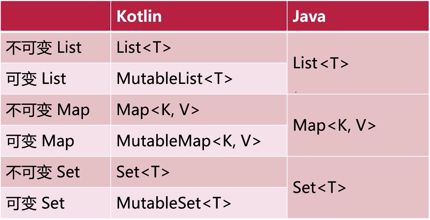

## 基础知识

### 基础类型

Java中基本类型声明

```java
int a = 2;
final String b = "Hello Java"
```

对照Kotlin中的声明：

```kotlin
var a:Int = 2
val b:String = "Hello Kotlin"
```


### long类型

Java

```java
long c = 12345678910l;
long d = 12345678910L;
```

Kotlin

```kotlin
val c = 12345678910l // error
val d = 12345678910L // fine
```


### 数值转换

Java

```java
int e = 10;
long f = e;
```

Kotlin

```kotlin
val e:Int = 10
val f:Long = e.toLong()
```


### 无符号类型

Java没有，但是kotlin有




### 字符串模板

```kotlin
fun main() {
    val j = "I Love China"
    println("Value of String j is: $j")
}
```


### 比较运算

在Java中==比较引用，`equals()`比较内容，而在Kotlin中===比较的是引用，==比较的是内容

```java
System.out.println(k==m);
System.out.println(k.equals(m));
```


```kotlin
println(k===m)
println(k==m)
```


### 数组




#### 数组的创建

Java

```java
int[] c = new int[]{1,2,3,4,5};
```

Kotlin

```kotlin
val c0 = intArrayOf(1,2,3,4,5)
val c1 = IntArray(5){it + 1} 
```


#### 数组的长度

Java中使用length来计算

```java
int[] a = new int[5];
System.out.println()
```

Kotlin则使用size

```kotlin
val a = IntArray(5)
println(a.size)
```


#### 数组的遍历

Java

```java
float[] e = new float[]{1,3,5,7};
for (float element : e) {
    System.out.println(element);
}
```

Kotlin

```kotlin
val e = floatArrayOf(1f, 3f, 5f, 7f)
for (element in e) {
    println(element)
}
-----------or--------------
e.forEach { element -> println(element) }
```


#### 数组的包含关系

Java中

```java
for (float element:e) {
    if (element == 1f) {
        System.out.println("1f exists in variale 'e'");
        break;
    }
}
```

Kotlin

```kotlin
if (1f in e) {
    println("1f exists in variale 'e'")
}
```


### 区间

#### ..符号

```kotlin
val intRange = 1..10
/*for (i in intRange) {
        println(i)
    }*/
val charRange = 'a'..'z'
val longRange = 1L..10L
val floatRange = 1f..10f
val doubleRange = 1.0..2.0
println(intRange.joinToString())
println(charRange.joinToString())
==================================
1, 2, 3, 4, 5, 6, 7, 8, 9, 10
a, b, c, d, e, f, g, h, i, j, k, l, m, n, o, p, q, r, s, t, u, v, w, x, y, z
```

#### 步距step

```kotlin
val intRangeStep = 1..10 step 2
val charRangeStep = 'a'..'z' step 2
println(intRangeStep.joinToString())
println(charRangeStep.joinToString())
====================================
1, 3, 5, 7, 9
a, c, e, g, i, k, m, o, q, s, u, w, y
```

#### until

until和..的区别在于，它是右闭区间

```kotlin
val intRangeUtil = 1 until 10
val charRangeUtil = 'a' until 'z'
println(intRangeUtil.joinToString())
println(charRangeUtil.joinToString())
=====================================
1, 2, 3, 4, 5, 6, 7, 8, 9
a, b, c, d, e, f, g, h, i, j, k, l, m, n, o, p, q, r, s, t, u, v, w, x, y
```

#### 倒数：downTo

```kotlin
val intRangeDownto = 10 downTo 1
val charRangeDownto = 'z' downTo 'a'
println(intRangeDownto.joinToString())
println(charRangeDownto.joinToString())
```

#### 区间的遍历

在Java中遍历数组是可以是这样

```java
int[] array = new int[]{1,3,5,7};
for (int i = 0; i < array.length; i++) {
    System.out.println(array[i]);
}
```

在kotlin中

```kotlin
val array = intArrayOf(1,3,5,7)
for (i in 0 until array.size) {
    println(array[i])
}
```

更加简化的版本是

```kotlin
for(i in array.indices) {
    println(i)
}
```


### 集合



#### List

Java中创建ArrayList

```java
List<Integer> intList = new ArrayList<>(Arrays.asList(1,2,3));
```

Kotlin中则分为可变List和不可变

```kotlin
val intList: List<Int> = listOf(1, 2, 3)
val intList2: MutableList<Int> = mutableListOf(1, 2, 3)
```

如果想像Java一样创建集合则

```kotlin
val stringList = ArrayList<String>()
```

那么它是如何实现创建集合和Java一样的呢？**类型别名**


##### 增加元素/删除元素

Java中的添加元素

```java
ArrayList<String> stringList = new ArrayList<>();
for (int i = 0; i < 10; i++) {
    stringList.append("num: " + i);
}
```

kotlin的添加元素

```kotlin
val stringList = ArrayList<String>()
for (i in 1..10) {
    stringList += "num: $i"
}
```

Kotlin中的删除元素则是

```kotlin
for (i in 1..10) {
    stringList -= "num: $i"
}
```


##### 读写元素

Java中

```java
stringList.set(5, "HelloWorld");
String valueAt5 = stringList.get(5);
```

Kotlin

```kotlin
stringList[5] = "HelloWorld"
val valueAt5 = stringList[5]
```


#### map

Java中读写元素

```java
HashMap <String, Integer> map = new HashMap<>();
map.put("Hello", 10);
System. out.println(map.get("Hello"));
```

Kotlin

```kotlin
val map = HashMap<String, Int>()
map["Hello"] = 10
println(map["Hello"])
```


#### pair

如何创建？

```kotlin
val pair = "Hello" to "Kotlin"
val pair2 = Pair("Hello", "Kotlin")
```

访问对应元素

```kotlin
val first = pair.first
val second = pair.second
```

对象解构

```kotlin
val (x, y) = pair
```


### 函数

结构如下：


#### 函数引用

符号是：`::`

像是定义了一个函数

```kotlin
class Foo {
    fun bar() {
        
    }
}
```

如果要使用它的引用`Foo::bar`


#### 变长参数

```kotlin
fun test1(vararg args: Int) {
    println(args.contentToString())
}
fun main() {
    test1(11,22,33)
}
========================================
[11, 22, 33]
```


#### 多返回值

定义返回一个Triple

```kotlin
fun multiRetureValues(): Triple<Int, Long, Double> {
    return Triple(1, 3L, 4.0)
}
```

使用的时候就可以使用对象解构

```kotlin
val (a, b, c) = multiRetureValues()
```


#### 默认参数

```kotlin
fun defaultParameter(x: Int = 5, y: String, z: Long = 0L) {
    println("$x,$y,$z")
}
```

同时，Kotlin支持具名参数

```kotlin
defaultParameter(y = "Hello")
```


### 类 & 接口

Java中定义类中的成员遍历不需要赋值

```java
public class SimpleClass{
    public int x;
    public void y(){}
}
```

Kotlin中必须给成员变量赋值

```java
class SimpleClass{
    var x: Int = 0
    fun y(){}
}
```


#### 构造方法

Java

```java
public class SimpleClass {
    public int x;
    public SimpleClass(int x) {
    	this.x = x;
    }
    ..
}
```

Kotlin，但是下面的风格不适合Kotlin

```kotlin
class SimpleClass{
    var x: Int
    constructor(x:Int){
        this.x = x
    }
    ..
}
```

下面这个风格才是Kotlin

```kotlin
class SimpleClass
constructor(x: Int) {
    var x:Int = x
}
```

还可以再进一步简化

```kotlin
class SimpleClass(x: Int) {
    
}
```

#### 类的实例化

Java

```java
SimpleClass simpleClass = new SimpleClass(9);
System.outprintln(simpleClass.x);
simpleClass.y();
```

Kotlin，不需要new

```kotlin
val simpleClass = SimpleClass(9)
println(simpleClass.x)
simpleClass.y()
```


#### 接口

Java中的接口

```java
public interface SimpleInf {
void simpleMethod();
}
```

Kotlin中的接口（不需要写public，默认）

```kotlin
interface Simplelnf {
fun simpleMethod()
}
```


#### 实现接口

Java中实现接口的方法

```java
public class SimpleClass implements SimpleInf {
    @Override
    public void simpleMethod() {
    }
}
```

Kotlin（使用override）

```kotlin
class SimpleClass(var x: Int): SimpleInf {
override fun simpleMethod() {
}

```


#### 抽象类定义

Java

```java
public abstract class AbsClass {
    public abstract void absMethod();
    protected void overridable(){ }
    public final void nonOverridable(){ }
}
```

Kotlin（默认不可以覆写，只有通过open才能被覆写）

```kotlin
abstract class AbsClass {
    abstract fun absMethod()
    open fun overridable(){}
    fun nonOverridable(){}
}
```


#### 类的继承

Java

```java
public class SimpleClassextends AbsClass implements Simplelnf {
..
}
```

Kotlin（注意继承类的时候加上括号，表示调用父类的构造方法）

```kotlin
class SimpleClass(var x:Int) : AbsClass(), SimpleInf{
    ...
}
```


#### 属性引用

这个基本和函数引用差不多

```kotlin
val ageRef = Person.:age
val person = Person(18, "Bennyhuo")
val nameRef = person::name
ageRef.set(person, 20)
nameRef.set(" Andyhuo")
```


### 空类型安全

在类的章节中已经介绍了，如果Kotlin中声明了一个成员变量，就必须给变量赋值，那么怎么为空呢？就是加一个`?`

```kotlin
var nullable: String? = "Hello"
nullable = null
```

如果加了`?`那么在某些情况就会编译错误

```kotlin
var length = nullable.length
```

【不推荐】那么也可以强制使用，就是使用`!!`，使用的时候要知道它肯定有值

```kotlin
var length = nullable!!.length
```

那么也可以安全访问，使用`?`

```kotlin
var length = nullable?.length
```

也可以使用`elvis`运算符 `?:`

```kotlin
var length = nullable?.length ?: 0
```


### 父子替换

父类可以替换为子类，但是反过来不行（Number是Int的父类）

```kotlin
var x: String = "Hello'
var y: String? = "World"
x=y // Type mismatch
y=x// OK
var a:Int = 2
var b: Number = 10.0
a=b // Type mismatch
b=a//OK
```


### 智能类型转换

例如下面的这段代码：

```kotlin
val kotliner: Kotliner = Person("benny", 20)
if(kotliner is Person){
	println((kotliner as Person).name)
}
```

Kotlin的智能转换可以换成下面，Kotliner自动转换成Person

```kotlin
val kotliner: Kotliner = Person("benny", 20)
if(kotliner is Person){
	println(kotliner.name)
}
```

#### 空类型的自动转换

* 在if之前是是`String?`
* if中：`String`
* if后：`String?`

```kotlin
var value: String? = null
value = "benny"
if(value != nulI){ t
	println(value.length)
}
```


### 中缀表达式

