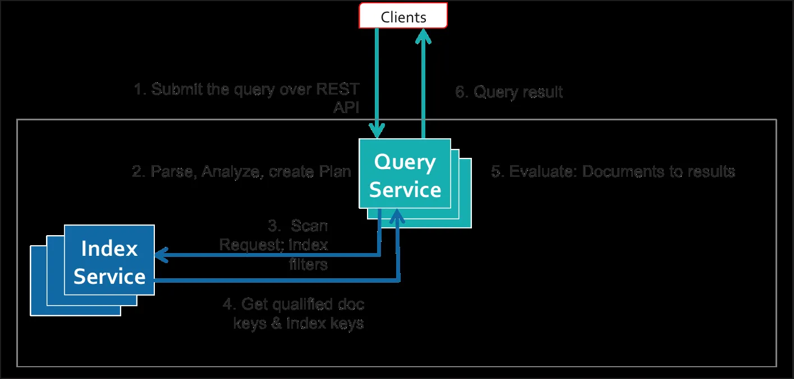
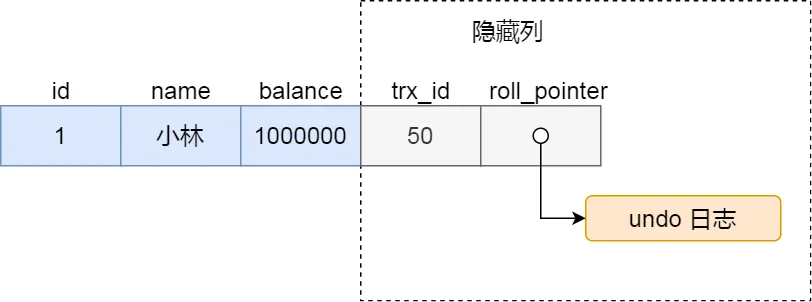
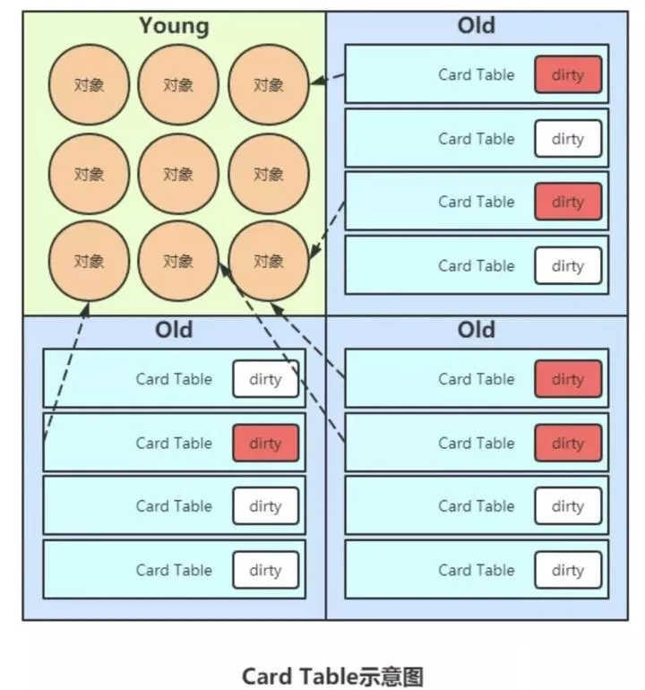
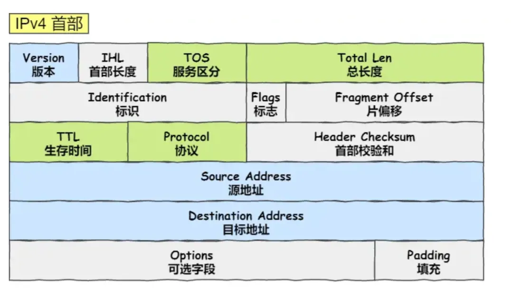
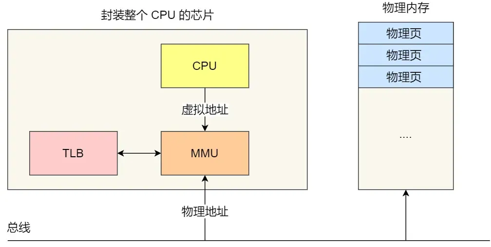
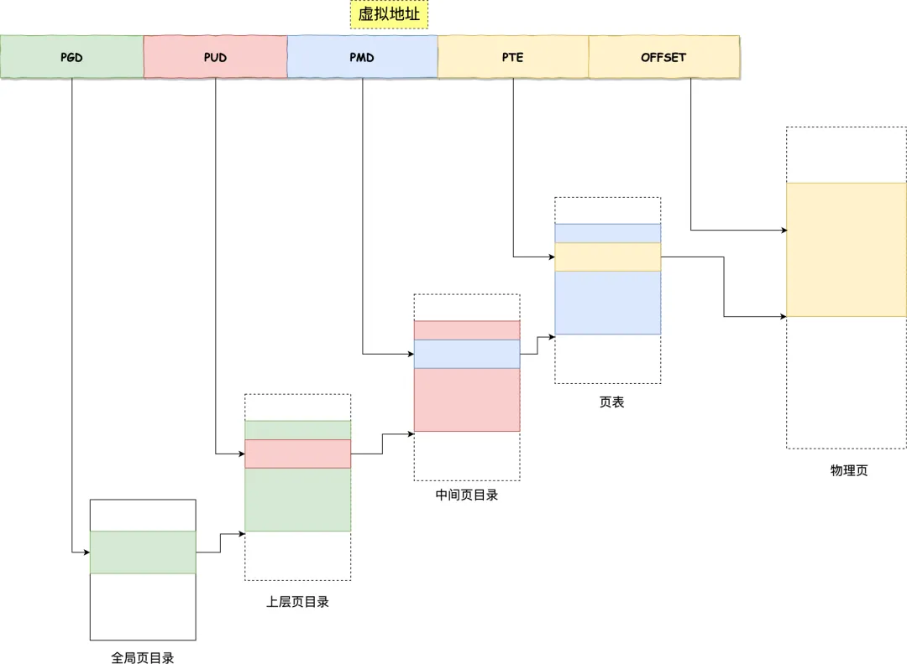
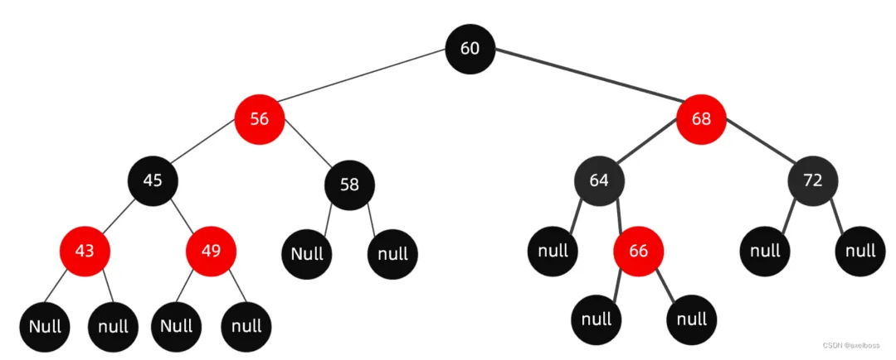
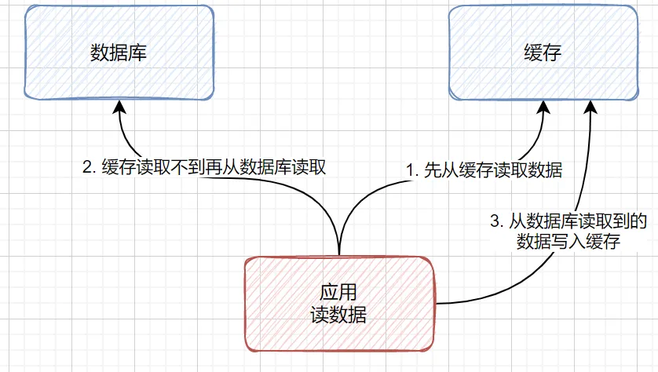

---

order: 20
author: zhiyu1998
title: 2023大厂八股文
category:
  - 八股文
  - 大厂
---


## 前言
2022有的大厂面试题不会在2023再次出现（也有可能会因为粗心加上，欢迎issue或者PR指正和修改），如果想要了解可以先看[2022大厂面试](/Java/eightpart/giant.md)版本。

## 🐦Java 基础
### ArrayList线程安全吗？把ArrayList变成线程安全有哪些方法？（2023美团）
将ArrayList变成线程安全有几种方法：
1. 使用**Collections.synchronizedList()** 方法将ArrayList转换为线程安全的List。该方法会返回一个线程安全的List，使用该List时需要在访问它的方法上添加synchronized关键字，以保证多线程访问的安全性。
```java
import java.util.ArrayList;
import java.util.Collections;
import java.util.List;

public class Main {
    public static void main(String[] args) {
        List<String> list = new ArrayList<>();
        List<String> synchronizedList = Collections.synchronizedList(list);
    }
}
```
2. 使用**CopyOnWriteArrayList**类来代替ArrayList。CopyOnWriteArrayList是一种线程安全的List实现，它通过在写操作时复制整个数组来保证线程安全性，在读操作时不需要加锁，因此可以提高读取效率。

```java
import java.util.concurrent.CopyOnWriteArrayList;

public class Main {
    public static void main(String[] args) {
        CopyOnWriteArrayList<String> list = new CopyOnWriteArrayList<>();
    }
}
```

3. 使用**Lock接口**来实现同步。可以使用ReentrantLock类来实现对ArrayList的同步操作，该类提供了与synchronized类似的功能，但是具有更高的灵活性。比如可以使用tryLock()方法来尝试获取锁，避免了线程的长时间等待。
```java
Lock lock = new ReentrantLock();
...
lock.lock();
try {
    // 对 ArrayList 的操作
} finally {
    lock.unlock();
}
```
4. 使用**读写锁**来实现同步。可以使用ReentrantReadWriteLock类来实现对ArrayList的读写操作的同步。该类提供了读锁和写锁两种锁，多个线程可以同时获取读锁，但是只有一个线程可以获取写锁，在写操作时需要先获取写锁，以保证线程安全。
```java
ReadWriteLock rwLock = new ReentrantReadWriteLock();
...
rwLock.readLock().lock();
try {
    // 对 ArrayList 的读操作
} finally {
    rwLock.readLock().unlock();
}
...
rwLock.writeLock().lock();
try {
    // 对 ArrayList 的写操作
} finally {
    rwLock.writeLock().unlock();
}
```
5. 使用 **Vector**: Vector 是一个线程安全的类，与 ArrayList 非常相似，可以作为替代品。但是，由于 Vector 的所有方法都是同步的，这可能会导致性能问题。

> 参考文献：
> - https://stackoverflow.com/questions/2444005/how-do-i-make-my-arraylist-thread-safe-another-approach-to-problem-in-java 如何使我的ArrayList线程安全？Java问题的另一种方法？
> - https://stackoverflow.com/questions/18983362/how-to-prove-arraylist-is-not-thread-safe-with-a-test 如何用测试证明数组列表不是线程安全的？
> - https://stackoverflow.com/questions/300519/arraylist-vs-vectors-in-java-if-thread-safety-isnt-a-concern ArrayList与vector，Java如果线程安全不是一个问题

### ArrayList的并发修改异常了解吗？单线程情况下会发生吗？（2023小红书）
这种异常通常发生在对ArrayList进行遍历时，同时尝试修改它的结构（例如添加或删除元素）。这种异常被称为ConcurrentModificationException。

在单线程情况下，这种异常也可能发生。当你在使用迭代器遍历ArrayList集合时，如果使用ArrayList的方法（如add()或remove()）修改了集合的结构，就可能触发这个异常。这是因为ArrayList的内部实现使用了一个modCount变量来跟踪结构修改的次数。当迭代器检测到modCount发生变化时，它会抛出ConcurrentModificationException异常。

为了避免这种异常，你可以在遍历ArrayList时采用以下方法：
1. 使用Iterator的remove()方法来删除元素，而不是直接使用ArrayList的remove()方法。这样可以确保modCount的值在迭代过程中保持一致。
2. 如果需要遍历过程中添加元素，可以考虑使用ListIterator，它提供了add()方法，允许在遍历过程中修改列表结构。
3. 另一种方法是使用Java 8的Stream API，它提供了一种更安全的方式来处理集合的并发修改问题。
4. 如果你确实需要在遍历过程中修改ArrayList，可以考虑先复制一个新的ArrayList，然后在新的ArrayList上进行修改。遍历完成后，再将新的ArrayList赋值给原来的引用。这样可以避免在遍历过程中修改原始ArrayList的结构。

> 参考：
> 1. https://stackoverflow.com/questions/602636/why-is-a-concurrentmodificationexception-thrown-and-how-to-debug-it 为什么会抛出它会抛出ConcurrentModificationException异常以及如何调试它
> 2. https://www.javatpoint.com/concurrentmodificationexception-in-java

### 面向过程的方法存在哪些问题？（2023美团）
1. 可维护性较差：面向过程编程主要依赖于函数和过程，随着代码规模的增大，可能会导致代码结构复杂，不易维护。
2. 可复用性较低：面向过程编程难以实现模块化，导致代码难以复用，进一步增加开发时间和成本。
3. 扩展性不足：面向过程编程在代码逻辑发生变化时，往往需要对程序进行大量的修改，这样的代码扩展性不足。
4. 抽象能力有限：面向过程编程主要关注过程和算法，而不是数据结构和对象，这使得它在表达现实世界的复杂问题时抽象能力有限。
5. 封装性差：面向过程编程没有提供良好的封装机制，程序中的数据和处理过程容易暴露，可能导致数据安全性和程序稳定性问题。
6. 强耦合：面向过程编程的方法往往导致程序组件之间存在强耦合，当一个组件发生变化时，可能会影响其他组件的正常工作。

### 面向过程好处是什么？（2023美团）
- 面向过程编程采用自顶向下的编程方式，将问题分解为一个个小的模块，便于理解和编写。
- 每个模块相对独立，出现问题时可以单独调试，降低了调试难度。
- 面向过程编程适合解决简单、逻辑性强的问题，对于初学者来说，学习成本较低。

### object 有哪些方法（2023百度）
当面试官问到 Java 中 Object 类的方法时，如果你无法记住所有的方法，可以采用以下回答策略：

- 强调**基本方法**：首先提及最常用和最基本的几个方法，如 equals()、hashCode()、toString()，这些方法几乎在每个对象中都会用到。
	- equals(Object obj): 检查当前对象是否与另一个对象相等。
	- hashCode(): 返回对象的哈希码值。
	- toString(): 返回对象的字符串表示。
- 提及**重要的方法**：接下来可以提及一些较为重要的方法，如 getClass() 用于获取对象的运行时类，clone() 用于创建对象的副本等。
	- clone(): 创建并返回当前对象的副本。
	- getClass(): 返回对象的运行时类。
- 谈论**对象间的通信**：强调 wait()、notify()、notifyAll() 这些用于线程间通信的方法，说明其在多线程编程中的作用。
	- notify(): 唤醒在该对象上等待的单个线程。
	- notifyAll(): 唤醒在该对象上等待的所有线程。
	- wait(): 导致当前线程等待，直到另一个线程调用该对象的 notify() 或 notifyAll() 方法。
- 谈论**垃圾回收**：提及 finalize() 方法，它在对象被垃圾回收之前调用，可以用于执行一些清理操作。
	- finalize(): 在对象被垃圾回收器回收之前调用。

### 如果让你自己实现一个 map 你会怎么做（2023百度）
1. 定义Map接口,包括get,put,remove,size,isEmpty等方法
```java
public interface MyMap {
    public Object get(Object key);
    public void put(Object key, Object value);
    public Object remove(Object key);
    public int size();
    public boolean isEmpty();
}
```

2. 实现HashMap,使用哈希表和链表解决hash冲突
```java
public class MyHashMap implements MyMap {
    private int size;
    private LinkedList[] buckets;
    
    public MyHashMap() {
        buckets = new LinkedList[16];
    }
    
    public Object get(Object key) {
        int hash = key.hashCode();
        int index = hash % buckets.length;
        LinkedList list = buckets[index];
        if (list != null) {
            for (Node node : list) {
                if (node.key.equals(key)) {
                    return node.value;
                }
            }
        }
        return null;
    }
    
    public void put(Object key, Object value) {
        // 省略实现...
    }
    
    // 其他方法省略...
}
```

3. 实现TreeMap,使用红黑树排序并存储key-value
```java
public class MyTreeMap implements MyMap {
    private Node root;
    
    private class Node {
        Object key;
        Object value;
        Node left;
        Node right;
        // 省略构造方法...
    }
    
    public Object get(Object key) {
        Node node = root;
        while (node != null) {
            if (key.compareTo(node.key) < 0) {
                node = node.left;
            } else if (key.compareTo(node.key) > 0) {
                node = node.right;
            } else {
                return node.value;
            }
        }
        return null;
    }
    
    public void put(Object key, Object value) {
        // 省略实现...
    }
}
```

### 作为 map 的 key 需要重写哪些方法？（2023完美世界）
首先，先理解面试题的意思，可以理解为：**如果你要用自己的类的对象作为Map的键，你需要重写这个类的哪些方法？**
- 在Java中，Map接口是基于键值对的，每个键都必须是唯一的。Java使用键对象的hashCode()方法来计算哈希值，这个哈希值用于确定在Map内部存储结构中的位置。同时，Java也使用键对象的equals()方法来检查两个键是否相等。
- 所以，如果你的类的对象要作为Map的键使用，那么通常需要你重写这个类的hashCode()和equals()方法，以确保它们的行为符合预期。
- 如果不重写这两个方法，那么默认的hashCode()方法将返回每个对象的内存地址，equals()方法将仅比较两个对象的内存地址。这可能会导致不符合预期的行为，比如两个内容完全相同但内存地址不同的对象被视为不同的键。


在Java中，作为Map的键（key），你通常需要重写以下两个方法：
1. **hashCode()**：这个方法返回对象的哈希码，用于确定在哈希表中的存储位置。如果两个对象被认为相等（根据equals()方法），那么它们的hashCode()方法必须返回相同的值。
2. **equals()**：这个方法用来判断两个对象是否相等。在Java的Map中，当我们调用get(key)或containsKey(key)方法时，Map实现会用这个方法来查找与给定键匹配的键。

当你创建自定义的类并打算将其实例用作Map的键时，通常需要覆盖这两个方法以确保它们的行为符合预期。如果不这样做，Map可能无法正确地查找、添加或删除键值对。

### List的实现类（2023阿里）
Java中的List接口有多个实现类，常用的包括：

- ArrayList：基于动态数组实现，优势在于支持随机访问和快速插入/删除元素，适用于频繁读取和遍历的场景。
- LinkedList：基于双向链表实现，优势在于支持快速插入/删除元素，适用于频繁插入/删除元素的场景。
- Vector：和ArrayList类似，但由于其线程安全性，适用于多线程环境。
- Stack：基于Vector实现，是一个后进先出（LIFO）的数据结构，适用于需要按照后进先出顺序处理元素的场景。

### List和Set的区别（2023阿里）
1. 顺序：List是有序的集合，它可以按照元素插入的顺序进行存储和访问。而Set是无序的集合，元素在集合中的位置是不固定的。
2. 重复元素：List允许存储重复的元素，即可以有多个相同的对象。Set不允许存储重复的元素，即每个对象在集合中只能出现一次。
3. 实现类：List的常用实现类有ArrayList和LinkedList，分别使用数组和链表作为底层数据结构。Set的常用实现类有HashSet、LinkedHashSet和TreeSet，分别基于哈希表、链表+哈希表和红黑树实现。
4. 性能：由于底层数据结构的差异，List和Set在增加、删除、查找等操作上的性能表现有所不同。例如，ArrayList在随机访问元素时性能较好，而LinkedList在插入和删除元素时性能较好。HashSet在查找、添加和删除元素时性能较好，但不保证元素顺序。TreeSet在保持元素排序的同时，也能提供较好的查找性能。

> 补充：
> Queue(实现排队功能的叫号机): 按特定的排队规则来确定先后顺序，存储的元素是有序的、可重复的。
> Map(用 key 来搜索的专家): 使用键值对（key-value）存储，类似于数学上的函数 y=f(x)，"x" 代表 key，"y" 代表 value，key 是无序的、不可重复的，value 是无序的、可重复的，每个键最多映射到一个值。

### 针对你说的List和Set的性质，那你会用这两种结构解决哪些问题（2023阿里）
List（列表）适用于以下场景：
1. 有序数据：列表中的元素按照插入顺序存储，因此适用于需要保持元素顺序的场景。
2. 允许重复元素：列表允许存储重复的元素，因此适用于需要统计元素出现次数的场景。
3. 需要根据索引进行查找、插入和删除操作：列表允许通过索引值直接访问、插入或删除元素，适用于需要频繁进行这些操作的场景。

Set（集合）适用于以下场景：
1. 去重：集合中的元素不能重复，因此适用于去除数据中重复元素的场景。
2. 无需关心元素顺序：集合中的元素没有固定顺序，适用于元素顺序无关紧要的场景。
3. 快速判断元素是否存在：集合提供了高效率的查找算法，适用于需要快速判断某个元素是否存在于数据集中的场景。
4. 集合运算：集合支持交集、并集、差集等运算，适用于需要进行这些运算的场景。

### Java创建对象的几种方式，除了new和反射还有其他吗？（2023 阿里实习）
1. 使用 new 关键字: 这是创建对象最常见的方式。例如：
```java
MyClass obj = new MyClass();
```

2. 使用 Java 反射 (Reflection) API，主要是 java.lang.Class 类中的 newInstance() 方法或者 java.lang.reflect.Constructor 类中的 newInstance() 方法。例如：
```java
Class<?> clazz = Class.forName("com.example.MyClass");
MyClass obj = (MyClass) clazz.newInstance();
```

3. 使用 java.lang.Cloneable 接口和 clone() 方法：这种方法用于创建现有对象的复制品。对象需要实现 Cloneable 接口，并重写 clone() 方法。
```java
MyClass obj1 = new MyClass();
MyClass obj2 = (MyClass) obj1.clone();
```

4. 使用 Java 序列化 (java.io.Serializable 接口) 和反序列化：这种方法通常用于创建现有对象的复制品，但它不调用构造器。对象需要实现 Serializable 接口。
```java
ObjectOutputStream out = new ObjectOutputStream(new FileOutputStream("data.obj"));
out.writeObject(obj1);
out.close();

ObjectInputStream in = new ObjectInputStream(new FileInputStream("data.obj"));
MyClass obj2 = (MyClass) in.readObject();
in.close();
```

5. 使用 java.lang.ClassLoader 或者 java.lang.Class 的 defineClass() 方法：这种方法用于从一个类的二进制名称或者字节码创建一个新的类和对象。
```java
ClassLoader classLoader = MyClass.class.getClassLoader();
Class<?> clazz = classLoader.loadClass("com.example.MyClass");
MyClass obj = (MyClass) clazz.newInstance();
```

Java9以后推荐的写法是：

```java
ClassLoader classLoader = MyClass.class.getClassLoader();
Class<?> clazz = classLoader.getClass();
MyClass obj = (MyClass)clazz.getDeclaredConstructor().newInstance();
```

### hashmap，为什么要转成红黑树，不是一开始就用？（2023 阿里实习）

在Java中，HashMap使用了链表和红黑树两种数据结构来存储数据。原因是，这两种数据结构在不同的情况下各有优缺点。让我们了解一下HashMap在何时以及为什么会将链表转换为红黑树。

**链表**
- 优点：相比于红黑树，链表结构更简单，占用空间较少，且在哈希冲突较少的情况下具有良好的性能。
- 缺点：链表在哈希冲突较多的情况下（即链表长度较长时），查找性能会明显下降，因为需要遍历链表。

**红黑树**
- 优点：红黑树是一种自平衡的二叉查找树，它能保证查找、插入和删除的时间复杂度为O(log n)，在哈希冲突较多的情况下性能更优。
- 缺点：相比于链表，红黑树结构更复杂，占用空间较多，且在哈希冲突较少的情况下性能优势不明显。

为了在空间和时间上达到一个平衡，Java的HashMap采用了一种折中的策略。它在初始化时使用链表结构来存储数据，但当链表长度达到一定阈值时（默认为8），会将链表转换为红黑树结构。这样，当哈希冲突较少时，HashMap可以利用链表的空间优势；而在哈希冲突较多时，HashMap则能从红黑树的时间性能上受益。

因此，在Java中，HashMap不是一开始就使用红黑树，而是根据实际情况动态地选择并转换数据结构，以达到最佳性能。

## 🕝 并发编程

### 线程池的拒绝策略能自定义拒绝策略吗？（2023阿里）
Java线程池拒绝策略是可以自定义的。你可以使用`RejecttedExecutionHandler`接口来定义你自己的拒绝策略。该接口只有一个方法拒绝执行（Runnable r，ThreadPoolExecator执行器），当执行器无法执行任务时调用。你可以实现这个方法来定义你自己的拒绝策略。

示例：
```java
public class CustomRejectedExecutionHandler implements RejectedExecutionHandler {
    @Override
    public void rejectedExecution(Runnable r, ThreadPoolExecutor executor) {
        // Your custom rejection policy here
    }
}

ThreadPoolExecutor executor = new ThreadPoolExecutor(
        corePoolSize,
        maxPoolSize,
        keepAliveTime,
        TimeUnit.SECONDS,
        new LinkedBlockingQueue<>(),
        new CustomRejectedExecutionHandler()
);
```

### 使用多线程要注意哪些问题？（2023美团）
使用多线程时需要注意以下问题：
1. **线程安全**：当多个线程同时访问某一数据时，如果不进行正确的同步控制，可能会导致数据的不一致。需要通过使用synchronized，Lock，volatile等机制来保证线程安全。
2. **死锁**：死锁是指两个或两个以上的线程在执行过程中，因争夺资源而造成的一种互相等待的现象，若无外力干涉那他们都将无法推进下去。我们应避免在代码中产生死锁。
3. **活锁**：活锁指的是线程虽然没有被阻塞，但是由于某种条件没有被满足，始终无法向前执行，就像在原地踏步。
4. **饥饿**：由于线程的优先级设置不合理或者锁机制不公平，导致某些线程始终无法获取到CPU资源或者锁资源，从而无法进行工作。
5. **资源消耗**：每个线程都会占用一定的内存资源，过多的线程可能会导致系统资源消耗过大。同时，线程上下文切换也会消耗CPU资源，过多的线程也可能会导致CPU负载过大。
6. **数据共享和可见性**：多线程之间共享数据，需要保证一个线程对数据的修改对其他线程可见，可以使用volatile或者Atomic类来保证。
7. **线程的生命周期管理**：需要合理的创建、启动、暂停、恢复、终止线程，不合理的管理可能会导致程序错误或者资源泄漏。
8. **线程异常处理**：线程中的未捕获异常会导致线程终止，而且这个异常不能被外部捕获。需要为线程设置UncaughtExceptionHandler来处理未捕获的异常。

### 保证数据的一致性有哪些方案呢？（2023美团）
在Java中，有多种方式可以保证数据的一致性：
1. **同步语句块(Synchronized Blocks)**：在Java中，你可以使用synchronized关键字对一个对象或者方法进行锁定，来保证在一个时刻只有一个线程可以访问该对象或者方法，从而避免数据的不一致。
2. **Volatile关键字**：volatile关键字可以保证变量的可见性。当一个共享变量被volatile修饰时，它会保证修改的值会立即被更新到主存，当有其他线程需要读取时，它会去主存中读取新值。
3. **原子类（Atomic Classes）**：Java提供了一组原子类（如AtomicInteger、AtomicLong等），它们使用了高效的机器级指令来保证原子性操作，从而避免了复杂的同步。
4. **Lock接口和相关类**：Java并发库提供了显式的锁机制，包括ReentrantLock、ReadWriteLock等，可以提供比synchronized更灵活的锁定机制。
5. **并发集合（Concurrent Collections）**：Java提供了一组并发集合类（如ConcurrentHashMap、CopyOnWriteArrayList等），它们内部已经实现了并发控制，可以在并发环境中安全使用。
6. **事务（Transactions）**：在数据库和某些支持事务的系统中，可以通过事务来保证数据的一致性。Java中的JPA和Spring等框架提供了对事务的支持。

以上就是在Java中保证数据一致性的一些常用方案，选择哪种方案取决于具体的应用场景和需求。

### 怎么获取子线程的返回值？（2023 阿里实习）
在Java中，若要获取子线程的返回值，可以使用Callable接口和Future类。Callable接口允许你定义一个返回值的任务，而Future类则代表这个任务的结果。为了获取子线程的返回值，首先创建一个实现Callable接口的类，并重写call()方法。然后，将这个Callable对象提交给ExecutorService，它会返回一个Future对象。通过调用Future对象的get()方法，主线程可以等待并获取子线程的返回值。

```java
import java.util.concurrent.Callable;
import java.util.concurrent.ExecutionException;
import java.util.concurrent.ExecutorService;
import java.util.concurrent.Executors;
import java.util.concurrent.Future;

public class Main {
    public static void main(String[] args) {
        ExecutorService executor = Executors.newSingleThreadExecutor();

        Callable<Integer> task = new Callable<Integer>() {
            @Override
            public Integer call() throws Exception {
                // 这里写你的子线程逻辑，并返回结果
                int result = 0;
                for (int i = 1; i <= 10; i++) {
                    result += i;
                }
                return result;
            }
        };

        Future<Integer> future = executor.submit(task);

        try {
            // 主线程等待并获取子线程的返回值
            Integer result = future.get();
            System.out.println("子线程的返回值: " + result);
        } catch (InterruptedException | ExecutionException e) {
            e.printStackTrace();
        } finally {
            executor.shutdown();
        }
    }
}
```

### 子线程抛异常，主线程 try-catch 是否可以获取到异常？（2023 阿里实习）
答案：可以。

当使用 Callable 和 Future 时，如果子线程在执行过程中抛出异常，主线程可以通过调用 Future.get() 方法时捕获异常来获取它。Future.get() 方法可以抛出一个 ExecutionException，这个异常包装了子线程抛出的真实异常。要获取子线程的异常，你可以在主线程的 try-catch 语句中捕获 ExecutionException，然后调用 getCause() 方法来获取子线程的异常。

```java
import java.util.concurrent.Callable;
import java.util.concurrent.ExecutionException;
import java.util.concurrent.ExecutorService;
import java.util.concurrent.Executors;
import java.util.concurrent.Future;

public class Main {
    public static void main(String[] args) {
        ExecutorService executor = Executors.newSingleThreadExecutor();

        Callable<Integer> task = new Callable<Integer>() {
            @Override
            public Integer call() throws Exception {
                // 这里故意抛出一个异常
                throw new RuntimeException("子线程抛出异常");
            }
        };

        Future<Integer> future = executor.submit(task);

        try {
            // 主线程等待并获取子线程的返回值
            Integer result = future.get();
        } catch (InterruptedException e) {
            e.printStackTrace();
        } catch (ExecutionException e) {
            // 获取并处理子线程抛出的异常
            Throwable cause = e.getCause();
            System.out.println("子线程抛出的异常: " + cause.getMessage());
        } finally {
            executor.shutdown();
        }
    }
}
```

### AtomicInteger是怎么更新保证原子性的？（2023 小红书）
AtomicInteger 是 Java 并发包 java.util.concurrent.atomic 中的一个类，它用于执行原子操作。原子操作是一种不可中断的操作，无论在任何情况下，只要这个操作开始，就会运行到结束，不会出现中间态。这是一种避免多线程并发问题的常用手段。

AtomicInteger 在内部通过很低级的原子硬件指令直接支持原子性。主要使用了一种名为“Compare and Swap”（CAS，比较并交换）的算法来实现原子性。这种算法使用三个参数：一个内存位置 V、预期的原始值 A 和新值 B。该算法仅当内存位置 V 的当前值与预期的原始值 A 相匹配时，才会将内存位置 V 的值更新为新值 B。如果内存位置 V 的当前值与预期值 A 不匹配，那么操作会失败，通常这个操作会在一个循环中进行，直到操作成功。

```java
public final boolean compareAndSet(int expect, int update) {
    return unsafe.compareAndSwapInt(this, valueOffset, expect, update);
}
```

AtomicInteger 的源码中,使用 Unsafe 类的 CAS 操作来实现:
```java
private static final Unsafe unsafe = Unsafe.getUnsafe();
private static final long valueOffset;

static {
    try {
        valueOffset = unsafe.objectFieldOffset
            (AtomicInteger.class.getDeclaredField("value"));
    } catch (Exception ex) { throw new Error(ex); }
}

public final int getAndIncrement() {
  return unsafe.getAndAddInt(this, valueOffset, 1);
}
```

unsafe.getAndAddInt() 方法实现了 CAS,它会获取当前值,加 1,并比较当前值是否改变,如果没有改变则更新,否则重新获取值。

所以 AtomicInteger 通过 CAS 无锁操作实现了线程安全的递增操作。


### Future抛出的两个异常的对比，都有什么用？（2023 百度提前批）

在Java中，`Future`接口在其方法执行过程中可能会抛出以下异常：

1. **InterruptedException**：当线程在等待、睡眠或其他占用时间的操作中被中断时可能会抛出此异常。例如，`Future.get()`方法会在等待计算完成时抛出此异常，如果线程在等待过程中被中断。

   ```java
   Future<Integer> future = executor.submit(callable);
   try {
       Integer result = future.get();
   } catch (InterruptedException e) {
       // handle exception
   }
   ```

2. **ExecutionException**：如果`Future`的计算抛出异常，那么`Future.get()`方法会抛出这个异常。这个异常的原因可以通过`ExecutionException.getCause()`获得。

   ```java
   Future<Integer> future = executor.submit(callable);
   try {
       Integer result = future.get();
   } catch (ExecutionException e) {
       Throwable cause = e.getCause();
       // handle exception
   }
   ```

3. **TimeoutException**：当`Future.get(long timeout, TimeUnit unit)`在超时时间内没有得到结果时，会抛出此异常。

   ```java
   Future<Integer> future = executor.submit(callable);
   try {
       Integer result = future.get(5, TimeUnit.SECONDS);
   } catch (TimeoutException e) {
       // handle exception
   }
   ```

4. **CancellationException**：当尝试取回已经取消的任务的结果时，会抛出此异常。

   ```java
   Future<Integer> future = executor.submit(callable);
   future.cancel(true);
   try {
       Integer result = future.get();
   } catch (CancellationException e) {
       // handle exception
   }
   ```

请注意，这些异常都必须被捕获和处理，因为它们都是`java.lang.Exception`的子类，是已检查的异常。


> 参考：
>
> 1. https://stackoverflow.com/questions/2665569/in-what-cases-does-future-get-throw-executionexception-or-interruptedexception 在什么情况下Future. get（）抛出ExecutionException或InterruptedException
> 2. https://stackoverflow.com/questions/2248131/handling-exceptions-from-java-executorservice-tasks 处理ExecutorService任务Java异常
> 3. https://www.baeldung.com/java-future
> 4. https://docs.oracle.com/javase/8/docs/api/java/util/concurrent/Future.html

## 🍃 常用框架
### MyBatis运用了哪些常见的设计模式？（2023美团）
- **工厂模式**，工厂模式在 MyBatis 中的典型代表是 SqlSessionFactory
- **建造者模式**，建造者模式在 MyBatis 中的典型代表是 SqlSessionFactoryBuilder
- **单例模式**，单例模式在 MyBatis 中的典型代表是 ErrorContext
- **适配器模式**，适配器模式在 MyBatis 中的典型代表是 Log
- **代理模式**，代理模式在 MyBatis 中的典型代表是 MapperProxyFactory
- **模板方法模式**，模板方法在 MyBatis 中的典型代表是 BaseExecutor
- **装饰器模式**，装饰器模式在 MyBatis 中的典型代表是 Cache
- **迭代器模式**，如迭代器模式Properties tyTokenizer；
- **组合模式**，如SqlNode和每个子类ChooseSqlNode；

> 参考文献：
> - https://programming.vip/docs/6200e8e7b682c.html 【Mybatis源码解析】Mybatis源码涉及的设计模式总结
> - https://programming.vip/docs/mybatis-design-pattern.html Mybatis设计模式

### MyBatis中创建了一个Mapper接口，在写一个xml文件，java的接口是要实现的，为什么这没有实现呢？（2023美团）
MyBatis中的Mapper接口并不需要实现，它只是定义了一组方法签名。MyBatis会根据Mapper接口中的方法名、参数类型和返回值类型，自动生成实现方法。因此，Mapper接口中的方法不需要实现，也不需要在该接口中编写任何方法体。

相反，你需要编写一个与Mapper接口同名的XML文件，来实现这些方法的具体SQL操作。这样，当你在Java代码中调用Mapper接口中的方法时，MyBatis会自动将该方法映射到对应的XML文件中的SQL语句，并执行该语句。

### 与传统的JDBC相比，MyBatis的优点？（2023美团）
在面试中，可以按照以下的方式来回答：
1. 首先，我认为最大的优点是MyBatis提供了更高的**灵活性**。我们可以直接编写SQL，这样可以充分利用数据库的特性并且更好地控制查询。
2. 其次，MyBatis使我们**无需手动**转换数据，它能自动将结果集映射到Java对象，这大大简化了编程工作。
3. 此外，MyBatis支持**动态SQL**，我们可以在SQL语句中使用动态元素，如if、choose等，从而能够创建更复杂的查询。
4. 除此之外，MyBatis将SQL语句放在**XML文件或注解**中，实现了SQL与Java代码的分离，这使得代码更加易于维护。
5. MyBatis也能**更好地处理一对多、多对多**等复杂关系。
6. 最后，MyBatis提供了**一些JDBC无法提供的特性**，如延迟加载，这对于性能优化是非常有用的。

### JDBC连接数据库的步骤（2023美团）
1. **加载数据库驱动程序**：首先，我们需要加载数据库驱动。这可以通过 Class.forName() 方法实现，例如 Class.forName("com.mysql.jdbc.Driver")。
2. **建立数据库连接**：使用DriverManager.getConnection()方法建立与数据库的连接，需要指定数据库的URL、用户名和密码，例如：Connection conn = DriverManager.getConnection("jdbc:mysql://localhost/mydatabase", "username", "password");
3. **创建Statement对象**：使用Connection对象的createStatement()方法创建一个Statement对象，用于执行SQL语句，例如：Statement stmt = conn.createStatement();
4. **执行SQL语句**：使用Statement对象的executeQuery()或executeUpdate()方法执行SQL语句，例如：ResultSet rs = stmt.executeQuery("SELECT * FROM mytable");
5. **处理查询结果**：如果执行的是查询语句，需要使用ResultSet对象来处理查询结果，例如：while (rs.next()) { String name = rs.getString("name"); int age = rs.getInt("age"); }
6. **关闭数据库连接**：在程序结束时，需要使用Connection对象的close()方法关闭数据库连接，例如：conn.close();

### 怎么理解SpringIoc？（2023美团）
**IoC（Inversion of Control）是“控制反转”** 的缩写，是一种设计思想，也是Spring框架的核心。IoC是将你设计好的对象交给容器控制，而不是传统的在你的对象内部直接控制。如何理解好IoC呢？可以从以下几点来看：
1. **控制反转**：传统的程序是由我们自己在对象内部通过new进行创建对象，是由程序控制对象的创建。在Spring框架中，对象的创建是由Spring容器来进行的，它负责控制对象的生命周期。所谓“控制反转”就是把传统的有我们自己控制的对象创建过程交给Spring框架来做。
2. **依赖注入**：IoC的一个重要的具体实现方法是DI（Dependency Injection），也叫作依赖注入。在我们设计好的对象中会有一些其他对象的引用（即依赖），如果没有Spring容器，我们需要使用很多复杂的方法来管理这些依赖。而有了Spring容器，我们只需要告诉Spring这些依赖即可，Spring会自动把这些依赖注入到对象中。
3. **容器**：在Spring的IoC下，Spring容器是一个非常重要的角色，它包含并管理了应用中定义的各种组件，负责实例化、配置、装配对象，管理对象的整个生命周期。
4. **减轻耦合**：通过IoC，对象间的耦合度可以降低，对象只需要关注自身的业务逻辑，而不需要关心其他对象是如何创建和管理的，大大增强了代码的可维护性和可测试性。
5. **提供配置**：Spring容器可以使用XML、Java注解、Java代码等多种方式来进行配置，提供了非常大的灵活性。

### 如果让你设计一个SpringIoc，你觉得会从哪些方面考虑这个设计？（2023美团）
- Bean的生命周期管理：需要设计Bean的创建、初始化、销毁等生命周期管理机制，可以考虑使用工厂模式和单例模式来实现。
- 依赖注入：需要实现依赖注入的功能，包括属性注入、构造函数注入、方法注入等，可以考虑使用反射机制和XML配置文件来实现。
- Bean的作用域：需要支持多种Bean作用域，比如单例、原型、会话、请求等，可以考虑使用Map来存储不同作用域的Bean实例。
- AOP功能的支持：需要支持AOP功能，可以考虑使用动态代理机制和切面编程来实现。
- 异常处理：需要考虑异常处理机制，包括Bean创建异常、依赖注入异常等，可以考虑使用try-catch机制来处理异常。
- 配置文件加载：需要支持从不同的配置文件中加载Bean的相关信息，可以考虑使用XML、注解或者Java配置类来实现。


### Spring给我们提供了很多扩展点，这些有了解吗？（2023美团）
1. BeanFactoryPostProcessor：允许在Spring容器实例化bean之前修改bean的定义。常用于修改bean属性或改变bean的作用域。
2. BeanPostProcessor：可以在bean实例化、配置以及初始化之后对其进行额外处理。常用于代理bean、修改bean属性等。
3. PropertySource：用于定义不同的属性源，如文件、数据库等，以便在Spring应用中使用。
4. ImportSelector和ImportBeanDefinitionRegistrar：用于根据条件动态注册bean定义，实现配置类的模块化。
5. Spring MVC中的HandlerInterceptor：用于拦截处理请求，可以在请求处理前、处理中和处理后执行特定逻辑。
6. Spring MVC中的ControllerAdvice：用于全局处理控制器的异常、数据绑定和数据校验。
7. Spring Boot的自动配置：通过创建自定义的自动配置类，可以实现对框架和第三方库的自动配置。
8. 自定义注解：创建自定义注解，用于实现特定功能或约定，如权限控制、日志记录等。

### 大致了解SpringMVC的处理流程吗？（2023美团）
1. **接收请求**：用户发送请求至前端控制器DispatcherServlet。
2. **查找处理器映射**：DispatcherServlet收到请求后，调用HandlerMapping处理器映射器。
3. **处理器映射返回处理器执行链**：HandlerMapping根据请求的URL找到对应的Controller并返回一个HandlerExecutionChain对象（包含一个Handler处理器（页面控制器）对象，多个HandlerInterceptor拦截器对象）。
4. **调用处理器适配器**：DispatcherServlet通过HandlerAdapter进行多类型的页面控制器的适配，调用对应的Controller（处理器）。
5. **Controller执行业务逻辑**：Controller开始执行页面控制器的处理方法，并返回一个ModelAndView对象（模型和视图）。
6. **视图解析**：DispatcherServlet通过视图解析器进行解析（根据逻辑视图名解析成实际视图/页面），并将ModelAndView对象中的模型数据填充到request域对象中。
7. **返回视图**：DispatcherServlet把返回的视图对象返回给用户。

###  SpringAOP主要想解决什么问题（2023美团）

1. 代码分离：在许多应用程序中，你可能会发现你需要在多个方法或对象中重复相同的代码块，比如日志记录、事务管理、权限检查等。这种情况下，代码不是真正的分离，各部分功能模块的职责并不清晰。通过使用AOP，你可以把这些代码集中在一起，然后应用到程序的其他部分，实现"横切关注点"（cross-cutting concerns）的有效管理。
2. 维护性：如果你需要修改一些重复的代码（比如更改日志记录的格式），你可能需要在多个位置进行更改。使用AOP，你只需要在一个地方更改，减少了出错的可能性，提高了代码的维护性。
3. 可读性：AOP可以使得代码的可读性增强。因为重复的、固定的代码被分离出来，业务代码更加清晰，易于理解。
4. 可重用性：由于AOP能将横切关注点抽象成独立的模块，这些模块可以在多个应用中重用。

总的来说，Spring AOP能够让开发者更好地关注业务逻辑的开发，而将诸如日志记录、安全控制、事务处理等公共任务抽象和集中处理，从而提高代码的可维护性、可读性和可重用性。

### SpringAOP的原理了解吗（2023美团、2023完美世界）
Spring AOP (Aspect-Oriented Programming)其主要目的是将业务逻辑与系统服务解耦。在 Spring 中，AOP 的实现主要通过代理实现。下面是一些关于其工作原理的关键点：
1. **代理模式**：Spring AOP 的实现主要依赖于代理模式。在运行时，Spring AOP 动态地在目标对象与实际对象之间创建一个代理对象，然后通过代理对象实现对目标对象的访问。
2. **JoinPoint**：这是程序执行过程中明确的点，比如方法的调用或特定的异常被抛出。在 Spring AOP 中，一个 JoinPoint 总是代表一个方法的执行。
3. **PointCut**：这是一组 JoinPoint，你可以通过表达式或规则定义。
4. **Advice**：这是实际要在程序特定的 JoinPoint 执行的动作。它的类型可以是 Before, After, AfterReturning, AfterThrowing, Around 等。
5. **Aspect**：这是一个关注点的模块化，这种关注点实现了某一种跨越一个应用程序的功能，通常包含一些 Advices 和 PointCuts。
6. **Target Object**：代理模式的目标对象。
7. **AOP Proxy**：AOP 框架创建的对象，包含了 advice。

Spring AOP 使用这些元素来确保横切关注点（cross-cutting concerns）在应用中适当的位置被执行。Spring 可以在运行时动态地将 Advice 应用到目标对象上，从而实现了解耦和代码重用。

在 Spring AOP 中，有两种类型的 AOP 代理：
- 基于 JDK 的动态代理：如果被代理的目标对象实现了至少一个接口，则会使用 JDK 动态代理。在这种情况下，生成的代理对象会实现被代理对象所实现的接口。
- CGLIB 代理：如果被代理的目标对象没有实现任何接口，则 Spring AOP 会创建一个被代理对象的子类，然后增强被代理对象的方法，这就是所谓的 CGLIB 代理。
所有这些都为开发者提供了一个强大的工具，使他们能够将业务逻辑和系统服务（如事务管理、日志、安全等）分开，从而使业务代码更简洁、更易于维护和复用。

> 面试的时候可以这样回答：
> 🙋‍♂️ "Spring AOP 是一种面向切面编程的实现，它通过动态代理方式解耦了业务逻辑和系统服务。其主要组成部分包括 JoinPoint（程序执行过程中的某个特定点，如方法调用），PointCut（一组可以通过表达式或规则定义的 JoinPoint），Advice（在特定的 JoinPoint 执行的代码），和 Aspect（包含 Advice 和 PointCut 的模块）。
> Spring AOP 根据目标对象是否实现接口来选择使用 JDK 动态代理还是 CGLIB 代理。如果目标对象实现了接口，Spring AOP 就会用 JDK 动态代理，否则会用 CGLIB 代理。这样，在运行时，Spring AOP 可以动态地将 Advice 应用到目标对象，实现系统服务和业务逻辑的解耦。
> 通过这种方式，我们可以将一些通用的系统服务（比如事务管理、日志、安全等）抽象出来，从而使业务代码更简洁、更易于维护和复用。"

### 拦截器有几个方法，分别在什么时候执行，对比过滤器（2023完美世界）
拦截器和过滤器是Web开发中常用的两种处理方法。这里我假设你指的是Spring MVC拦截器和Java Servlet过滤器。
拦截器 (Interceptor) 在Spring MVC中通常有3个方法：
- `preHandle(HttpServletRequest request, HttpServletResponse response, Object handler)`: 在请求被处理之前调用。如果返回true，处理流程继续；如果返回false，处理流程结束，不会调用后续的拦截器和处理器。
- `postHandle(HttpServletRequest request, HttpServletResponse response, Object handler, ModelAndView modelAndView)`: 在请求被处理之后，视图被渲染之前调用。可以通过它来修改数据模型和视图或进行其他处理。
- `afterCompletion(HttpServletRequest request, HttpServletResponse response, Object handler, Exception ex)`: 在请求处理完毕后（视图渲染后）调用，通常用于进行资源清理等工作。

过滤器 (Filter) 在Java Servlet API中通常有三个方法：
- init(FilterConfig filterConfig): 在服务器启动时，创建Filter对象时调用。
- doFilter(ServletRequest request, ServletResponse response, FilterChain chain): 每次在过滤请求时调用。可以进行逻辑处理，然后使用chain.doFilter(request, response);将请求传递到链中的下一个过滤器或资源（servlet或静态内容）。
- destroy(): 在服务器关闭时，销毁Filter对象时调用。

比较：
- 相较于过滤器，拦截器更加灵活和强大。拦截器是基于Java的反射机制的，它在运行时动态地将逻辑插入到方法调用中，而不需要改变源码。此外，拦截器可以获得Spring容器中的各种bean，从而有更多的操作。
- 过滤器则主要用于请求的过滤处理，包括日志记录、请求压缩、安全检查、用户登录校验等。它的运行速度一般比拦截器快，但功能上不如拦截器强大。


### 导入一个 jar 包怎么让 springboot 知道哪些需要自动配置（2023完美世界）
Spring Boot自动配置是通过@EnableAutoConfiguration注解实现的。它基本上是通过查找并加载META-INF/spring.factories配置文件来完成的。
如果你想要将你的jar包在Spring Boot项目中进行自动配置，你需要以下步骤：
1. 在你的jar包中创建一个spring.factories文件，并将其放入META-INF目录下
2. 在spring.factories文件中添加你的自动配置类，格式如下
```
org.springframework.boot.autoconfigure.EnableAutoConfiguration=\
com.yourpackage.YourAutoConfigurationClass
```
3. 确保你的AutoConfiguration类使用了@Configuration，并在需要的bean上使用了@Bean注解。

这样，当Spring Boot项目启动时，它会读取META-INF/spring.factories文件，并自动配置那些bean。

请注意，你的AutoConfiguration类应该尽可能的"幂等"，意味着多次运行结果应该是一致的，并且应该对已有的Bean有所尊重，如果容器中已经存在了你要创建的Bean，你应该避免再次创建。

另外，你可能需要使用@Conditional注解以避免在不需要的情况下创建bean。

## 📑 数据库

### 可重复读和已提交读隔离级别表现的现象是什么，区别是什么样的？（2023美团）
- 读提交，指一个事务提交之后，它做的变更才能被其他事务看到，会有不可重复读、幻读的问题。
- 可重复读，指一个事务执行过程中看到的数据，一直跟这个事务启动时看到的数据是一致的，MySQL InnoDB 引擎的默认隔离级别，解决了不可重复读的问题，并且以很大程度上避免幻读现象的发生。

### 数据文件大体分成哪几种数据文件？（2023美团）
我们每创建一个 database（数据库） 都会在 /var/lib/mysql/ 目录里面创建一个以 database 为名的目录，然后保存表结构和表数据的文件都会存放在这个目录里。

比如，我这里有一个名为 my_test 的 database，该 database 里有一张名为 t_order 数据库表。

然后，我们进入 /var/lib/mysql/my_test 目录，看看里面有什么文件？
```java
[root ~]#ls /var/lib/mysql/my_test
db.opt  
t_order.frm  
t_order.ibd
```
可以看到，共有三个文件，这三个文件分别代表着：
- db.opt，用来存储当前数据库的默认字符集和字符校验规则。
- t_order.frm ，t_order 的表结构会保存在这个文件。在 MySQL 中建立一张表都会生成一个.frm 文件，该文件是用来保存每个表的元数据信息的，主要包含表结构定义。
- t_order.ibd，t_order 的表数据会保存在这个文件。表数据既可以存在共享表空间文件（文件名：ibdata1）里，也可以存放在独占表空间文件（文件名：表名字.ibd）。这个行为是由参数 innodb_file_per_table 控制的，若设置了参数 innodb_file_per_table 为 1，则会将存储的数据、索引等信息单独存储在一个独占表空间，从 MySQL 5.6.6 版本开始，它的默认值就是 1 了，因此从这个版本之后， MySQL 中每一张表的数据都存放在一个独立的 .ibd 文件。

### 对一个慢sql怎么去排查？（2023美团）
可通过开启mysql的慢日志查询，设置好时间阈值，进行捕获

### 索引字段是不是建的越多越好（2023美团）
索引越多，在写入频繁的场景下，对于B+树的维护所付出的性能消耗也会越大

### 什么是覆盖索引？（2023 快手）
> 这个其实在2022年的大厂面试中出现过，但是是以聚簇索引形式提问出现

**覆盖索引是一种数据库查询优化机制**。在覆盖索引中，索引本身包含了查询所需要的所有数据，因此在执行查询时，数据库系统可以只访问索引，而不需要再访问数据行。这样可以显著提高查询速度，因为访问索引通常比访问数据行要快。（在索引 B+Tree 的叶子节点上都能找得到的那些索引，从二级索引中查询得到记录，而不需要通过聚簇索引查询获得，可以避免回表的操作）

> 覆盖索引与聚簇索引和非聚簇索引的主要区别在于数据的存储和访问方式：
> - 覆盖索引：它被称为“覆盖”，因为只需使用索引即可满足查询，而无需访问表数据本身。这可以使查询更快，因为它避免了访问表数据的需要，而是使用通常更小、更紧凑的索引数据
> - 聚簇索引：在聚簇索引中，数据行实际上被存储在索引中，因此每个表只能有一个聚簇索引。索引的顺序与磁盘上行的物理顺序相同。聚簇索引可以快速查找指定的数据行，但如果你需要在同一表上执行许多不同的查询，那么可能会受到限制，因为每个表只能有一个聚簇索引。
> - 非聚簇索引：非聚簇索引是一个单独的结构，与数据行分开存储。非聚簇索引包含索引键值和一个指向每个数据行实际位置的指针。在非聚簇索引中查找数据需要两个步骤：首先在索引中查找，然后使用索引中的指针访问数据行。因此，非聚簇索引的查询通常比聚簇索引要慢一些。

覆盖索引可以看作是非聚簇索引的一个特例，它不仅包含索引键值和数据行的指针，还包含查询所需的其他列的数据。所以，如果查询可以被一个覆盖索引满足，那么查询速度就会比一般的非聚簇索引要快，因为数据库系统不需要再访问数据行，所有需要的数据都在索引中。使用覆盖索引的好处就是，不需要查询出包含整行记录的所有信息，也就减少了大量的 I/O 操作。

使用覆盖索引的例子:

```sql
CREATE TABLE `tbl_user` (
  `id` int(11) NOT NULL,
  `name` varchar(50) NOT NULL,
  `age` int(11) NOT NULL,
  KEY `idx_name_age` (`name`,`age`)
) ENGINE=InnoDB DEFAULT CHARSET=utf8mb4;

SELECT `name`, `age` FROM `tbl_user` WHERE `name` = 'John' AND `age` = 30;
```
这里 (name, age) 组成了一个复合索引 idx_name_age,查询只需要name和age两列,所以这个查询可以使用覆盖索引,数据库只需要扫描索引,不需要访问表数据,所以查询效率高。

具体查询为：
```sql
SELECT `name`, `age` FROM `tbl_user` WHERE `name` = 'John' AND `age` = 30;
```
这个查询只需要name和age两个字段,而idx_name_age索引中就包含这两个字段,所以这个查询可以使用覆盖索引。
覆盖索引的查询语句应该是:

```sql
SELECT 
    idx_name_age.name, 
    idx_name_age.age
FROM tbl_user 
WHERE idx_name_age.name = 'John' AND idx_name_age.age = 30;
```

这里我们直接从idx_name_age索引中选取需要的字段,而不再访问表数据,所以这个查询使用了覆盖索引。
所以,一个查询要使用覆盖索引,需要满足两个条件:
1. 查询所需要的字段都存在于某个索引中
2. 查询语句直接从该索引中选取字段,而不再访问表数据

没使用覆盖索引的例子:

```sql
CREATE TABLE `tbl_user` (
  `id` int(11) NOT NULL,
  `name` varchar(50) NOT NULL,
  `age` int(11) NOT NULL,
  `address` varchar(100) NOT NULL,
  KEY `idx_name_age` (`name`,`age`)  
) ENGINE=InnoDB DEFAULT CHARSET=utf8mb4;

SELECT `name`, `age`, `address` FROM `tbl_user` WHERE `name` = 'John' AND `age` = 30;
```
这里虽然有(name, age)的索引,但是由于查询需要的address字段不在该索引中,所以这个查询无法使用覆盖索引,需要访问表数据获取address字段,查询效率较低。


图示：
在没有使用覆盖索引，数据库查询数据是这样：


使用了覆盖索引避免了从数据服务中获取数据的额外步骤。这导致了相当大的性能改进。


> 参考文献：
> - https://stackoverflow.com/questions/62137/what-is-a-covered-index 什么是覆盖索引？
> - https://xiaolincoding.com/mysql/index/index_interview.html#按字段个数分类 覆盖索引优化-小林coding
> - https://stackoverflow.com/questions/609343/what-are-covering-indexes-and-covered-queries-in-sql-server 在SQL Server中什么是覆盖索引和覆盖查询？
> - https://docs.couchbase.com/server/current/n1ql/n1ql-language-reference/covering-indexes.html Covering Indexes
> - https://www.red-gate.com/simple-talk/databases/sql-server/learn/using-covering-indexes-to-improve-query-performance/ 使用覆盖索引以提高查询性能


### redis怎么实现分布式锁 set nx命令有什么问题 如何解决？（2023小红书）

Redis实现分布式锁的基本思路是使用SET命令的NX（Not eXists）选项。NX选项表示只有当键不存在时，才会设置键值对。这样可以确保在分布式环境中，只有一个客户端能够成功地获取锁。以下是一个简单的示例：
```shell
SET lock_key some_value NX PX 30000
```
这个命令尝试设置一个名为lock_key的键，值为some_value，并且使用NX选项。PX选项表示设置一个过期时间，单位为毫秒，在这个例子中是30000毫秒（30秒）。
然而，使用SET NX命令实现分布式锁存在一些问题：
1. 非原子操作：在某些情况下，客户端可能在设置锁和设置过期时间之间崩溃，导致锁永远不会被释放。这可以通过使用SET命令的PX选项来解决，它可以在设置锁的同时设置过期时间，确保操作是原子的。
2. 无法解决锁超时问题：如果持有锁的客户端在锁过期之前没有完成任务，其他客户端可能会获取到锁，导致并发问题。为了解决这个问题，可以在获取锁时设置一个唯一的值（例如UUID），并在释放锁时检查该值。这样可以确保只有锁的持有者才能释放锁。
3. 无法解决锁释放问题：如果持有锁的客户端在释放锁之前崩溃，锁可能永远不会被释放。为了解决这个问题，可以使用一个后台线程定期检查并释放过期的锁。
4. 无法实现公平锁：SET NX命令无法保证公平性，即等待时间最长的客户端不一定能够优先获取锁。要实现公平锁，可以使用Redis的LIST数据结构，将等待锁的客户端按照先进先出（FIFO）的顺序排队。
综上所述，虽然SET NX命令可以实现基本的分布式锁功能，但在实际应用中可能需要考虑更多的问题。为了解决这些问题，可以使用成熟的Redis分布式锁库，如Redlock。Redlock提供了一个更加健壮和可靠的分布式锁实现，可以解决上述问题

### 什么情况使用 redis 反而降低性能（2023完美世界）

- 数据集过大：Redis 将数据存储在内存中，如果数据集过大，超出了服务器可用内存的限制，就会导致 Redis 使用交换空间（swap space）或者频繁地从磁盘加载数据，从而严重影响性能。
- 内存碎片化：当 Redis 频繁地进行写入、更新和删除操作时，可能会导致内存碎片化。这会导致 Redis 需要更多的内存来存储相同的数据，最终导致性能下降。
- 大量的键过期操作：当 Redis 中有大量的键需要过期处理时，Redis 会执行定期清理操作来删除过期的键。如果这个清理操作耗时较长，会导致 Redis 在执行其他操作时的性能下降。
- 高并发写入操作：当有大量的并发写入操作时，Redis 可能会因为竞争条件而降低性能。这种情况下，可以考虑使用 Redis 的事务功能来减少竞争并发。
- 复杂的数据结构操作：Redis 提供了多种复杂的数据结构，如列表、集合和有序集合等。当对这些数据结构进行复杂的操作时，例如对大型列表进行频繁的插入和删除操作，可能会导致性能下降。

需要注意的是，这些情况并不意味着 Redis 总是会降低性能，而是在特定的场景下可能会出现性能下降的情况。为了优化 Redis 的性能，可以根据具体的情况进行调整和优化，例如增加内存、合理设置过期时间、使用合适的数据结构等。

> 参考资料：
> 1. https://loadforge.com/guides/troubleshooting-redis-performance-issues
> 2. https://severalnines.com/blog/performance-tuning-redis/

### mysql的隔离级别是什么?mysql是如何实现的？（2023阿里）
MySQL InnoDB 引擎的默认隔离级别虽然是「可重复读」，但是它很大程度上避免幻读现象（并不是完全解决了），解决的方案有两种：
- 针对**快照读**（普通 select 语句），是通过 MVCC 方式解决了幻读，因为可重复读隔离级别下，事务执行过程中看到的数据，一直跟这个事务启动时看到的数据是一致的，即使中途有其他事务插入了一条数据，是查询不出来这条数据的，所以就很好了避免幻读问题。
- 针对**当前读**（select ... for update 等语句），是通过 next-key lock（记录锁+间隙锁）方式解决了幻读，因为当执行 select ... for update 语句的时候，会加上 next-key lock，如果有其他事务在 next-key lock 锁范围内插入了一条记录，那么这个插入语句就会被阻塞，无法成功插入，所以就很好了避免幻读问题。
- 
> 参考：https://xiaolincoding.com/mysql/transaction/mvcc.html

### Redis大key如何解决（2023 滴滴）
Redis大key通常指的是存储在Redis中的数据结构（例如字符串、列表、集合、哈希表和有序集合）的数据量特别大的key。例如，一个列表中的元素数量巨大，或者一个哈希表的字段数量很多。这些大key可能会导致在执行某些操作时消耗过多的CPU和内存资源，进而影响Redis的性能。
例如：字符串(String)：一个字符串value的长度非常大，例如超过10KB。
```c
SET bigkey "a very large string....."  # string长度非常大
```
列表(List)：列表中的元素数量非常多，例如超过10000个。
```c
LPUSH bigkey item1 item2 item3 ... item10001  # 列表元素数量非常多
```
哈希(Hash)：哈希中的字段数量非常多，例如超过10000个。
```c
HMSET bigkey field1 value1 field2 value2 ... field10001 value10001  # 哈希字段数量非常多
```
以上的数值（例如10KB，10000个等）仅作为参考，具体定义大key的阈值需要根据实际业务和Redis的配置来决定。如果这些key对Redis的性能产生了影响，就应当考虑对其进行优化。

> 什么是大key总结
- String 类型的值大于 10 KB；
- Hash、List、Set、ZSet 类型的元素的个数超过 5000个；

> 大 key 会造成什么问题？

大 key 会带来以下四种影响：
- **客户端超时阻塞**。由于 Redis 执行命令是单线程处理，然后在操作大 key 时会比较耗时，那么就会阻塞 Redis，从客户端这一视角看，就是很久很久都没有响应。
- **引发网络阻塞**。每次获取大 key 产生的网络流量较大，如果一个 key 的大小是 1 MB，每秒访问量为 1000，那么每秒会产生 1000MB 的流量，这对于普通千兆网卡的服务器来说是灾难性的。
- **阻塞工作线程**。如果使用 del 删除大 key 时，会阻塞工作线程，这样就没办法处理后续的命令。
- **内存分布不均**。集群模型在 slot 分片均匀情况下，会出现数据和查询倾斜情况，部分有大 key 的 Redis 节点占用内存多，QPS 也会比较大。

> 如何找到大 key ？

1. redis-cli --bigkeys 查找大key

可以通过 redis-cli --bigkeys 命令查找大 key：
```
redis-cli -h 127.0.0.1 -p6379 -a "password" -- bigkeys
```
使用的时候注意事项：
- 最好选择在从节点上执行该命令。因为主节点上执行时，会阻塞主节点；
- 如果没有从节点，那么可以选择在 Redis 实例业务压力的低峰阶段进行扫描查询，以免影响到实例的正常运行；或者可以使用 -i 参数控制扫描间隔，避免长时间扫描降低 Redis 实例的性能。
该方式的不足之处：
- 这个方法只能返回每种类型中最大的那个 bigkey，无法得到大小排在前 N 位的 bigkey；
- 对于集合类型来说，这个方法只统计集合元素个数的多少，而不是实际占用的内存量。但是，一个集合中的元素个数多，并不一定占用的内存就多。因为，有可能每个元素占用的内存很小，这样的话，即使元素个数有很多，总内存开销也不大；

2. 使用 SCAN 命令查找大 key
使用 SCAN 命令对数据库扫描，然后用 TYPE 命令获取返回的每一个 key 的类型。
对于 String 类型，可以直接使用 STRLEN 命令获取字符串的长度，也就是占用的内存空间字节数。
对于集合类型来说，有两种方法可以获得它占用的内存大小：
- 如果能够预先从业务层知道集合元素的平均大小，那么，可以使用下面的命令获取集合元素的个数，然后乘以集合元素的平均大小，这样就能获得集合占用的内存大小了。List 类型：LLEN 命令；Hash 类型：HLEN 命令；Set 类型：SCARD 命令；Sorted Set 类型：ZCARD 命令；
- 如果不能提前知道写入集合的元素大小，可以使用 MEMORY USAGE 命令（需要 Redis 4.0 及以上版本），查询一个键值对占用的内存空间。

3. 使用 RdbTools 工具查找大 key
使用 RdbTools 第三方开源工具，可以用来解析 Redis 快照（RDB）文件，找到其中的大 key。
比如，下面这条命令，将大于 10 kb 的  key  输出到一个表格文件。
```
rdb dump.rdb -c memory --bytes 10240 -f redis.csv
```

> 如何删除大 key

删除操作的本质是要释放键值对占用的内存空间，不要小瞧内存的释放过程。

释放内存只是第一步，为了更加高效地管理内存空间，在应用程序释放内存时，操作系统需要把释放掉的内存块插入一个空闲内存块的链表，以便后续进行管理和再分配。这个过程本身需要一定时间，而且会阻塞当前释放内存的应用程序。

所以，如果一下子释放了大量内存，空闲内存块链表操作时间就会增加，相应地就会造成 Redis 主线程的阻塞，如果主线程发生了阻塞，其他所有请求可能都会超时，超时越来越多，会造成 Redis 连接耗尽，产生各种异常。

因此，删除大 key 这一个动作，我们要小心。具体要怎么做呢？这里给出两种方法：
- 分批次删除
- 异步删除（Redis 4.0版本以上）

1. 分批次删除

对于删除大 Hash，使用 hscan 命令，每次获取 100 个字段，再用 hdel 命令，每次删除 1 个字段。

Python代码：
```python
def del_large_hash():
  r = redis.StrictRedis(host='redis-host1', port=6379)
    large_hash_key ="xxx" #要删除的大hash键名
    cursor = '0'
    while cursor != 0:
        # 使用 hscan 命令，每次获取 100 个字段
        cursor, data = r.hscan(large_hash_key, cursor=cursor, count=100)
        for item in data.items():
                # 再用 hdel 命令，每次删除1个字段
                r.hdel(large_hash_key, item[0])
```

对于删除大 List，通过 ltrim 命令，每次删除少量元素。

Python代码：
```python
def del_large_list():
  r = redis.StrictRedis(host='redis-host1', port=6379)
  large_list_key = 'xxx'  #要删除的大list的键名
  while r.llen(large_list_key)>0:
      #每次只删除最右100个元素
      r.ltrim(large_list_key, 0, -101) 
```
对于删除大 Set，使用 sscan 命令，每次扫描集合中 100 个元素，再用 srem 命令每次删除一个键。

Python代码：
```python
def del_large_set():
  r = redis.StrictRedis(host='redis-host1', port=6379)
  large_set_key = 'xxx'   # 要删除的大set的键名
  cursor = '0'
  while cursor != 0:
    # 使用 sscan 命令，每次扫描集合中 100 个元素
    cursor, data = r.sscan(large_set_key, cursor=cursor, count=100)
    for item in data:
      # 再用 srem 命令每次删除一个键
      r.srem(large_size_key, item)
```

对于删除大 ZSet，使用 zremrangebyrank 命令，每次删除 top 100个元素。

Python代码：
```python
def del_large_sortedset():
  r = redis.StrictRedis(host='large_sortedset_key', port=6379)
  large_sortedset_key='xxx'
  while r.zcard(large_sortedset_key)>0:
    # 使用 zremrangebyrank 命令，每次删除 top 100个元素
    r.zremrangebyrank(large_sortedset_key,0,99) 
```

2. 异步删除
从 Redis 4.0 版本开始，可以采用异步删除法，用 unlink 命令代替 del 来删除。
这样 Redis 会将这个 key 放入到一个异步线程中进行删除，这样不会阻塞主线程。
除了主动调用 unlink 命令实现异步删除之外，我们还可以通过配置参数，达到某些条件的时候自动进行异步删除。
主要有 4 种场景，默认都是关闭的：
```
lazyfree-lazy-eviction no
lazyfree-lazy-expire no
lazyfree-lazy-server-del
noslave-lazy-flush no
```

它们代表的含义如下：
- lazyfree-lazy-eviction：表示当 Redis 运行内存超过 maxmeory 时，是否开启 lazy free 机制删除；
- lazyfree-lazy-expire：表示设置了过期时间的键值，当过期之后是否开启 lazy free 机制删除；
- lazyfree-lazy-server-del：有些指令在处理已存在的键时，会带有一个隐式的 del 键的操作，比如 rename 命令，当目标键已存在，Redis 会先删除目标键，如果这些目标键是一个 big key，就会造成阻塞删除的问题，此配置表示在这种场景中是否开启 lazy free 机制删除；
- slave-lazy-flush：针对 slave (从节点) 进行全量数据同步，slave 在加载 master 的 RDB 文件前，会运行 flushall 来清理自己的数据，它表示此时是否开启 lazy free 机制删除。

建议开启其中的 lazyfree-lazy-eviction、lazyfree-lazy-expire、lazyfree-lazy-server-del 等配置，这样就可以有效的提高主线程的执行效率。


> 解决
1. **对大Key进行拆分**：将一个Big Key拆分为多个key-value这样的小Key，并确保每个key的成员数量或者大小在合理范围内，然后再进行存储，通过get不同的key或者使用mget批量获取。
2. **对大Key进行清理**：对Redis中的大Key进行清理，从Redis中删除此类数据。Redis自4.0起提供了UNLINK命令，该命令能够以非阻塞的方式缓慢逐步的清理传入的Key，通过UNLINK，你可以安全的删除大Key甚至特大Key。
3. **监控Redis的内存、网络带宽、超时等指标**：通过监控系统并设置合理的Redis内存报警阈值来提醒我们此时可能有大Key正在产生，如：Redis内存使用率超过70%，Redis内存1小时内增长率超过20%等。
4. **定期清理失效数据**：如果某个Key有业务不断以增量方式写入大量的数据，并且忽略了其时效性，这样会导致大量的失效数据堆积。可以通过定时任务的方式，对失效数据进行清理。
5. **压缩value**：使用序列化、压缩算法将key的大小控制在合理范围内，但是需要注意序列化、反序列化都会带来一定的消耗。如果压缩后，value还是很大，那么可以进一步对key进行拆分。

> 参考：
> 1. https://blog.csdn.net/Weixiaohuai/article/details/125391957
> 2. https://min.news/en/news/a1b1f8acadd9af9be99514da7504de1b.html
> 3. https://www.dragonflydb.io/error-solutions/redis-big-key-problem
> 4. https://xiaolincoding.com/redis/base/redis_interview.html#redis-的大-key-如何处理

### 什么是热key？如何解决热key问题（2023 滴滴，2023 小红书）
>小红书的问法是：Redis中，如果单key过热怎么处理？

热key是指在Redis中被频繁访问的key。当大量的请求都集中在一小部分key上时，就会形成热key。这可能导致Redis服务器负载不均，甚至可能导致部分业务瘫痪。

#### 如何发现热key？

- 凭借业务经验，预估热 Key 出现：根据业务系统上线的一些活动和功能，我们是可以在某些场景下提前预估热 `Key` 的出现的，比如业务需要进行一场商品秒杀活动，秒杀商品信息和数量一般都会缓存到 `Redis` 中，这种场景极有可能出现热 `Key` 问题的。
- 客户端进行收集：一般我们在连接 `Redis` 服务器时都要使用专门的 SDK（比如：`Java` 的客户端工具 `Jedis`、`Redisson`），我们可以对客户端工具进行封装，在发送请求前进行收集采集，同时定时把收集到的数据上报到统一的服务进行聚合计算。
- 在代理层进行收集：如果所有的 `Redis` 请求都经过 `Proxy`（代理）的话，可以考虑改动 `Proxy` 代码进行收集，思路与客户端基本类似。
- hotkeys 参数：`Redis` 在 `4.0.3` 版本中添加了 [hotkeys](https://github.com/redis/redis/pull/4392) 查找特性，可以直接利用 `redis-cli --hotkeys` 获取当前 `keyspace` 的热点 `key`，实现上是通过 `scan + object freq` 完成的。
- monitor 命令：`monitor` 命令可以实时抓取出 `Redis` 服务器接收到的命令，通过 `redis-cli monitor` 抓取数据，同时结合一些现成的分析工具，比如 [redis-faina](https://github.com/facebookarchive/redis-faina)，统计出热 Key。
- Redis 节点抓包分析：`Redis` 客户端使用 `TCP` 协议与服务端进行交互，通信协议采用的是 `RESP` 协议。自己写程序监听端口，按照 `RESP` 协议规则解析数据，进行分析。或者我们可以使用一些抓包工具，比如 `tcpdump` 工具，抓取一段时间内的流量进行解析。

#### 如何解决热key？

常用方案：

1. **【强力推荐】分片**：这是一种常见的解决方式，将数据分散到多个 Redis 实例中去，这样可以分散访问压力，避免单个 Redis 实例被过度访问。之所以出现热 `Key`，是因为有大量的对同一个 `Key` 的请求落到同一个 `Redis` 实例上，如果我们可以有办法将这些请求打散到不同的实例上，防止出现流量倾斜的情况，那么热 `Key` 问题也就不存在了。

   那么如何将对某个热 `Key` 的请求打散到不同实例上呢？我们就可以通过热 `Key` 备份的方式，基本的思路就是，我们可以给热 `Key` 加上前缀或者后缀，把一个热 `Key` 的数量变成 `Redis` 实例个数 `N` 的倍数 `M`，从而由访问一个 `Redis` `Key` 变成访问 `N * M` 个 `Redis` `Key`。 `N * M` 个 `Redis` `Key` 经过分片分布到不同的实例上，将访问量均摊到所有实例。

2. 二级缓存（本地缓存）：当出现热 `Key` 以后，把热 `Key` 加载到系统的 `JVM` 中。后续针对这些热 `Key` 的请求，会直接从 `JVM` 中获取，而不会走到 `Redis` 层。这些本地缓存的工具很多，比如 `Ehcache`，或者 `Google Guava` 中 `Cache` 工具，或者直接使用 `HashMap` 作为本地缓存工具都是可以的。

其他解决方案：

1. [MemCached](https://www.memcached.org/) / [Redission](https://redisson.org/) + Redis主从复制：这个方案也可以说是分片的具体实现了[2]。复制热点数据到多个节点，这样可以分摊读取压力。Redis 具有内建的主从复制功能，可以使用它来实现热点数据的复制。Memcached 不直接支持复制，但你可以在上层实现。同样，Redission 自身并不直接解决热点键（HotKeys）问题，但支持多种集群模式，包括分片，可以将数据更均匀地分布在多个节点上，从而降低热点键对单个节点的影响。


2. 代理+读写分离+SLB（服务器负载均衡（Server Load Balancing））：
   1. 负载均衡在SLB层实现
   2. 在代理层实现读写分离和自动路由
   3. 写请求由主节点处理
   4. 读请求由从节点处理
   5. HA（High Availability，互联网黑话）在从节点和主节点上实现


> 参考：
> 1. https://dzone.com/articles/redis-hotspot-key-discovery-and-common-solutions
> 2. https://dongzl.github.io/2021/01/14/03-Redis-Hot-Key/index.html
> 3. https://abhivendrasingh.medium.com/understanding-and-solving-hotkey-and-bigkey-and-issues-in-redis-1198f98b17a5
> 4. https://developerknow.com/what-is-the-hot-key-problem-in-redis-how-to-solve-the-hot-key-problem/
> 5. https://www.programmersought.com/article/54911114988/

### 讲下Redis的ZSet（2023 滴滴）
Redis的ZSet（有序集合）是一种数据结构，它与普通的集合相比，在存储每个元素时关联了一个分数（score）。这个分数用于对集合中的元素进行排序，并且每个元素都是唯一的。当多个字符串具有相同分数时，这些字符串按字典顺序排列。一些有序集合的用途包括： 
- 排行榜。例如，您可以使用有序集合轻松地维护大型在线游戏中得分最高的有序列表。 
- 速率限制器。特别是，您可以使用有序集合构建滑动窗口速率限制器，以防止过多的API请求。

ZSet中的每个元素都有一个分数，根据分数的大小对元素进行排序。不同的元素可以有相同的分数，但每个元素在集合中必须是唯一的。
Redis内部使用了跳跃表（skip list）和压缩列表（ziplist）两种数据结构来实现ZSet。跳跃表用于提供有序性，而散列表用于快速查找元素。
Redis的ZSet提供了高效的操作，包括插入、删除和查找操作。这些操作的时间复杂度通常为O(log N)，其中N是ZSet中元素的数量。

> 参考：
> 1. https://redis.io/docs/data-types/sorted-sets/
> 2. https://www.educba.com/redis-zset/
> 3. https://redis.io/commands/zadd/

### ZSet的范围查询的时间复杂度是多少（2023 滴滴）
Redis的ZSet范围查询的时间复杂度是O(log N + M)，其中N是ZSet中的元素数量，M是范围内的元素数量。

具体来说，范围查询是通过指定最小和最大分数值来检索元素。Redis内部使用跳跃表（skip list）这种有序数据结构来存储ZSet，并且通过跳跃表可以高效地进行范围查询。

在进行范围查询时，Redis首先会通过二分查找在跳跃表中找到最小分数大于等于指定最小分数的节点，然后从这个节点开始，按照指定的最大分数遍历跳跃表，直到找到最后一个分数小于等于指定最大分数的节点。这个过程的时间复杂度是O(log N)。

然后，Redis会从找到的节点开始向后遍历，并收集在范围内的元素，直到遍历完所有符合条件的元素或达到范围内的元素数量上限。这个过程的时间复杂度是O(M)，其中M是范围内的元素数量。

综上所述，Redis的ZSet范围查询的时间复杂度是O(log N + M)，其中N是ZSet中的元素数量，M是范围内的元素数量。请注意，这是一种平均情况下的时间复杂度，具体的性能还受到硬件环境和实际数据分布的影响。

### MySQL中delete 和 truncate 的区别？（2023 阿里实习）
1. **命令类型**：DELETE是一个DML（数据操作语言）命令，而TRUNCATE是一个DDL（数据定义语言）命令。
2. **删除的数据范围**：DELETE可以删除表中的一行或多行，TRUNCATE则会删除表中的所有行。
3. **是否可以撤销**：DELETE命令执行后，你可以使用ROLLBACK命令撤销更改，而TRUNCATE执行后无法撤销。
4. **日志记录**：DELETE命令在删除行时会记录行的日志，而TRUNCATE命令在删除数据时不记录任何日志。
5. **性能**：TRUNCATE命令比DELETE命令快，因为它不记录任何日志。
6. **触发器行为**：如果你在表上设置了触发器，那么DELETE命令会触发它，而TRUNCATE命令不会。
7. **参照完整性约束**：TRUNCATE是不能在参照完整性约束存在的情况下使用的，即，如果存在外键约束，不能使用TRUNCATE。

### 什么是联合索引，为什么要建联合索引？（2023 阿里实习）
联合索引是数据库中一种特殊类型的索引，它基于两个或多个列的值进行创建。简单来说，如果你经常在WHERE子句中同时使用多个列进行查询，那么可能需要使用联合索引。

联合索引的主要优势在于它可以极大地提高查询速度。如果你的查询通常会涉及到多个列，那么使用联合索引可能会比使用多个单列索引更高效。同时，因为索引本身会占用存储空间，联合索引比多个单列索引需要更少的存储空间。

例如：假设你有一个人员表，它有两个字段：名字（FirstName）和姓氏（LastName）。你经常运行如下查询来查找特定的全名：
```sql
SELECT * FROM People WHERE FirstName = 'John' AND LastName = 'Doe';
```
在这种情况下，如果你分别为 FirstName 和 LastName 创建索引，MySQL 需要首先在 FirstName 索引中找到所有名为 'John' 的人，然后在 LastName 索引中找到所有姓为 'Doe' 的人，最后对这两个结果集进行交集操作。这可能需要大量的时间和计算资源，特别是在表非常大的时候。

但是，如果你为这两列创建一个联合索引，那么 MySQL 可以直接使用这个索引来找到所有名为 'John' 并且姓为 'Doe' 的人，无需额外的交集操作。这样查询的效率就会大大提高。

创建联合索引的SQL命令可能如下：
```sql
CREATE INDEX idx_firstname_lastname ON People (FirstName, LastName);
```
然后，你的查询可以直接利用这个联合索引，大大提高查询效率。

### redis 批处理？（2023 阿里实习）

Redis 批处理通常指的是通过使用 Redis 的管道 (pipeline) 功能来一次性执行多个命令。这样做可以提高效率，因为它减少了客户端与服务器之间的通信开销。在 Redis 的管道中，客户端会一次性发送多个命令，然后 Redis 服务器依次执行这些命令并返回结果。

使用 Redis 批处理时，请注意以下几点：
1. 批处理并不保证原子性，这意味着如果管道中的某个命令失败，其他命令仍可能执行成功。如果你需要原子性，可以考虑使用 Redis 的事务功能。
2. 由于管道中的命令是按顺序执行的，因此命令之间可能存在依赖关系。在这种情况下，可以通过在添加命令时检查前一个命令的结果来处理这些依赖关系。
3. 在添加大量命令到管道时，要注意内存使用情况。如果可能的话，可以分批执行管道，以避免一次性执行过多的命令。

在 Java 中，可以使用 Jedis 库来进行 Redis 批处理操作。Jedis 是一个用于操作 Redis 的 Java 客户端库。请先确保已将 Jedis 添加到项目的依赖中。如果使用 Maven，可以在 pom.xml 文件中添加以下依赖：
```xml
<dependency>
    <groupId>redis.clients</groupId>
    <artifactId>jedis</artifactId>
    <version>3.7.0</version>
</dependency>
```
示例
```java
import redis.clients.jedis.Jedis;
import redis.clients.jedis.Pipeline;
import redis.clients.jedis.Response;

public class RedisBatchExample {
    public static void main(String[] args) {
        // 连接到 Redis 服务器
        Jedis jedis = new Jedis("localhost", 6379);

        // 创建一个管道
        Pipeline pipeline = jedis.pipelined();

        // 向管道中添加命令
        pipeline.set("key1", "value1");
        pipeline.set("key2", "value2");
        pipeline.set("key3", "value3");

        // 执行管道中的命令
        pipeline.sync();

        // 获取执行结果
        String value1 = jedis.get("key1");
        String value2 = jedis.get("key2");
        String value3 = jedis.get("key3");

        // 输出结果
        System.out.println("key1: " + value1);
        System.out.println("key2: " + value2);
        System.out.println("key3: " + value3);

        // 关闭连接
        jedis.close();
    }
}
```

### SQL explain 会输出哪些信息？（2023 阿里实习）
- ID：表示查询执行计划中每个操作的唯一标识符。
- Select Type：表示查询中的子查询或者表的类型，如 SIMPLE（无子查询或者 UNION）、PRIMARY（最外层查询）、SUBQUERY、DERIVED 等。
- Table：表示正在访问的表的名称。
- Type：表示连接类型，如 ALL（全表扫描）、index（全索引扫描）、range（范围扫描）、ref（使用非唯一索引键或者唯一索引键的一部分进行查找等）。
- Possible Keys：表示查询可能使用的索引。
- Key：表示实际使用的索引。
- Key Length：表示使用的索引的长度。
- Ref：表示哪些列或者常量被用于查找索引列上的值。
- Rows：估计要检查的行数。
- Filtered：表示返回的行数占扫描行数的百分比（基于条件过滤）。
- Extra：包含有关查询执行计划的其他信息，如 Using filesort、Using temporary、Using index 等。

>参考：
>1. https://dev.mysql.com/doc/refman/8.0/en/explain-output.html
>2. https://stackoverflow.com/questions/44629837/understanding-output-of-explain-mysql-command


### sql 怎么手动加锁（2023 阿里实习）
在 SQL 中手动加锁通常是通过使用显式锁定语句来实现的。在 MySQL 中，你可以使用 LOCK TABLES 和 UNLOCK TABLES 语句来手动加锁和解锁。以下是一些示例：
1. 读锁（Read Lock）：给一个表加读锁，可以防止其他事务对该表进行写操作，但允许其他事务进行读操作。要给一个表加读锁，可以使用以下语句：
```sql
LOCK TABLES table_name READ;
```
其中，`table_name` 是你要加锁的表的名称。

2. 写锁（Write Lock）：给一个表加写锁，可以防止其他事务对该表进行读、写操作。要给一个表加写锁，可以使用以下语句：
```sql
LOCK TABLES table_name WRITE;
```

在使用 LOCK TABLES 对表进行显式锁定后，你需要使用 UNLOCK TABLES 语句来释放锁。示例如下：
```sql
UNLOCK TABLES;
```

请注意，这种手动加锁方式主要适用于 MyISAM 存储引擎，因为 MyISAM 不支持事务。对于支持事务的存储引擎（如 InnoDB），你通常应该使用事务来实现并发控制和锁定。

在 InnoDB 存储引擎中，你可以使用 SELECT ... FOR UPDATE 或 SELECT ... LOCK IN SHARE MODE 语句来锁定行。例如：
1. 行锁 - FOR UPDATE：给一个或多个行加排他锁，防止其他事务对这些行进行读、写操作。

```sql
START TRANSACTION;
SELECT * FROM table_name WHERE condition FOR UPDATE;
-- 进行其他操作
COMMIT;
```

2. 行锁 - LOCK IN SHARE MODE：给一个或多个行加共享锁，允许其他事务对这些行进行读操作，但阻止其他事务进行写操作。
```sql
START TRANSACTION;
SELECT * FROM table_name WHERE condition LOCK IN SHARE MODE;
-- 进行其他操作
COMMIT;
```
在使用行锁时，请确保你的操作在事务中进行，并在完成操作后提交事务。这将释放锁并保持数据一致性。

### 介绍一些 mysql 底层结构？（2023 蚂蚁金服）
1. **存储引擎（Storage Engines）**：MySQL 支持多种存储引擎，每种引擎都有其特定的特性和用途。例如，InnoDB 是支持事务和行级锁定的存储引擎，而 MyISAM 则是一个简单、高性能的引擎，适用于只读或读写比较低的场景。选择合适的存储引擎对于数据库性能和可靠性至关重要。
2. **服务器层（Server Layer）**：服务器层负责处理客户端连接、查询缓存、查询分析、查询优化和执行等任务。它提供了许多功能，如存储过程、触发器、视图等，以帮助用户更高效地管理和使用数据库。
3. **缓冲池（Buffer Pool）**：缓冲池是 InnoDB 存储引擎用于缓存数据和索引的内存区域。缓冲池的大小和管理对于数据库性能至关重要，因为它可以减少磁盘 I/O，从而提高查询速度。
4. **日志（Logs）**：MySQL 使用多种日志来记录数据库活动和辅助恢复。例如，二进制日志（Binary Log）记录了数据库更改的历史，可以用于数据复制和恢复。而 InnoDB 的重做日志（Redo Log）则记录了对数据的修改操作，用于确保事务的持久性和数据库在崩溃后的恢复。
5. **索引（Indexes）**：索引是数据库中用于加速查询的数据结构。MySQL 支持多种索引类型，如 B-Tree、哈希索引、全文索引等。合理地使用索引可以大幅提高查询性能，但过多的索引可能会导致更新操作变慢。
6. **锁定（Locking）**：为了保证数据一致性和并发控制，MySQL 使用各种锁定机制，如表锁、行锁、元数据锁等。锁定策略的选择和实现对于数据库性能和并发处理能力至关重要。
7. **事务（Transactions）**：事务是一组原子性的数据库操作，它们要么全部成功执行，要么完全不执行。事务可以帮助确保数据一致性和并发控制。InnoDB 存储引擎提供了对事务的支持，包括提交、回滚、隔离级别等功能。

>参考：
>1. https://dev.mysql.com/doc/refman/8.0/en/system-schema.html

### RDB fork子进程去写日志的时候，如果宕机了是不是有数据就丢失了（2023 小红书）
是的，当Redis使用RDB持久化策略时，如果Redis服务在RDB进程fork出子进程写RDB文件的时候宕机，那么此时还没有写到RDB文件的数据将会丢失。

Redis RDB的工作原理是：
1. Redis主进程fork出一个子进程
2. 子进程负责将数据库快照写入到硬盘上的RDB文件中
3. 如果在此期间Redis主进程被kill，那么正在被子进程写入RDB文件的那部分数据将丢失
4. RDB文件写入完成后，子进程退出，Redis主进程继续服务客户端请求

所以，RDB持久化最大的问题就是可能导致数据丢失，虽然概率很小，但数据依然存在一定风险。


### mysql中，主键索引和唯一索引的区别是什么？（2023 百度提前批）

在MySQL中，**主键索引（Primary Key）**和**唯一索引（Unique Key）**都是两种非常重要的索引类型，它们之间的主要区别可以从以下几个方面来理解：

1. **唯一性**：主键索引和唯一索引都保证了索引列的唯一性。换句话说，主键索引和唯一索引都要求索引列的值唯一，不能有重复的值。
2. **非空性**：主键索引要求索引列的值必须是非空的，而唯一索引则允许索引列的值为NULL。也就是说，如果你在一列上定义了主键索引，那么你不能在这列上插入NULL值；而如果你在一列上定义了唯一索引，那么你可以在这列上插入NULL值。
3. **数量**：在一个表中，主键索引只能有一个，而唯一索引可以有多个。
4. **自动增长**：主键可以自动增长，但是唯一索引不能。
5. **集群索引**：在InnoDB存储引擎中，主键索引是集群索引（Clustered Index），也就是说，数据记录是按照主键的顺序来存储的。如果一个表没有明确定义主键，InnoDB会选择一个唯一索引作为主键，如果没有唯一索引，InnoDB会自动生成一个6字节的ROWID作为主键。

这些区别让主键索引和唯一索引在数据库设计和优化中发挥不同的作用。


### 一个联合索引（a, b, c），查询（a, c），能用到索引吗？（2023 百度提前批）

在MySQL中，使用联合索引（比如索引(a, b, c)）查询时，需要按照索引的顺序使用列。这是由MySQL的索引策略决定的，称为最左前缀原则或最左前缀匹配原则。

对于查询(a, c)，只有在查询条件中包含“a”字段，并且"b"字段也在查询条件中时，"c"才能用到索引。这是因为在联合索引(a, b, c)中，“c"是第三个字段，如果查询条件中不包含"b”，那么索引在"b"之后的部分都不能使用。

因此，如果你的查询条件是(a, c)，那么MySQL只能使用到"a"的部分索引，不能利用到"c"的部分索引，即便"c"在索引中。

为了使查询更有效地使用索引，你可以考虑调整索引或查询的设计。例如，你可以创建一个新的联合索引(a, c)，或者在查询条件中包含"b"字段。


### 事务原子性是怎么实现的？（2023 美团）

MySQL的事务原子性主要通过Undo Log（撤销日志）来实现的。

当进行一次事务操作时，MySQL会首先在Undo Log中记录下事务操作前的数据状态。如果事务成功执行并提交，Undo Log中的记录就可以被删除。但如果在事务执行过程中出现错误，或者用户执行了ROLLBACK操作，MySQL就会利用Undo Log中的信息将数据恢复到事务开始前的状态，从而实现事务的原子性。

这就意味着，事务要么全部执行成功，要么如果部分执行失败，那么已经执行的部分也会被撤销，保证数据的一致性。


### 事务的隔离性怎么实现的？（2023 美团）

MySQL的事务隔离性主要通过锁机制和多版本并发控制（MVCC）来实现。

1. 锁机制：包括行锁和表锁。行锁可以精确到数据库表中的某一行，而表锁则会锁定整个数据表。当一个事务在操作某个数据项时，会对其加锁，阻止其他事务对同一数据项的并发操作，从而实现隔离性。
2. 多版本并发控制（MVCC）：这是InnoDB存储引擎特有的一种机制，它可以在不加锁的情况下创建数据在某一时间点的快照。在读取数据时，MVCC会返回该时间点的数据版本，即使该数据后来被其他事务修改。这样，每个事务都有自己的数据视图，彼此之间不会互相影响，实现了隔离性。

此外，MySQL还提供了四种隔离级别（读未提交、读已提交、可重复读、串行化），可以根据需要选择不同的隔离级别，以在并发性和数据一致性之间取得平衡。


### 事务一致性怎么实现的？（2023 美团）

MySQL实现事务一致性主要依赖于其InnoDB存储引擎的ACID属性，其中C代表一致性(Consistency)。具体来说，以下是MySQL如何实现事务一致性的一些方式：

1. **使用锁机制**：InnoDB存储引擎支持行级锁和表级锁，通过锁机制来控制并发事务的访问冲突，确保每个事务都在一致性的状态下执行。
2. **使用MVCC**：InnoDB存储引擎通过MVCC来实现读已提交和可重复读两个隔离级别，保证了事务的一致性视图，即在事务开始时生成一个快照，事务在执行过程中看到的数据都是这个快照中的数据。
3. **使用Undo日志**：InnoDB存储引擎在修改数据前，会先将原始数据保存在Undo日志中，如果事务失败或者需要回滚，就可以利用Undo日志将数据恢复到原始状态，从而保证了数据的一致性。
4. **使用Redo日志**：Redo日志用于保证事务的持久性，但也间接保证了一致性。因为在系统崩溃恢复时，可以通过Redo日志来重做已提交的事务，保证这些事务的修改能够持久保存。


### 事务的持久性怎么实现的？（通过2023 美团面试题思考补充）

MySQL实现事务持久性主要依赖于其使用的存储引擎，比如InnoDB。以下是InnoDB如何实现事务持久性的一些方式：

1. **重做日志（Redo Logs）**：InnoDB引擎有一组重做日志文件，事务提交前，会先将更改写入到重做日志中，并保证这些日志被写入到磁盘。这种机制就是所谓的预写式日志（Write-Ahead Logging，WAL）。每个重做日志都包含了事务的相关信息，以及这个事务所做的修改。
2. **刷新缓冲池（Flush Buffer Pool）**：当事务提交时，InnoDB引擎只是将更改写入了重做日志，并没有立即写入到磁盘的数据文件中。实际的写入过程是在后台以一定的频率进行的，这就是所谓的刷新缓冲池。
3. **崩溃恢复（Crash Recovery）**：如果数据库在事务执行过程中崩溃，InnoDB可以使用重做日志来恢复数据到一个一致的状态。在重启过程中，InnoDB会检查重做日志，并将所有未完成的事务所做的修改应用到数据文件中，同时取消所有未提交的事务。

这些机制共同确保了MySQL事务的持久性，即使在系统崩溃后，已提交的事务所做的修改也能被正确地恢复。

> 具体如何刷盘可以看：https://javaguide.cn/database/mysql/mysql-logs.html#%E5%88%B7%E7%9B%98%E6%97%B6%E6%9C%BA


### MVCC的隔离机制介绍一下？（2023 美团）

- Read View 中四个字段作用；
- 聚簇索引记录中两个跟事务有关的隐藏列；

那 Read View 到底是个什么东西？


Read View 有四个重要的字段：

- m_ids ：指的是在创建 Read View 时，当前数据库中「活跃事务」的**事务 id 列表**，注意是一个列表，**“活跃事务”指的就是，启动了但还没提交的事务**。
- min_trx_id ：指的是在创建 Read View 时，当前数据库中「活跃事务」中事务 **id 最小的事务**，也就是 m_ids 的最小值。
- max_trx_id ：这个并不是 m_ids 的最大值，而是**创建 Read View 时当前数据库中应该给下一个事务的 id 值**，也就是全局事务中最大的事务 id 值 + 1；
- creator_trx_id ：指的是**创建该 Read View 的事务的事务 id**。

知道了 Read View 的字段，我们还需要了解聚簇索引记录中的两个隐藏列。

假设在账户余额表插入一条小林余额为 100 万的记录，然后我把这两个隐藏列也画出来，该记录的整个示意图如下：



对于使用 InnoDB 存储引擎的数据库表，它的聚簇索引记录中都包含下面两个隐藏列：

- trx_id，当一个事务对某条聚簇索引记录进行改动时，就会**把该事务的事务 id 记录在 trx_id 隐藏列里**；
- roll_pointer，每次对某条聚簇索引记录进行改动时，都会把旧版本的记录写入到 undo 日志中，然后**这个隐藏列是个指针，指向每一个旧版本记录**，于是就可以通过它找到修改前的记录。

在创建 Read View 后，我们可以将记录中的 trx_id 划分这三种情况：


一个事务去访问记录的时候，除了自己的更新记录总是可见之外，还有这几种情况：

- 如果记录的 trx_id 值小于 Read View 中的 `min_trx_id` 值，表示这个版本的记录是在创建 Read View **前**已经提交的事务生成的，所以该版本的记录对当前事务**可见**。

- 如果记录的 trx_id 值大于等于 Read View 中的 `max_trx_id` 值，表示这个版本的记录是在创建 Read View **后**才启动的事务生成的，所以该版本的记录对当前事务**不可见**。

- 如果记录的 trx_id 值在 Read View 的 min_trx_id和max_trx_id之间，需要判断 trx_id 是否在 m_ids 列表中：

- - 如果记录的 trx_id **在** `m_ids` 列表中，表示生成该版本记录的活跃事务依然活跃着（还没提交事务），所以该版本的记录对当前事务**不可见**。
  - 如果记录的 trx_id **不在** `m_ids`列表中，表示生成该版本记录的活跃事务已经被提交，所以该版本的记录对当前事务**可见**。

**这种通过「版本链」来控制并发事务访问同一个记录时的行为就叫 MVCC（多版本并发控制）。**


### 数据库的三大范式，可以反范式吗？（2023 美团）

数据库的三大范式是数据库设计的基本原则，主要包括：

1. **第一范式（1NF）** ：数据表中的每一列都是不可分割的最小单元，也就是属性值是原子性的。
2. **第二范式（2NF）**：在第一范式的基础上，要求数据表中的每一列都与主键相关，也就是说非主键列必须完全依赖于主键，不能只依赖主键的一部分（针对联合主键）。
3. **第三范式（3NF）**：在第二范式的基础上，要求一个数据表中不包含已在其他表中已包含的非主键信息，也就是说，非主键列必须直接依赖于主键，不能存在传递依赖。

> 传递依赖进步一解释：在一个数据库表中，如果存在一个非主键列B，它不直接依赖于该表的主键列A，而是依赖于另一个非主键列C，而这个非主键列C又依赖于主键列A，那么就可以说，非主键列B对主键列A存在传递依赖。
>
> 例如，假设我们有一个包含学生ID（主键）、学生姓名、班级名称和班主任姓名的表。在这个表中，学生姓名直接依赖于学生ID，班级名称也直接依赖于学生ID，但是班主任姓名并不直接依赖于学生ID，而是依赖于班级名称（因为一个班级对应一个班主任）。在这种情况下，我们就可以说，班主任姓名对学生ID存在传递依赖。
>
> 为了满足第三范式（3NF），我们需要消除这种传递依赖。具体来说，我们可以将原表拆分为两个表，一个表包含学生ID、学生姓名和班级名称，另一个表包含班级名称和班主任姓名。这样，每个表中的非主键列都直接依赖于主键，不存在传递依赖，从而满足第三范式。

关于反范式，是的，数据库设计可以反范式。反范式设计是为了优化数据库性能，通过增加冗余数据或者组合数据，减少复杂的数据查询，提高数据读取性能。

> 反范式：是数据库设计中的一种策略，通过引入数据冗余或合并表来优化读取性能，但可能会增加数据管理的复杂性和数据一致性的风险。
>
> 在理想的范式设计中，为了减少数据冗余和避免数据异常（如插入异常、更新异常和删除异常），一般会将数据分解到多个相关的表中。然而，这种设计可能会导致查询性能降低，因为需要执行多表连接操作以获取所需的数据。
>
> 反范式设计通过以下方式优化读取性能：
>
> 1. **数据冗余**：在多个表中存储相同的数据，以减少多表连接操作。这可能会导致数据更新更复杂，因为需要在多个位置更新相同的数据。
> 2. **数据预计算**：将经常需要计算的数据预先计算并存储起来，如总数、平均数等。
> 3. **表合并**：将多个表合并为一个表，以减少多表连接操作。这可能会导致数据冗余，但可以提高查询性能。
>
> 虽然反范式设计可以优化读取性能，但也会带来数据管理的复杂性和数据一致性的风险。因此，是否使用反范式设计需要根据具体的应用场景和性能需求进行权衡。


## ♻️ JVM

### 堆是如何管理内存的（2023 快手）
1. **堆的划分**：在JVM中，堆被划分为年轻代（Young Generation）和老年代（Old Generation）。年轻代又被划分为Eden区和两个Survivor区（S0和S1）。新创建的对象首先在Eden区创建，当Eden区满时，会触发Minor GC进行垃圾回收。存活的对象会被移动到Survivor区，当Survivor区也满时，对象会被移动到老年代。当老年代满了，会触发Major GC或者Full GC。
2. **垃圾回收**：JVM通过垃圾回收机制自动回收不再使用的对象以释放内存。JVM的垃圾回收算法包括标记-清除、复制、标记-整理、分代收集等。
3. **内存分配**：当创建新对象时，JVM会在堆中为其分配内存。JVM有一个指针叫做TLAB（Thread Local Allocation Buffer），用于在特定的线程中分配对象，这样可以避免线程之间的竞争。如果对象很大，可能直接在老年代分配。
4. **堆大小调整**：JVM的堆大小可以动态调整，以适应程序的需求。可以通过启动参数设置最小堆大小（-Xms）和最大堆大小（-Xmx）。如果程序需要更多内存，堆可以扩展到最大堆大小；如果程序需要的内存减少，堆可以收缩到最小堆大小。

### 跨代引用问题怎么解决（2023 快手）
**跨代引用问题是指在JVM内存模型中，年轻代的对象引用老年代的对象，或者老年代的对象引用年轻代的对象**。这在垃圾回收时可能会导致一些问题，因为垃圾回收通常会针对年轻代和老年代分别进行。

为了解决这个问题，JVM引入了一个叫做 **"卡表"（Card Table）** 的数据结构。卡表的主要作用是快速找到老年代中被年轻代对象引用的对象，从而在进行Minor GC时，减少全堆扫描的开销。

> 卡表概览：卡表是Java虚拟机（JVM）中加速查找引用的一种辅助数据结构。表中每个条目对应于Java堆的一小部分，这里我称为小块。当老年代中的一个对象写入/更新对年轻代中的一个对象的引用时，这个操作会通过一种叫做写屏障的东西。当JVM看到这些写屏障时，它会更新卡片表中的相应条目。
> - 写屏障：垃圾收集器用来跟踪对象引用更改的一种机制。它是一段代码（JVM实现的），每当对象引用更新时就会运行。写屏障确保垃圾收集器可以跟踪堆中的所有引用，并确定哪些对象仍在使用，哪些没有。
> - 当写入屏障发现语句`some_obj.field = other_obj;`将年轻指针存储在旧对象中时，它会这样做：`card_table[(&old_obj - start_of_heap) >> K] = 1;`
> - 其中`&old_obj`是现在有一个年轻代指针的对象的地址（它已经在寄存器中，因为它刚刚被确定引用旧对象）。 在次要GC期间，垃圾收集器查看卡表以确定要扫描哪些堆区域以查找年轻指针。
> 	- for i from 0 to (heap_size >> K):
> 	- if card_table[i]: scan heap[i << K .. (i + 1) << K] for young pointers
> 	

卡表将老年代的内存分为多个小块（通常为512字节），每个小块对应卡表中的一项，当老年代中的某个小块内存**被修改时**（例如年轻代的对象引用了该小块中的某个对象），对应的卡表项就被标记为 **"脏（dirty）"** 。

在进行Minor GC（清理年轻代）时，JVM只需要检查标记为"脏"的卡表项对应的内存块，找出被年轻代对象引用的老年代对象，而无需扫描整个老年代。这样就大大提高了垃圾回收的效率。

至于**老年代的对象引用年轻代的对象，这在JVM的分代回收策略中是不推荐的，因为会增加垃圾回收的复杂性**。如果确实存在这种情况，一般需要在进行垃圾回收时，遍历老年代找到所有引用年轻代的对象，确保不会误删。

> 参考文献如下：
> - https://stackoverflow.com/questions/19154607/how-actually-card-table-and-writer-barrier-work 卡表和写屏障是如何工作的？
> - https://tschatzl.github.io/2022/02/15/card-table-card-size.html Card Table Card Size Shenanigans
> - https://www.mo4tech.com/jvm-card-table.html JVM Card Table
> - https://www.cnblogs.com/hongdada/p/12016020.html JVM-卡表（Card Table）
> - http://blog.ragozin.info/2011/06/understanding-gc-pauses-in-jvm-hotspots.html Alexey Ragozin

### 每次回收都要从GC ROOT开始吗（2023 快手）
是的，每次垃圾回收都会从GC Roots开始。GC Roots是垃圾回收算法开始工作的一组必要的"根"对象。

Java中可以作为GC Roots的对象包括：
1. 在虚拟机栈（栈帧中的本地变量表）中引用的对象。
2. 方法区中类静态属性引用的对象。
3. 方法区中常量引用的对象。
4. 本地方法栈中JNI（即一般说的Native方法）引用的对象。

垃圾回收器在对堆进行回收前，会先从GC Roots开始对堆中的对象进行可达性分析。只有当对象在GC Roots到该对象之间没有任何引用链可达时（换句话说，GC Roots到该对象不可达），这个对象才会被判定为可回收的垃圾对象。

这种通过GC Roots进行可达性分析的方式，保证了只有真正不再使用的对象会被回收，从而避免了错误地回收仍在使用的对象。


### 垃圾回收过程如何判断每个阶段已经完成，可以进入下一个阶段（2023 快手）
像是垃圾回收器如CMS（并发标记清除）和G1（Garbage-First）在进行垃圾回收时，会通过一系列的阶段来判断何时可以进入下一步。

CMS垃圾回收器：
CMS垃圾回收器主要包含以下四个阶段：
1. 初始标记（Initial Mark）：标记GC Roots能直接关联的对象，此阶段需要暂停所有的其他线程，但是时间通常较短。
2. 并发标记（Concurrent Mark）：进行GC Roots Tracing的过程，也就是从GC Roots开始对堆中的对象进行可达性分析，此阶段可以与用户线程并发执行。
3. 重新标记（Remark）：修正并发标记期间因用户程序继续运行而导致标记产生变动的那一部分标记记录，防止数据不一致，此阶段需要暂停所有的其他线程。
4. 并发清除（Concurrent Sweep）：清除不再使用的对象，此阶段可以与用户线程并发执行。
CMS在每个阶段完成后会判断是否可以进入下一阶段。例如，在并发标记阶段，当所有从GC Roots开始可达的对象都被标记后，就可以进入重新标记阶段。

G1垃圾回收器：
G1垃圾回收器将堆内存划分为多个小块（Region），每个小块可能属于Eden区、Survivor区或者Old区。G1的垃圾回收过程包括以下几个阶段：
1. 初始标记（Initial Mark）：标记所有的GC Roots能直接关联的对象，此阶段需要暂停所有的其他线程。
2. 并发标记（Concurrent Mark）：进行GC Roots Tracing的过程，此阶段可以与用户线程并发执行。
3. 最终标记（Final Mark）：修正并发标记期间因用户程序继续运行而导致标记产生变动的那一部分标记记录，此阶段需要暂停所有的其他线程。
4. 筛选回收（Cleanup）：首先统计各个Region的存活对象，并对Region进行排序，然后回收垃圾对象最多的Region。
类似地，G1在每个阶段完成后会判断是否可以进入下一阶段。例如，在并发标记阶段，当所有从GC Roots开始可达的对象都被标记后，就可以进入最终标记阶段。

总的来说，垃圾回收器在每个阶段的结束条件主要取决于当前阶段的任务是否完成，例如是否所有的对象都已经被标记，或者是否所有的垃圾都已经被清除。

### 什么时候会发生FULL GC？（2023 小红书）
每当堆满时，就会触发Full GC。在这种情况下，首先收集年轻代，然后收集老年代。如果老年代太满而无法接受年轻代的内容，则省略年轻代GC，并使用旧代GC以并行或串行方式收集完整堆。

另外：
1. Young Generation 已满,而 Old Generation 中又没有足够的空间存活对象时,会触发 full gc。
2. 已使用的内存超过最大堆内存(通过 -Xmx 设置)时,也会触发 full gc 以回收内存。
3. 调用 System.gc() 方法时,如果 JVM 检测到 Old Generation 中有足够的垃圾需要清理,也会触发 full gc。
4. Minor GC 完成后,如果 JVM 检测到 Old Generation 中有足够的垃圾需要清理,也会触发 full gc。

> 参考：
> 1. https://stackoverflow.com/questions/24766118/when-is-a-full-gc-triggered


### 可以在代码中捕获oom异常吗？（2023 小红书）
可以通过代码捕获 OOM(OutOfMemory)异常。例如:
```java
try {
    // 可能触发 OOM 的代码
} catch (OutOfMemoryError e) {
    System.out.println("Out of Memory");
}
```
当 JVM 的可用内存不足以满足应用的内存需求时,会抛出 OOM 异常。捕获这个异常可以让应用优雅地处理 OOM 错误,而不是直接崩溃。


### 能不能说一下堆区具体怎么划分，为什么这样划分（2023百度）
Java虚拟机（JVM）的堆区（Heap）是JVM所管理的最大的一块内存空间，也是Java内存管理中最关键的部分。它主要用于存放各种对象实例，包括Java类的实例和数组。

堆区的具体划分可能会随着不同的JVM实现（例如HotSpot、JRockit、IBM J9等）和版本有所不同，但一般来说，可以划分为以下几个部分：
1. **新生代（Young Generation）**：新生代是堆内存中的一部分，主要存放新创建的对象。新生代又可以分为三部分：
	- **Eden区**：这是新生代的主要部分，大部分新创建的对象首先在Eden区分配内存。
	- **Survivor区**：Survivor区包括两个，通常称为From Survivor和To Survivor，用于存放从Eden区经过一次Minor GC后仍然存活的对象。
2. **老年代（Old Generation）**：当对象在新生代Survivor区中经历了一定次数的GC后，或者Eden区没有足够空间进行分配时，对象会被晋升到老年代。老年代的空间通常比新生代大，用于存放长时间存活的对象。
3. **永久代（Permanent Generation）/元空间（Metaspace）**：这部分内存用于存放JVM加载的类信息、常量、静态变量等数据。在Java 8之后，永久代被移除，改为使用元空间。

堆的这种划分方式主要基于一个观察到的现象，即大部分对象的生命周期都非常短，即“弱代假说”。基于此，JVM采用了分代回收的垃圾收集策略。

新生代中的对象生命周期较短，所以可以通过Minor GC更频繁地收集新生代区域。当Eden区满时，会触发Minor GC，清理掉那些已经死亡的对象，把仍然存活的对象移动到Survivor区，如果Survivor区也满了，就会将对象移动到老年代。

老年代中的对象一般存活时间较长，或者是Survivor空间无法容纳的大对象。因此，相比于新生代，老年代的GC（Major GC或Full GC）会相对少些，但每次GC时间会比Minor GC要长，因为需要对整个老年代进行整理。

永久代/元空间存放的数据类型（如类信息、常量）的生命周期与一般的Java对象有所不同，其内存管理也有特殊之处，比如类的卸载等情况。

这种内存划分和管理方式能够提高垃圾收集的效率，同时也减轻了Full GC的压力，提高了系统的性能和稳定性。

### 怎么释放一个用完的大对象的内存空间？（2023 阿里实习）
1. 消除对象引用：首先，你需要确保没有任何活动的引用指向这个对象。这可能涉及将任何变量指向该对象的引用设置为null。
```java
BigObject bigObject = new BigObject();
// Use bigObject
bigObject = null;  // Helps to make bigObject eligible for GC
```

2. 请求系统进行垃圾收集：虽然JVM会自动进行垃圾收集，但是在处理大对象时，你可能希望尽早地释放内存。为此，你可以使用System.gc()方法来请求JVM进行垃圾收集。但是，这只是一个建议，JVM可能不会立即响应。

```java
System.gc();  // Suggests JVM to run the garbage collector
```

对于大对象，特别注意的是，频繁创建和销毁大对象可能导致内存碎片，这会影响垃圾收集的效率和程序的性能。如果可能，你可以尽量复用这些大对象，或者使用池化等技术来管理这些资源。

### 写查询语句的时候应该从哪些方面考虑来注意性能？（2023 阿里实习）
1. 使用索引：索引可以极大地提升查询速度。理解你的查询是如何使用索引的，并且尽可能地使你的查询能够使用索引。
2. 避免全表扫描：尽可能地避免全表扫描。这通常意味着你需要为经常用于查询的列创建索引。
3. 减少返回的数据量：只查询你真正需要的数据。例如，使用 SELECT * 会返回所有列，这可能会浪费大量的I/O资源。尽可能只返回你需要的列。
4. 过滤结果：在数据库层面过滤结果，而不是在应用层面过滤。例如，使用 WHERE 子句而不是在应用代码中过滤数据。
5. 优化联接：如果需要联接多个表，确保你正确地创建了索引，并尽可能地减少联接的数量。
6. 使用 LIMIT：如果可能，使用 LIMIT 语句来限制返回的数据量，特别是在只需要一部分结果的情况下。
7. 避免复杂的子查询：尽可能避免复杂的子查询，因为它们可能导致性能问题。有时候，可以使用 JOIN 来代替子查询。
8. 分析查询：使用 EXPLAIN 语句分析你的查询，看看它是如何在数据库中运行的。这可以帮助你找到可能的性能瓶颈。

以上只是一些基本的指南，每个具体的情况可能会有不同的优化策略。

### 怎么手动让 JAVA 虚拟机 OOM（2023 阿里实习）
为了手动让Java虚拟机（JVM）内存溢出（OutOfMemoryError），可以尝试在代码中创建一个很大的对象数组，以尽快耗尽JVM的可用内存。下面是一个简单的例子：
```java
import java.util.ArrayList;
import java.util.List;

public class OOMExample {
    public static void main(String[] args) {
        List<byte[]> list = new ArrayList<>();

        while (true) {
            // 每次分配1MB的内存
            byte[] memoryChunk = new byte[1024 * 1024];
            list.add(memoryChunk);
            System.out.println("Memory allocated: " + (list.size() * memoryChunk.length / (1024 * 1024)) + " MB");
        }
    }
}
```
程序会不断分配1MB的内存块直到JVM耗尽内存。不过请注意，这种方法并不是高效地触发OOM，因为JVM的垃圾回收器可能会在某个时刻释放部分内存。但这个例子通常足以触发一个内存溢出错误。

在运行这个程序时，可能需要根据您的机器限制JVM的内存。例如，若要将最大内存限制为256MB，可以使用以下命令：
```shell
java -Xmx256m OOMExample
```

### 如果频繁出现Full GC该怎么排查（2023 小红书）

频繁出现Full GC的原因有以下几个：
1. 内存溢出：应用程序申请的内存超过了JVM的最大可用内存，导致GC线程频繁执行Full GC来回收内存。可以通过检查JVM启动参数中-Xmx的值来确认是否内存溢出，如果是的话可以适当增加该值。
2. 老年代空间不足：应用中大量对象存活时间较长，使得老年代空间占满，触发Full GC。可以通过-Xms和-Xmx参数调大年老代大小(-XX：PermSize和-XX：MaxPermSize)。
3. 年轻代和老年代空间不平衡：如果年轻代空间过小，存活对象过早晋升到老年代，导致老年代空间饱和，触发Full GC。可以适当增加年轻代大小(-Xmn)和减小老年代空间(-XX：PermSize)。
4. 垃圾循环引用：应用中存在对象之间相互引用，形成闭环，使得GC无法回收它们。需要排查代码，发现并打破循环引用。
5. 代码缺陷：应用代码中存在资源未关闭、 memcache连接泄露等资源泄露问题，应检查代码并修复这些问题。

### Full GC会收集的是哪些对象（2023 小红书）
1. 年轻代中的对象：年轻代中晋升不到老年代的对象和刚创建的新对象。
2. 老年代中的对象：存活时间长的对象。
3. 永久代(JDK8以下)或元空间(JDK8及以上)中的对象：类信息、常量、方法等。
4. 虚拟机栈中的对象：虚拟机栈中引用的对象。
5. 本地方法栈中的对象：本地方法栈中引用的对象。

### 解决Full GC，我们可以减少对象的频繁创建，那么有一个我们接请求需求创建对象的场景，可以怎么优化？（2023 小红书）
1. 对象池技术：重复利用对象，避免过度创建。比如字符串常量池，线程池等。
2. 适当增加年轻代空间：-Xmn参数调大，让更多对象在Minor GC中就被回收，减少进入老年代的对象。
3. 避免短期object churn：避免对象的频繁创建和消亡，尽量重复使用对象，这可以减少GC累积的工作。
4. 避免finalize()方法：finalize()方法会增加GC的工作量，可以在代码中避免重写finalize()方法。
5. 适当增加老年代空间：-Xms和-Xmx参数调大，增加老年代的空间，减少Full GC的触发频率。
6. JDK8中使用Metaspace代替永久代：-XX：MetaspaceSize和-XX：MaxMetaspaceSize参数控制，避免永久代溢出。
7. 分代收集器：-XX：+UseParallelGC和-XX：+UseParallelOldGC等参数选择分代收集器，Minor GC和Major GC可以并行进行，提高效率。
8. 替换Full GC收集器：-XX：+UseG1GC等参数选择G1等收集器，避免出现Stop The World的Full GC。
9. 减少垃圾循环引用： reviewing your code to reduce circular references can decrease the number of live objects and therefore Full GCs。
10. 避免代码缺陷：如关闭数据库连接、文件流等，避免资源泄露导致Full GC。

这些优化措施可以从JVM参数调优、代码层面上防止对象过度创建和减少GC工作量，有效减少Full GC的频率。

## 🦸‍♀️中间件
### 请求很多，消息堆积处理不过来了如何应对（2023滴滴）
如果发现消息中间件中的消息正在堆积，这可能意味着生产者生产的消息速度大于消费者的消费速度。有几种可能的策略可以缓解这个问题：
1. 扩展消息中间件**集群**：考虑对消息中间件进行水平扩展，提高整体的处理能力。例如，在RabbitMQ中，可以增加节点来实现集群扩展。
2. **降级**：在降级策略中，当发现消息处理速度不足以应对积压的情况时，可以决定对某些类型或优先级较低的消息进行降级处理。降级处理的方式可能包括减慢处理这些消息的速度、暂时忽略这些消息，或者将这些消息转移到一个低优先级的队列等待处理。这样，系统可以把更多的资源用于处理高优先级的消息。
3. **熔断**：熔断是一种防止系统过载并快速失败的机制，类似于电路中的熔断器。当发现消息处理系统的压力过大时，可以启动熔断机制。这可能意味着暂时拒绝接收更多的消息，或者对新到的消息进行快速失败处理（例如立即返回错误，而不是将其放入队列）。一旦启动了熔断机制，就需要有一个机制去检测何时可以“闭合”熔断器，也就是何时可以恢复正常处理消息。这通常涉及到对系统的负载和性能进行监控，并设置合适的阈值。

### 用户在消息堆积时以为卡了多次请求怎么处理（2023滴滴）
当用户在消息堆积时多次发送相同的请求，这可能会进一步加重系统的压力。有几种策略可以帮助应对这个问题：
1. **前端防抖（Debounce）**：可以在客户端实现防抖机制，防止用户在短时间内多次点击发送重复的请求。例如，用户提交表单后，可以禁用提交按钮一段时间，防止多次提交。
2. **后端去重**：后端可以记录每个请求的ID或者其他唯一标识，然后判断是否有重复的请求。如果检测到重复请求，可以选择忽略或者返回已处理的结果。
3. **用户反馈**：在用户发送请求后，及时给出反馈，让用户知道请求已经被接收，正在处理中，以防止用户因为等待时间过长而重复发送请求。例如，可以显示一个进度条或者"正在处理"的提示。
4. **超时和重试策略**：对于超时的请求，可以设置一个合理的超时时间，超过这个时间后，可以让用户选择是否重新发送请求。此外，可以设置自动重试策略，但需要注意控制重试次数和间隔，以防止过度重试加重系统压力。

## 🤹‍♂️微服务、分布式
### RPC如何进行序列化？（2023 阿里）
RPC的序列化是将数据结构或对象转换成可以通过网络传输的格式的过程。序列化后的数据可以通过网络传输，并在另一端反序列化，以重建原始数据结构或对象。
有很多方法可以序列化RPC数据，包括使用二进制格式，如Protocol Buffers1、JSON、XML等。


### dubbo 的请求处理流程（2023完美世界）
Dubbo 的请求处理流程如下：
1. 服务消费方(客户端)调用远程服务的代理对象(Proxy)发起 RPC 调用。
2. Proxy 接收到调用后,将调用信息转换成 Request 对象,然后发送到 Dubbo 的核心线程池 Executor 中。
3. Executor 在线程池中选取一个线程,把 Request 发给 Dubbo 的 NIO 服务器 NettyServer。
4. NettyServer 收到 Request 后,通过数据库查询找到服务提供方地址,然后将 Request 编码成 Netty 的 Buffer 对象。
5. NettyServer 通过Netty Client 连接远程服务提供方,并将编码后的 Buffer 对象发送过去。
6. 服务提供方 NettyServer 收到 Buffer 后,解码成 Request 对象。然后查找本地的服务实现并调用服务方法。
7. 服务方法执行完成后,将返回结果封装成 Response 对象,并编码成 Buffer。
8. 服务提供方 NettyServer 将 Buffer 通过 Netty Client 连接发送给服务消费方 NettyServer。
9. 服务消费方 NettyServer 收到Buffer后,解码成 Response。然后发送给 Executor 线程池。
10. Executor 将 Response 返回给最初的 Proxy 调用处。Proxy 得到响应结果后,返回给客户端。
11. 整个 Dubbo RPC 调用过程完成。

所以 Dubbo 的请求处理主要分为四部分:
1. 客户端 Proxy 发送请求
2. 服务消费方收到请求,经过线程池转发给 Netty 服务器
3. 服务器之间的网络通信,将请求转发给服务提供方
4. 服务提供方执行服务并返回响应,将响应返回给服务消费方和客户端。
5. 整个过程中,Netty 负责服务器网络通信,Executor 负责线程池和请求调度,Proxy 负责与客户端交互。

>参考：
>1. https://cn.dubbo.apache.org/zh-cn/docsv2.7/dev/source/service-invoking-process/

### 分布式系统的一致性怎么保证的？（2023 蚂蚁金服）
1. **Paxos**：Paxos 是一个分布式系统中的一致性算法，它解决了在一个不可靠的网络中达成共识的问题。Paxos 核心思想是通过选举一个提案的领导者（proposer）并在提案的大多数接受者（accepter）之间达成共识。
2. **Raft**：Raft 算法是一种更易于理解和实现的一致性算法，用于管理分布式系统中的复制日志。Raft 通过选举领导者并确保日志数据在集群中的节点达成一致来实现一致性。Raft 通常用于实现分布式数据库、文件系统等。
3. **两阶段提交（2PC）**：两阶段提交是一种事务管理协议，用于保证分布式系统中的事务一致性。在第一阶段，事务协调者请求所有参与者预备提交；在第二阶段，事务协调者根据所有参与者的反馈提交或回滚事务。此协议存在阻塞问题，因为如果协调者宕机，参与者可能会一直等待。
4. **三阶段提交（3PC）**：三阶段提交是两阶段提交的改进版本，通过添加一个“预提交”阶段来减少阻塞问题。然而，这种协议在网络分区的情况下仍可能会遇到问题。
5. **分布式快照算法**：分布式快照算法用于捕捉分布式系统中的全局状态，以评估一致性或检测死锁等问题。Chandy-Lamport 分布式快照算法是一个常用的实现。
6. **向量时钟和版本向量**：向量时钟和版本向量是用于跟踪分布式系统中事件之间的因果关系的数据结构。它们可以帮助检测冲突和保持一致性。
7. **Read Repair 和 Hinted Handoff**：这些技术用于最终一致性系统（如 Apache Cassandra），在节点故障后进行数据修复以保持一致性。

实际应用中，通常会根据系统的需求和场景选择合适的一致性协议和算法。在选择时，需要权衡一致性、可用性和分区容错性之间的关系（CAP 理论）

### gRPC，diRPC（滴滴自研）、Thrift和Dubbo各有什么优缺点，如何选型（2023 小红书）
优缺点：略，看看博客随便答吧

高性能、低延迟，可以选择 gRPC 或 diRPC。
服务治理功能，推荐 Dubbo。
简单、易用，可以选择 Thrift 或 Dubbo。
跨语言，可以选择 gRPC 或 Thrift。

## 🌐 计算机网络
### 服务端出现大量 close_wait 状态，可能的情况？（2023美团）

`CLOSE_WAIT`状态通常意味着你的程序在关闭连接时有一些问题，或者说，它没有正确地关闭套接字连接。这通常发生在程序接收到了服务端的完成（FIN）信号，但是程序自身没有正确地关闭套接字，或者没有在适当的时间内关闭。当这种情况发生时，你会看到大量的连接处于`CLOSE_WAIT`状态。

导致大量CLOSE_WAIT状态的可能情况有很多，以下是一些可能的情况：

1. **应用程序故障**：应用程序可能没有正确地关闭连接。例如，应用程序可能在完成数据交换后忘记关闭连接，或者应用程序可能由于错误而无法关闭连接。这是最常见的原因。
2. **网络问题**：如果网络环境不稳定，可能导致部分TCP连接无法正常关闭，从而导致'close_wait'状态。网络故障**：网络连接问题可能会导致套接字无法正确关闭，从而导致大量的CLOSE_WAIT状态。例如，网络延迟可能导致FIN包被延迟发送，或者网络丢包可能导致FIN包丢失，这都可能导致连接无法正确关闭。
3. **系统资源不足**：系统资源不足可能会导致应用程序无法创建新的套接字，或者无法为新的连接分配足够的内存，这都可能导致大量的`CLOSE_WAIT`状态。
4. **服务端负载过高**：服务器负载过高可能会导致应用程序无法及时处理所有的连接，特别是在需要关闭的连接上，从而导致这些连接长时间处于`CLOSE_WAIT`状态。
5. **服务端代码中有一个bug**： 服务器代码中的错误可能导致它意外关闭连接。 这也可能导致新请求处于等待状态。
6. **服务端有硬件问题**： 硬件问题（如内存泄漏或CPU瓶颈）也可能导致服务器关闭连接。 这可能导致新请求处于等待状态。
7. **客户端频繁断开连接**：如果客户端频繁地建立和断开连接，而服务端处理这些连接的速度不够快，也可能导致大量的'close_wait'连接。另外，如果客户端频繁地建立和断开连接，那么即使服务端可以及时处理所有的连接，也可能会因为网络延迟等问题，导致大量的`CLOSE_WAIT`状态。
8. **TCP连接没有正确地被结束**：当一个TCP连接要结束时，通常需要双方都发送一个“FIN”数据包来表示他们不再发送数据，并等待对方的确认。关闭系统调用是应用程序向操作系统发出的指令，要求关闭套接字并释放资源。客户端的“FIN”数据包，但没有调用关闭系统调用，那么服务器就会一直保持在“close_wait”状态，直到应用程序关闭套接字

解决这种问题通常需要找出导致大量CLOSE_WAIT状态的原因，并进行相应的修复。例如，如果是应用程序没有正确关闭连接，那么可能需要修改应用程序的代码，确保它在完成数据交换后正确关闭连接。如果是网络问题，可能需要检查和修复网络连接。如果是系统资源不足，可能需要增加系统资源或优化应用程序以减少资源使用。如果是服务器负载过高，可能需要增加服务器资源或优化服务器配置来降低负载。

> 参考：
>
> 1. https://stackoverflow.com/questions/21033104/close-wait-state-in-server 服务器中的CLOSE_WAIT状态
> 2. https://superuser.com/questions/173535/what-are-close-wait-and-time-wait-states 什么是CLOSE_WAITTIME_WAIT状态？
> 3. https://learn.microsoft.com/en-us/answers/questions/337518/tcp-connections-locked-in-close-wait-status-with-i
> 4. https://www.cnblogs.com/grey-wolf/p/10936657.html
> 5. https://juejin.cn/post/6844903734300901390#heading-6
> 6. https://www.thegeekdiary.com/high-number-of-connections-is-close_wait-state-in-netstat-command-output/ 为什么"netstat"输出显示许多连接处于CLOSE_WAIT状态？


### http协议的报文的格式有了解吗？


HTTP 的请求报文分为三个部分：

请求行、首部行、实体主体。

### http2了解吗？（2023小红书）
HTTP/2是对万维网使用的HTTP网络协议的重大修订。它源自较早的实验性SPDY协议，最初由Google开发。HTTP/2不是对协议的彻底重写；HTTP方法、状态码和语义学与HTTP/1. x相同（可能有一些小的补充）来表示协议。新的二进制成帧机制的引入改变了客户端和服务器之间数据交换的方式。要描述这个过程，可以熟悉HTTP/2术语 -- `Stream`：已建立连接内的双向字节流，它可能携带一条或多条消息。

您还可以提到HTTP/2旨在提高网站性能并减少延迟。它通过引入几个新功能来做到这一点，例如服务器推送、标头压缩和多路复用。

> 参考：
> 1. https://http2.github.io/
> 2. https://en.wikipedia.org/wiki/HTTP/2
> 3. https://web.dev/performance-http2/
> 4. https://www.digitalocean.com/community/tutorials/http-1-1-vs-http-2-what-s-the-difference

### 建立 TCP 连接后，客户端下线了会发生什么（2023 百度）

TCP（传输控制协议）连接建立后，如果客户端下线或断开，那么这个TCP连接就会被中断。

在TCP协议中，任何一方（客户端或服务器）都可以主动断开连接。在正常情况下，断开连接会通过一个四步握手过程（四次挥手）来完成。这个过程保证了双方都能清楚地了解连接已经被关闭，而不会造成数据丢失。

然而，如果客户端突然下线（比如因为网络中断、电源切断等原因），服务器可能并不会立刻知道这个情况。这是因为TCP协议的设计使得它能够在短暂的网络中断后恢复连接。所以，如果服务器尝试向客户端发送数据，这些数据可能会被阻塞，直到达到一定的重试次数或者超时，服务器才会认为连接已经断开。

在客户端重新上线后，如果它尝试再次建立与服务器的连接，那么需要完全重新进行TCP的三次握手过程来建立新的连接。

需要注意的是，TCP协议提供的是一种“可靠”的传输服务。即使在网络环境不稳定、丢包率高的情况下，TCP也能确保数据的完整性和有序性。但是，这种可靠性是通过复杂的错误检测和修复机制、以及重传机制来实现的，这也使得TCP在处理断开连接和重连的情况时相对复杂。

### 讲讲 ARP，ICMP? 什么时候不用查 ARP 表? ICMP 是哪个路由器回复的，什么地方用了 icmp，traceroute 怎么做的? （2023 阿里实习）
**ARP（地址解析协议）** 和**ICMP（公网控制消息协议）** 都是计算机网络中使用的协议，ARP用于将网络地址（如IP地址）映射到物理地址（如MAC地址），而ICMP用于错误报告和诊断目的，ping命令也使用ICMP来测试两个设备之间的网络连通性。

> 地址解析协议（英语：Address Resolution Protocol，缩写：ARP）是一个通过解析网络层地址来找寻数据链路层地址的网络传输协议，它在IPv4中极其重要。ARP最初在1982年的RFC 826（征求意见稿）中提出并纳入互联网标准STD 37。ARP也可能指是在多数操作系统中管理其相关地址的一个进程。

>互联网控制消息协议（英语：Internet Control Message Protocol，缩写：ICMP）是互联网协议族的核心协议之一。它用于网际协议（IP）中发送控制消息，提供可能发生在通信环境中的各种问题反馈。通过这些信息，使管理者可以对所发生的问题作出诊断，然后采取适当的措施解决。

---
在计算机网络中，通常在以下几种情况下不需要查ARP（地址解析协议）表：
1. 跨网段通信：当通信双方位于不同的网络子网中时，ARP表不起作用。此时，数据包需要经过路由器进行转发，通信双方只需查找默认网关的MAC地址，而不需要查找对方的IP地址和MAC地址的映射关系。
2. 非以太网链路层协议：ARP主要用于解析IPv4地址和以太网MAC地址之间的映射关系。对于其他链路层协议（如帧中继、ATM等）或其他网络层协议（如IPv6），ARP表可能无法使用或使用不同的机制。例如，IPv6使用邻居发现协议（NDP）而非ARP。
3. 已知目标MAC地址：在某些特殊情况下，发送方可能已知目标设备的MAC地址，此时无需查找ARP表。例如，某些特定的网络管理或监控应用可能直接处理MAC地址。
4. 广播与多播：对于广播（例如IPv4的全局广播地址255.255.255.255）或多播（例如IPv6的多播地址），数据包将发送给一组设备而非单个目标。这种情况下，发送方无需查找ARP表，而是将数据包发送到一个特定的广播或多播MAC地址上。

总结：在跨网络子网通信、使用非以太网链路层协议、已知目标MAC地址、或进行广播和多播通信的情况下，通常不需要查找ARP表。

---
当数据包在传输过程中遇到问题，如无法到达目的地或超时等，通常是路由器或目标主机回复ICMP报文。例如，当数据包无法到达目标地址时，路由器可能会发送ICMP“目标不可达”（Destination Unreachable）报文；当数据包在网络中传输时间过长时，路由器可能会发送ICMP“超时”（Time Exceeded）报文。

**traceroute**（Windows系统中的tracert）是一个网络诊断工具，用于显示数据包从源主机到目标主机所经过的路由器。traceroute的工作原理如下：
1. 发送方生成一个特殊的数据包（通常是UDP或ICMP ECHO请求报文），并将其生存时间（TTL，Time to Live）设置为1。
2. 当第一个路由器收到该数据包时，它会将TTL减1。由于TTL变为0，路由器会丢弃该数据包，并向发送方发送一个ICMP“超时”（Time Exceeded）报文。
3. 发送方收到ICMP“超时”报文后，记录报文中的路由器地址，然后再生成一个相同的数据包，但将TTL设置为2。
4. 重复上述过程，逐步增加TTL值，直到发送方收到目标主机的ICMP“端口不可达”（Port Unreachable）报文（对于UDP数据包）或ICMP ECHO响应（对于ICMP ECHO请求报文）。
5. 通过分析收到的ICMP报文，traceroute可以显示数据包从源主机到目标主机所经过的所有路由器的地址，以及数据包在每个路由器上的往返时间（RTT，Round-Trip Time）。

>参考：
>1. https://www.linux.com/news/ping-icmp-vs-arp/
>2. https://nmap.org/book/host-discovery-techniques.html
>3. https://zh.wikipedia.org/wiki/%E4%BA%92%E8%81%94%E7%BD%91%E6%8E%A7%E5%88%B6%E6%B6%88%E6%81%AF%E5%8D%8F%E8%AE%AE
>4. https://zh.wikipedia.org/wiki/%E5%9C%B0%E5%9D%80%E8%A7%A3%E6%9E%90%E5%8D%8F%E8%AE%AE
>5. https://www.fortinet.com/resources/cyberglossary/what-is-arp
>6. https://www.tutorialspoint.com/arp-table
>7. https://superuser.com/questions/894557/is-there-a-way-to-get-arp-to-list-devices-on-all-subnets-of-a-network
>8. https://obkio.com/blog/traceroutes-what-are-they-and-how-do-they-work/
>9. https://www.howtogeek.com/134132/how-to-use-traceroute-to-identify-network-problems/
>10. https://www.fortinet.com/resources/cyberglossary/traceroutes


### 如果同时有大量客户并发建立连接，服务器端有什么机制进行处理？（2023 字节提前批）

服务器端处理大量并发连接的机制主要有以下几种：

1. **多进程和多线程**：每当接收到新的客户端连接时，服务器都会分配一个新的进程或线程去处理这个连接。这可以确保服务器能够同时处理多个客户端连接。但是，如果连接数太多，过多的线程或进程可能会导致系统资源的过度使用，影响服务器的性能。
2. **事件驱动（Event-driven）或异步I/O（Async I/O）**：在这种模型中，服务器一次接收多个连接请求，然后通过事件循环（Event Loop）异步地处理这些连接。这样可以避免为每个连接创建新的线程或进程，从而提高性能。
3. **负载均衡（Load Balancing）**：如果服务器无法处理所有的并发连接，可以使用负载均衡器将连接请求分配到多个服务器上。这可以分散服务器的负载，提高整体的处理能力。

> 这里要区分出现了大量TIME_WAIT或者CLOSE_WAIT
>
> 大量的 `TIME_WAIT` 或 `CLOSE_WAIT`，它们是 TCP 连接关闭过程中的状态。`TIME_WAIT` 表示连接已被本地关闭，正在等待足够的时间以确保远程TCP接收到连接终止的通知。`CLOSE_WAIT` 则表示远程TCP连接关闭或接收到了连接终止的通知。


### HTTP1.1， 2.0区别（2023 百度提前批，2023 字节客户端）

HTTP/1.1 和 HTTP/2 是两个不同的协议版本，用于在客户端和服务器之间进行通信。以下是它们之间的一些主要区别：

1. **传输方式**：HTTP/1.1 使用序列化的文本数据来传输请求和响应，而 HTTP/2 使用二进制格式的数据帧来传输请求和响应。这种二进制格式能够更高效地传输数据，减少了数据传输的大小和延迟。 
2. **多路复用**：HTTP/1.1 在一个连接上只能处理一个请求和响应，而 HTTP/2 支持在同一个连接上同时处理多个请求和响应。这种多路复用的特性可以减少连接建立和关闭的开销，提高了性能和效率。 
3. **头部压缩**：HTTP/2 引入了头部压缩机制，使用 HPACK 算法对请求和响应的头部进行压缩。这种压缩机制可以减少数据传输的大小，提高网络传输效率。 
4. **服务器推送**：HTTP/2 支持服务器主动推送资源给客户端，以提高页面加载性能。服务器可以在发送请求的同时，将一些可能需要的资源主动推送给客户端，减少了客户端发送额外请求的需要。 
5. **流控制**：HTTP/2 引入了流控制机制，允许客户端和服务器控制数据流的速率，以避免数据传输过程中的拥塞和溢出。 总体而言，HTTP/2 相对于 HTTP/1.1 来说，在性能和效率上有了很大的提升。它的多路复用、头部压缩、服务器推送等特性使得网络传输更加高效，能够更快地加载网页和提供更好的用户体验。
6. **流量控制**：HTTP/1.1 使用 TCP 层的流量控制机制，而 HTTP/2 在应用层实现了自己的流量控制机制。这使得 HTTP/2 可以更好地控制数据的传输速率，避免缓冲区溢出的问题。


总的来说，HTTP1.1和HTTP2.0是用于在web服务器和客户端之间传输数据的协议。HTTP2.0比HTTP1.1更快、更可靠，因为它使用二进制编码、多路复用和并发。HTTP1.1为每个TCP连接加载一个请求，这可能会导致网络延迟和页面加载速度减慢。HTTP2.0可以并行处理多个请求和响应，这可以提高web性能和用户体验。HTTP2.0与HTTP1.1语义（如方法和头）兼容，因此web应用程序仍然可以使用新协议正常运行。

> 参考：
>
> 1. https://www.cloudflare.com/zh-cn/learning/performance/http2-vs-http1.1/ HTTP/2 与 HTTP/1.1：它们如何影响 Web 性能？
> 2. https://www.baeldung.com/cs/http-versions HTTP: 1.0 vs. 1.1 vs 2.0 vs. 3.0
> 3. https://www.digitalocean.com/community/tutorials/http-1-1-vs-http-2-what-s-the-difference 【推荐阅读】HTTP/1.1与HTTP/2：有什么区别？


### tcp 是怎么实现可靠传输的？（2023 字节）

- 序列号与确认应答：TCP将每个发送的数据包进行编号（序列号），接收方通过发送确认应答（ACK）来告知发送方已成功接收到数据。如果发送方在一定时间内未收到确认应答，会进行超时重传。
- 数据校验：TCP使用校验和来验证数据的完整性。接收方会计算接收到的数据的校验和，并与发送方发送的校验和进行比较，以检测数据是否在传输过程中发生了错误。
- 窗口控制：TCP使用滑动窗口机制来控制发送方和接收方之间的数据流量。发送方根据接收方的处理能力和网络状况来调整发送的数据量，接收方则通过窗口大小来告知发送方可以接收的数据量。
- 重传机制：如果发送方未收到确认应答或接收方检测到数据错误，TCP会进行重传。发送方会根据超时时间或接收方的冗余确认来触发重传，以确保数据的可靠传输。
- 拥塞控制：TCP使用拥塞控制算法来避免网络拥塞。通过动态调整发送速率和窗口大小，TCP可以根据网络的拥塞程度来进行适当的调整，以提高网络的利用率和稳定性。


### IP数据报的报头有哪些字段？（2023 字节）




### IP 报文的TTL是什么意思？（2023 字节）

指定数据报在网络中可以经过的最大路由器跳数。每当数据报经过一个路由器时，该字段的值会减少1。当TTL的值为0时，路由器将丢弃该数据报并发送ICMP的时间超过消息给源主机。

TTL的主要目的是防止数据报在网络中无限循环，避免由于路由环路或其他问题导致的数据报无法正常到达目的地。通过限制数据报的最大跳数，TTL可以确保数据报在有限的时间内能够到达目标主机或被丢弃，以避免网络资源的浪费和延迟。


### 如何实现一个可靠UDP？（2023 美团）

可以通过以下方法实现一个可靠的UDP：

1. 应用层协议设计：在应用层上设计一个自定义的协议，通过在UDP数据包中添加序列号、校验和、确认应答等字段来实现可靠性。发送方发送数据时，需要等待接收方的确认应答，如果没有收到确认应答或者收到了错误的确认应答，就进行重传。
2. 超时重传：发送方在发送数据后设置一个超时时间，如果在超时时间内没有收到确认应答，就进行重传。接收方在接收到数据后发送确认应答，如果发送方没有收到确认应答，就进行重传。
3. 数据校验：在发送方和接收方都进行数据校验，例如使用校验和算法（如CRC）来检测数据是否被篡改。如果校验失败，就进行重传。
4. 应答机制：发送方发送数据后，接收方需要发送确认应答来告知发送方数据已经接收成功。如果发送方没有收到确认应答，就进行重传。
5. 流量控制和拥塞控制：在发送方和接收方之间进行流量控制和拥塞控制，以防止数据包的丢失和网络拥塞。


### ping命令是什么协议？（2023 美团）

icmp 协议

同个子网下的主机 A 和 主机 B，主机 A 执行`ping` 主机 B 后，我们来看看其间发送了什么？


ping 命令执行的时候，源主机首先会构建一个 **ICMP 回送请求消息**数据包。

ICMP 数据包内包含多个字段，最重要的是两个：

- 第一个是**类型**，对于回送请求消息而言该字段为 `8`；
- 另外一个是**序号**，主要用于区分连续 ping 的时候发出的多个数据包。

每发出一个请求数据包，序号会自动加 `1`。为了能够计算往返时间 `RTT`，它会在报文的数据部分插入发送时间。


然后，由 ICMP 协议将这个数据包连同地址 192.168.1.2 一起交给 IP 层。IP 层将以 192.168.1.2 作为**目的地址**，本机 IP 地址作为**源地址**，**协议**字段设置为 `1` 表示是 `ICMP`协议，再加上一些其他控制信息，构建一个 `IP` 数据包。


接下来，需要加入 `MAC` 头。如果在本地 ARP 映射表中查找出 IP 地址 192.168.1.2 所对应的 MAC 地址，则可以直接使用；如果没有，则需要发送 `ARP` 协议查询 MAC 地址，获得 MAC 地址后，由数据链路层构建一个数据帧，目的地址是 IP 层传过来的 MAC 地址，源地址则是本机的 MAC 地址；还要附加上一些控制信息，依据以太网的介质访问规则，将它们传送出去。


主机 `B` 收到这个数据帧后，先检查它的目的 MAC 地址，并和本机的 MAC 地址对比，如符合，则接收，否则就丢弃。

接收后检查该数据帧，将 IP 数据包从帧中提取出来，交给本机的 IP 层。同样，IP 层检查后，将有用的信息提取后交给 ICMP 协议。

主机 `B` 会构建一个 **ICMP 回送响应消息**数据包，回送响应数据包的**类型**字段为 `0`，**序号**为接收到的请求数据包中的序号，然后再发送出去给主机 A。


在规定的时候间内，源主机如果没有接到 ICMP 的应答包，则说明目标主机不可达；如果接收到了 ICMP 回送响应消息，则说明目标主机可达。

此时，源主机会检查，用当前时刻减去该数据包最初从源主机上发出的时刻，就是 ICMP 数据包的时间延迟。

针对上面发送的事情，总结成了如下图：


当然这只是最简单的，同一个局域网里面的情况。如果跨网段的话，还会涉及网关的转发、路由器的转发等等。

但是对于 ICMP 的头来讲，是没什么影响的。会影响的是根据目标 IP 地址，选择路由的下一跳，还有每经过一个路由器到达一个新的局域网，需要换 MAC 头里面的 MAC 地址。

说了这么多，可以看出 ping 这个程序是**使用了 ICMP 里面的 ECHO REQUEST（类型为 8 ） 和 ECHO REPLY （类型为 0）**。


### 了解哪些网络错误码吗?（2023 美团）

以下是其中一些常见的错误码及其含义：

- 400 Bad Request：请求无效或不完整。
- 401 Unauthorized：未经授权，需要身份验证。
- 403 Forbidden：服务器拒绝请求，没有访问权限。
- 404 Not Found：请求的资源不存在。
- 500 Internal Server Error：服务器内部错误。
- 502 Bad Gateway：网关错误，作为代理或网关的服务器从上游服务器接收到无效的响应。
- 503 Service Unavailable：服务不可用，服务器暂时过载或维护中。
- 504 Gateway Timeout：网关超时，作为代理或网关的服务器在等待上游服务器响应时超时。
- 505 HTTP Version Not Supported：不支持的HTTP协议版本。


## 🖥️操作系统

### linux有几种IO模型（2023 阿里）
> 参考：https://linyunwen.github.io/2022/01/02/linux-io-model/


### 分配给进程的资源有哪些（2023 滴滴）
1. **CPU时间**：每个进程都需要使用CPU来执行其指令。操作系统通过进程调度算法来决定哪个进程应该得到CPU时间。
2. **内存空间**：每个进程都需要内存来存储其代码、数据和运行时的状态信息。操作系统通过内存管理算法来分配和管理内存资源。
3. **I/O设备**：包括硬盘、鼠标、键盘、打印机等。操作系统负责管理和调度进程对这些设备的访问。
4. **文件**：文件是一种常见的存储资源，操作系统通过文件系统来管理和控制进程对文件的访问。
5. **网络**：进程可能需要通过网络来进行数据传输和通信，操作系统负责管理和调度进程对网络资源的访问。
6. **各种软件和库资源**：例如数据库系统、图形处理库等。这些都是进程可能需要使用的资源，由操作系统进行管理和分配。


### 操作系统是怎么做内存管理的？（2023 小红书）
操作系统的内存管理确实是一个复杂而有趣的话题。一般来说，操作系统需要在保护、共享、虚拟化和物理内存管理四个方面进行平衡。以下是这四个方面的详细解释：
1. 保护：操作系统需要保证每个进程都在其自己的内存空间中运行，以防止它们相互干扰。这通常通过硬件支持的内存保护机制来实现。
2. 共享：虽然内存保护很重要，但有时候，不同的进程需要能够访问共享的内存区域。操作系统提供了一种机制，允许进程在需要的时候共享内存。
3. 虚拟化：操作系统为每个进程提供了一种看似有很大的、连续的内存空间的幻象。这实际上是通过一种叫做内存虚拟化的技术实现的，这使得每个进程都认为它有自己的私有内存，尽管实际上物理内存被所有进程共享。
4. 物理内存管理：操作系统需要管理物理内存，这包括哪些内存被使用，哪些内存是空闲的，以及如何分配和回收内存。

如果非要说一种管理策略，有一种叫做“jemalloc”的内存分配策略。这种策略是一种用于处理动态内存分配的技术。在这种策略中，内存被分成不同大小的块，例如16KB，32KB，64KB等。这些块是2的幂，因此可以通过位操作快速分配和释放。这种策略的好处是它可以减少内存碎片，同时还可以提高内存的分配速度。

当进程需要更多的内存时，jemalloc会尝试找到比所需内存大的第一个2的幂的内存块。如果这样的块不存在，它会尝试找到一个更大的块，然后将这个块分割成两个更小的块。如果这个更大的块仍然不足以满足需求，它就会向操作系统请求更多的内存。

这种策略允许jemalloc在需要的时候快速找到合适大小的内存块，而不需要遍历所有的空闲内存块。这使得jemalloc在面对大量小型内存分配请求时表现出色。


### ✨ 怎么向操作系统申请内存空间？（2023 小红书）【2023热门问题】
brk和mmap系统调用，brk申请堆内存，mmap分配文件映射区和匿名映射区

进程确实是通过系统调用，如 brk 和 mmap 向操作系统申请内存的。以下是这两个系统调用的一些详细信息：
1. `brk`：这是一个用于改变进程堆大小的系统调用。堆是用于动态内存分配的内存区域（如通过 malloc、calloc、realloc 和 free 这样的C库函数）。当进程调用 brk 来改变堆的结束地址时，操作系统可以根据需要分配更多的物理内存给进程，或者回收未使用的内存。值得注意的是，brk 只能用于改变堆的大小，而不能用于改变栈的大小。
2. `mmap`：这是一种更通用的内存管理系统调用，可以用于实现内存映射。内存映射可以有多种用途，如文件映射和创建共享内存。mmap 还可以创建匿名映射，这是一种没有与文件系统关联的内存区域，可以用于进程间通信或者替代 malloc 和 free 进行内存管理。mmap 调用允许进程显式地控制内存的分页行为，包括页错误处理、预取、同步和保护等。

这两个系统调用是操作系统提供的基本内存管理工具，可以直接由进程使用，也可以被更高级的内存管理库，如 jemalloc 或C库的 malloc 和 free 函数所使用。


### 有没有更快的申请内存方式（内存分配优化策略）？（2023 滴滴实习）

1. **内存池（Memory Pool）**：内存池是一种内存分配策略，预先在堆中分配一大块内存，然后由应用程序自行管理这块内存。当需要分配内存时，直接从内存池中取，而不是每次都去调用`malloc`或`new`。同样，内存释放时，也是返回到内存池，而不是直接调用`free`或`delete`。这样可以大大减少系统调用的次数，提高内存分配和释放的效率。
2. **对象池（Object Pool）**：对象池是内存池的一种应用，主要用于频繁创建和销毁的小对象。它会预先创建一些对象并保存在池中。当需要对象时，从池中获取而不是创建新的对象；当对象不再需要时，返回到池中而不是销毁。这样可以减少对象创建和销毁的开销。
3. **使用定制的内存分配器**：有些内存分配器可以针对特定的使用模式进行优化，比如Google的tcmalloc、Facebook的jemalloc等。
4. **零拷贝（Zero Copy）**：零拷贝是一种可以减少CPU复制数据的技术。这种技术主要用于网络数据传输，但也可以用于内存分配。通过直接操作数据的地址，而不是复制数据，可以大大提高效率。


### 申请一块大内存和一块小内存的效率是一样的吗？（2023 滴滴实习）

申请一块大内存和一块小内存的效率并不完全相同。下面是几个可能影响效率的因素：

1. **内存管理策略**：操作系统和内存分配库（如glibc中的malloc）通常使用不同的策略来处理大块和小块内存的分配。例如，对于小块内存的分配，它们可能使用分段列表（segregated lists）或位图（bitmaps）等数据结构来快速查找合适的空闲块。对于大块内存的分配，它们可能使用更复杂的数据结构，如平衡树或堆，以便在可能的空闲块中找到最合适的一块。这些策略的区别可能导致大块和小块内存分配的效率不同。
2. **内存碎片化**：如果频繁地申请和释放小块内存，可能导致内存碎片化，即空闲内存被分割成许多小块，而无法满足大块内存的分配需求。反之，如果分配的内存大部分是大块内存，那么可能较少遇到内存碎片化的问题。因此，内存碎片化也可能影响到内存分配的效率。
3. **页故障（Page Faults）**：当申请一块大内存并访问它时，可能会触发更多的页故障，因为需要加载更多的物理内存页到内存中。页故障是一种昂贵的操作，会增加内存分配和访问的开销。

因此，申请大块内存和小块内存的效率并不完全相同，它们取决于许多因素，包括内存管理策略、内存碎片化、页故障等。在实际的编程中，应尽可能避免不必要的内存分配和释放，以提高程序的效率和性能。


### jvm分代内存管理和操作系统内存管理的区别（2023 小红书）
1. 操作系统的内存管理的主要目标是提供一个抽象的、连续的地址空间给每个进程，保护进程之间的内存，确保进程不会相互干扰，并在物理内存有限的情况下尽可能有效地分配和回收内存。另一方面，JVM的内存管理的目标更关注于对象的生命周期管理。Java具有自动垃圾收集（GC）的特性，其目标是自动识别并回收不再使用的对象，从而简化程序员的工作。
2. 操作系统通常使用一种称为虚拟内存的技术，将物理内存抽象为连续的虚拟地址空间，并通过页表和硬件支持实现对虚拟地址到物理地址的映射。另一方面，JVM采用了分代收集策略，将内存分为新生代（Young Generation）、老年代（Old Generation）和永久代（Permanent Generation，Java 8以后被Metaspace替代）。这种策略基于两个观察结果：大部分对象的生命周期都很短，少数生命周期长的对象可能会存活很长时间。因此，JVM通过使用不同的垃圾收集算法和策略来处理这些不同的内存区域。

在这两个层次的内存管理之间还有一层：Java运行时环境（JRE）会从操作系统申请内存，然后将这些内存分配给JVM使用。在JVM内部，内存会被进一步划分为用于不同目的的各种区域，如Java堆（用于存储对象）、方法区（用于存储类的元数据）以及各种线程栈（用于存储局部变量和方法调用的上下文）等。


### fork()读时、共享写时的拷贝是怎样的？（2023 滴滴实习）

在Linux中，`fork()`是一个用来创建新进程的系统调用。当一个进程调用`fork()`时，会创建一个新的进程，这个新进程是原进程的副本，包括原进程的代码段、数据段、堆和栈等。

具体到内存的复制，Linux采用了写时复制（Copy-on-Write，COW）的策略。这是一种可以提高性能和内存利用率的技术。

**写时复制（COW）**是这样的一种策略：当进行`fork()`操作时，子进程并不立即复制父进程的所有内存页，而是父子进程共享同一份物理内存，同时标记这些内存页为只读。只有当进程试图写入这些内存页时，内核才会为写入操作的进程创建该页的一个拷贝，然后修改页表以将虚拟内存重新映射到新的物理内存页。这就是所谓的"写时复制"。

这样做的优点是，如果子进程并没有修改内存，那么就不需要真正的复制内存，从而节省了大量的内存。同时，由于不需要立即复制所有内存，`fork()`操作可以更快地完成。

需要注意的是，这种机制只适用于虚拟内存系统，并且需要操作系统的支持。在没有这种机制的系统中，`fork()`操作可能需要花费更长的时间，并且会消耗更多的内存。


### 死锁的必要条件是什么？（2023 百度提前批）

死锁的必要条件通常被归结为四个基本条件，它们都必须同时满足才能发生死锁。这四个条件也被称为死锁的四个"Coffman"条件，得名于1971年由E.G. Coffman Jr.等人在其论文中首次提出。这四个条件包括：

1. **互斥**：资源至少有一个是不能被共享的，即在一段时间内只能被一个进程使用。如果其他进程请求该资源，那么请求进程必须等待直到占有资源的进程已经释放。
2. **占有并等待**：一个进程因请求占用资源而被阻塞时，对已获得的资源保持不放。
3. **非抢占**：进程已获得的资源在未使用完前不能被其他进程强行剥夺，只能由拥有资源的进程主动释放。
4. **循环等待**：在发生死锁时，必然存在一个进程—资源的环形链，即进程集合{P0, P1, …, Pn}中的P0正在等待一个P1占用的资源；P1正在等待P2占用的资源，……，Pn正在等待已经被P0占用的资源。

只有在满足这四个条件的情况下，才可能出现死锁。


### top命令有哪些参数，说一下（2023 美团）

top命令是一个用于实时监控系统资源和进程的命令，它可以显示当前运行的进程、CPU使用情况、内存使用情况等信息。以下是一些常用的top命令参数：

1. -d <秒数>：指定top命令刷新的时间间隔，默认为3秒。
2. -n <次数>：指定top命令执行的次数后自动退出。
3. -p <进程ID>：指定要监控的进程ID。
4. -u <用户名>：只显示指定用户名的进程。
5. -s <排序字段>：按指定字段对进程进行排序，常见的字段有cpu（CPU使用率）、mem（内存使用率）等。
6. -H：显示进程的层次关系。
7. -i：只显示运行中的进程，不显示僵尸进程。


### 怎么显示线程？（2023 美团）

在Linux中，可以使用以下命令来显示线程：

- top命令：在top命令的默认显示中，可以看到每个进程的线程数（Threads列）。例如，执行top命令后，按下"Shift + H"键可以切换到线程视图，显示每个进程的线程信息。
- ps命令：通过ps命令结合选项来显示线程。例如，使用"ps -eLf"命令可以显示系统中所有线程的详细信息。


### 虚拟地址是怎么转化到物理地址的？（2023 字节）



虚拟地址到物理地址的转换是通过操作系统中的内存管理单元（MMU，Memory Management Unit）来完成的。下面是一般的虚拟地址到物理地址转换过程：

- 程序发出内存访问请求时，使用虚拟地址进行访问。
- 虚拟地址被传递给MMU进行处理。
- MMU中的地址映射表（页表）被用来将虚拟地址转换为物理地址。页表是一种数据结构，用于存储虚拟地址和物理地址之间的映射关系。
- MMU根据页表中的映射关系，将虚拟地址转换为对应的物理地址。
- 转换后的物理地址被传递给内存系统，用于实际的内存访问操作。


### 页表是怎么构成的？（2023 字节）

页表是一种数据结构，用于存储虚拟地址和物理地址之间的映射关系。多级页表将页表分为多个层级，每个层级的页表项存储下一级页表的物理地址。通过多级索引，可以逐级查找，最终找到对应的物理页。

对于 64 位的系统，主要有四级目录，分别是：

- 全局页目录项 PGD
- 上层页目录项 PUD
- 中间页目录项 PMD
- 页表项 PTE




### 共享内存是怎么实现的？（2023 字节）

共享内存的机制，就是拿出一块虚拟地址空间来，映射到相同的物理内存中。这样这个进程写入的东西，另外一个进程马上就能看到了，都不需要拷贝来拷贝去，传来传去，大大提高了进程间通信的速度。


### 操作系统原子操作怎么实现的？（2023 字节）

操作系统中的原子性操作是通过硬件和软件的支持来实现的。在多核处理器上，原子性操作需要保证在多个核心之间的并发执行中的正确性和一致性。

硬件层面上，现代处理器提供了一些特殊的指令或机制来支持原子性操作，例如原子交换（atomic exchange）、原子比较并交换（atomic compare-and-swap）等。这些指令能够在执行期间禁止中断或其他核心的干扰，确保操作的原子性。

软件层面上，操作系统提供了一些原子性操作的接口或函数，例如原子操作函数（atomic operation），它们使用了硬件提供的原子性指令来实现原子性操作。这些函数通常是在内核态下执行，可以保证在多个进程或线程之间的原子性。

操作系统还可以使用锁机制来实现原子性操作。例如，互斥锁（mutex）可以用来保护共享资源的访问，只有持有锁的进程或线程可以访问共享资源，其他进程或线程需要等待锁的释放。通过锁的机制，可以保证对共享资源的原子性操作。


## 数据结构

### 红黑树说一下，跳表说一下？（2023 美团）

红黑树（Red-Black Tree）是一种自平衡的二叉搜索树，它在插入和删除操作后能够通过旋转和重新着色来保持树的平衡。红黑树的特点如下：

1. 每个节点都有一个颜色，红色或黑色。
2. 根节点是黑色的。
3. 每个叶子节点（NIL节点）都是黑色的。
4. 如果一个节点是红色的，则它的两个子节点都是黑色的。
5. 从根节点到叶子节点或空子节点的每条路径上，黑色节点的数量是相同的。

红黑树通过这些特性来保持树的平衡，确保最长路径不超过最短路径的两倍，从而保证了在最坏情况下的搜索、插入和删除操作的时间复杂度都为O(logN)。



跳表（Skip List）是一种基于链表的数据结构，它通过添加多层索引来加速搜索操作。


跳表的特点如下：

1. 跳表中的数据是有序的。
2. 跳表中的每个节点都包含一个指向下一层和右侧节点的指针。

跳表通过多层索引的方式来加速搜索操作。最底层是一个普通的有序链表，而上面的每一层都是前一层的子集，每个节点在上一层都有一个指针指向它在下一层的对应节点。这样，在搜索时可以通过跳过一些节点，直接进入目标区域，从而减少搜索的时间复杂度。

跳表的平均搜索、插入和删除操作的时间复杂度都为O(logN)，与红黑树相比，跳表的实现更加简单，但空间复杂度稍高。跳表常用于需要高效搜索和插入操作的场景，如数据库、缓存等。


场景：

- epoll 用了红黑树来保存监听的 socket
- redis 用了跳表来实现 zset


## 🎨 设计模式
### 适配器模式、装饰器模式、代理模式有什么区别？（2023小红书）
- **适配器模式**：适配器模式就像是一个电源适配器，它允许两个不兼容的接口可以一起工作。例如，一个类的接口与客户端代码需要的接口不一致时，可以通过创建一个适配器类来转换接口，使得客户端代码能够利用现有的类。
- **装饰器模式**：装饰器模式可以动态地向对象添加额外的职责，而不改变其实现。装饰器封装了一个类，并提供和该类相同的接口，但在调用其方法时，可以额外执行一些操作。装饰器可以被无限地堆叠，每个装饰器都添加一些额外的行为。
- **代理模式**：代理模式在不改变接口的前提下，为其他对象提供一个代理或占位符以控制对这个对象的访问。代理可以用于许多不同的目的，如安全控制、复杂性隐藏、延迟加载等。代理通常控制对其委托对象的访问，并可能选择创建或删除它。

综上所述，适配器模式用于让不兼容的接口能够一起工作，装饰器模式用于动态添加功能，代理模式用于控制对另一个对象的访问。


## 🖼️场景题


### Java 程序运行了一周，发现老年代内存溢出，分析一下？（2023美团）
老年代内存溢出表现为java.lang.OutOfMemoryError: Java heap space，通常是因为Java堆内存中长期存活的对象占用的空间过大，导致内存无法分配。下面从浅入深分析可能的原因和解决方法

1. **堆内存设置不合理**
首先检查Java堆内存的配置是否合适。通过-Xmx和-Xms参数设置堆内存的最大值和初始值。如果没有设置或设置过小，可能导致内存溢出。可以根据实际需求和硬件条件适当调整这两个参数的大小。
2. **长期存活对象过多**
检查程序中是否存在大量的长期存活对象。这些对象会导致老年代空间不足。可以通过以下方法解决：
- 优化代码，减少长期存活对象的数量。
- 使用缓存策略，如LRU算法，限制缓存对象的数量。
- 使用弱引用（WeakReference），使得在内存不足时，可以被垃圾回收器回收。
3. **内存泄漏**
内存泄漏是指程序中错误地持有了不再需要的对象引用，导致这些对象无法被垃圾回收器回收。需要检查代码，排查可能的内存泄漏问题。以下几种场景容易出现内存泄漏：
- 静态集合类（如HashMap、ArrayList等）中的对象没有被移除。
- 监听器或回调没有被正确注销。
- 线程池或数据库连接池没有正确关闭。
4. **使用内存分析工具**
使用内存分析工具（如VisualVM、MAT等）对程序进行内存分析，找出内存占用的瓶颈和内存泄漏的地方。具体操作步骤如下：
- 获取堆内存快照（Heap Dump）。
- 分析快照，找出内存占用最大的对象。
- 分析对象的引用链，找出持有这些对象引用的地方。
- 根据分析结果，修改代码，解决内存问题。

综上所述，发生老年代内存溢出时，可以从设置合理的堆内存大小、优化代码减少长期存活对象、排查内存泄漏、使用内存分析工具和垃圾回收器调优等方面入手，全面分析和解决问题。

### 如果核心线程数是 5，已经启动 4 个任务，后面又进来 1 个，是优先复用前面四个任务中的空闲线程还是重新创建新线程（2023完美世界）
> 线程池是为了限制系统中执行线程的数量。根据系统的任务负载和资源容量，线程池可以灵活地调整线程的数量，优化线程的管理，这样可以减少线程创建和销毁带来的额外开销。

这个问题的答案取决于你使用的是什么样的线程池。如果你使用的是Java的ThreadPoolExecutor线程池，其行为会按照以下规则：
1. 如果当前运行的线程数量小于核心线程数，即使线程池中存在空闲线程，新任务到来也会创建新的线程处理任务。
2. 只有在运行的线程数量已经达到核心线程数，但是任务队列未满时，新任务会被放到任务队列中等待。
3. 如果当前运行的线程数量等于最大线程数且任务队列已满，新任务将会被拒绝。
所以，在你提供的这种情况下，如果线程池使用的是Java的ThreadPoolExecutor，且核心线程数是5，已经启动4个任务，后面又进来1个任务，会新开一个线程处理新的任务，而不是复用前面四个任务中的空闲线程。这是因为核心线程数没有被用完，线程池会优先创建新的线程。

### 如果大量请求进来你怎么限流（2023美团）
一些通用的限流手段是：
1. **令牌桶**：在令牌桶限流策略中，系统有一个令牌桶，桶中的令牌以一定的速率被添加。当一个新的请求到来时，系统会从桶中取出一个令牌。如果桶是空的，那么新的请求就会被拒绝。这种策略允许突然的大量请求，只要桶中有足够的令牌。在SpringCloud中可以使用spring-boot-starter-data-redis-reactive的令牌桶算法，根据Spring Cloud Gateway的客户端实际IP地址限制传入请求的速率。 简而言之，可以在路由上设置RequestRateLimiter过滤器，然后配置网关使用IP地址限制唯一客户端的请求。
在Spring Cloud中，你可以通过整合Redis以及使用Reactive编程模式来实现令牌桶算法。以下是一个基本的步骤：

首先，你需要在你的pom.xml文件中添加相关的依赖：
```xml
<dependency>
  <groupId>org.springframework.boot</groupId>
  <artifactId>spring-boot-starter-data-redis-reactive</artifactId>
</dependency>
<dependency>
  <groupId>org.springframework.cloud</groupId>
  <artifactId>spring-cloud-starter-gateway</artifactId>
</dependency>
```
在你的Spring Cloud Gateway应用中，你需要创建一个自定义的GatewayFilter。此过滤器将负责检查每个请求的IP地址，并限制每个IP地址的请求速率。
```java
@Component
public class RateLimiterFilter implements GatewayFilterFactory<RateLimiterFilter.Config> {

    private final RateLimiterService rateLimiterService;

    public RateLimiterFilter(RateLimiterService rateLimiterService) {
        this.rateLimiterService = rateLimiterService;
    }

    @Override
    public GatewayFilter apply(Config config) {
        return (exchange, chain) -> {
            // 获取请求的IP地址
            String ipAddress = exchange.getRequest().getRemoteAddress().getAddress().getHostAddress();

            if (!rateLimiterService.isAllowed(ipAddress)) {
                // 如果超过了限制，返回429状态码（Too Many Requests）
                return Mono.error(new ResponseStatusException(HttpStatus.TOO_MANY_REQUESTS));
            }

            return chain.filter(exchange);
        };
    }

    public static class Config {
        // 配置属性可以在这里定义
    }
}
```
然后，你需要创建一个RateLimiterService，在这个服务中，你可以使用令牌桶算法和Reactive Redis操作实现请求速率的限制：
```java
@Service
public class RateLimiterService {

    private final ReactiveStringRedisTemplate redisTemplate;

    public RateLimiterService(ReactiveStringRedisTemplate redisTemplate) {
        this.redisTemplate = redisTemplate;
    }

    public boolean isAllowed(String ipAddress) {
        // 使用Redis和令牌桶算法实现速率限制的逻辑
        // 这个部分需要根据你的具体需求来实现
    }
}
```
最后，在你的路由配置中使用这个过滤器：
```java
@Bean
public RouteLocator customRouteLocator(RouteLocatorBuilder builder, RateLimiterFilter rateLimiterFilter) {
    return builder.routes()
        .route(r -> r.path("/some-path/**")
            .filters(f -> f.filter(rateLimiterFilter.apply(new RateLimiterFilter.Config())))
            .uri("lb://some-service"))
        .build();
}
```

2. **Sentinel 通过注解（@SentinelResource）** 的方式将某个方法或者资源标记为受保护的资源，然后可以对这些资源设置各种规则，比如 QPS 限流，滑动窗口限流等。

例如：
```java
@SentinelResource(value = "test", blockHandler = "exceptionHandler")
public String test() {
    // your logic here
}
```

在这个例子中，test 方法被标记为受 Sentinel 保护的资源，如果这个方法的调用频率超过了设定的限制，Sentinel 就会调用 exceptionHandler 方法来处理这个问题。

3. 使用**消息队列** (MQ) 进行限流也是一个常见的做法。通过将请求放入消息队列中，然后通过调整处理请求的速度来实现限流。例如，你可以使用 RabbitMQ、Kafka 等消息队列技术，这种方式也可以起到异步处理的作用，提高系统的吞吐量。


### 写 MQ 时程序宕机了怎么办？（2023美团）
如果在使用消息队列（MQ）时，生产者（Producer）程序在写入消息队列时宕机，那么你可能会面临消息丢失的问题。以下是一些可行的解决方案：
1. **消息持久化**：大多数消息队列系统（如RabbitMQ，Kafka）都支持消息的持久化。持久化的消息即使在宕机情况下也不会丢失，因为它们被存储在磁盘上。当服务器恢复后，可以继续从存储介质上读取并处理这些消息。但是，使用持久化会增加系统的开销并可能影响性能。
2. **高可用配置**：配置高可用集群可以提高系统的稳定性。对于Kafka，可以配置多个副本，当某个节点宕机时，其他节点可以继续提供服务。RabbitMQ 也支持类似的镜像队列（Mirrored Queues）机制。
3. **生产者确认机制**：许多消息队列系统提供了生产者确认（Producer Acknowledgments）机制，生产者只有在收到消息已成功写入消息队列的确认后，才会认为消息已成功发送。这样，如果在写入过程中服务器宕机，生产者知道消息没有成功发送，并且可以在服务器恢复后重新发送。
4. **使用事务**：如果你的应用场景允许，你可以使用事务来确保消息的完整性。在一次事务中，你可以将消息的发送和你的业务操作放在一起，要么都成功，要么都失败。但是，使用事务会增加系统的复杂性，并可能影响性能。
5. **异步写入 + 本地日志**：对于非常关键的消息，可以采取异步写入+本地日志的方式。先将消息写入本地日志，然后再异步写入消息队列，如果消息队列写入失败，通过后台进程重试，直到写入成功。

在设计和选择方案时，需要根据你的应用的具体需求和可接受的复杂性进行权衡。例如，你需要考虑你的应用是否能接受消息的丢失，是否需要保证消息的顺序，你的系统是否能承受持久化和事务的开销，以及你的系统是否有足够的资源来支持高可用配置。

### 秒杀场景下扣减库存太慢了怎么办？（2023 滴滴）
如果在秒杀场景下扣减库存的过程太慢，那么可能会导致系统的响应时间变长，用户体验下降，甚至系统过载。以下是一些优化扣减库存过程的建议：

1. **使用内存数据库**：相比于传统的关系型数据库，内存数据库如Redis的读写速度更快，适合处理高并发请求。你可以在活动开始前将库存信息预加载到Redis中，用户抢购时直接在Redis中扣减库存，活动结束后再将Redis中的数据同步回数据库。
2. **异步处理**：用户的抢购请求可以先进入消息队列，由后台服务异步处理。这样用户的请求就可以立即得到响应，提高了用户体验，同时也减轻了服务器的压力。
3. **数据库优化**：如果仍然使用关系型数据库，可以通过数据库层面的优化来提高效率，例如选择合适的索引、调整事务的隔离级别、使用批处理等。
4. **减少数据库操作**：每次扣减库存时都需要更新数据库，这会占用大量的I/O资源。你可以采用一些方法来减少数据库操作，例如将用户的请求先暂存起来，当积累到一定数量或者过了一段时间后再批量更新到数据库。
5. **使用分布式系统**：如果你的系统规模较大，可以考虑使用分布式系统来分担压力。例如，可以使用分布式数据库、分布式缓存、分布式计算等技术。

### 短信登录的短信怎么发送的（2023 滴滴）

短信登录的过程通常如下：
1. 用户在应用程序或网站上输入手机号码。
2. 系统验证该手机号码的格式是否正确。
3. 如果手机号码正确，系统将生成一个随机的验证码。
4. 系统使用短信服务提供商（如Twilio, Alibaba SMS Service等）将验证码作为短信发送到用户的手机号码上。
5. 用户收到短信后，将验证码输入应用程序或网站。
6. 系统验证输入的验证码是否与发送的验证码一致。
7. 如果一致，系统允许用户登录。

### 旁路缓存机制具体解决的什么场景（2023 滴滴）
旁路缓存（Sidecar Caching）是一种在获取数据时避免缓存穿透、缓存击穿和缓存雪崩等问题的策略。在使用Redis作为缓存系统时，我们可以使用旁路缓存策略来提高系统的稳定性和性能。

旁路缓存与普通缓存的主要区别在于其处理缓存未命中的策略。普通缓存在未命中时会直接让所有相关的请求去数据库中获取数据，但这在高并发的环境中可能导致数据库的负载过大。另外，如果数据库中也没有数据，那么这些请求可能会重复地查询数据库，这种情况被称为缓存穿透。

旁路缓存策略则在缓存未命中时，会先将所有请求暂时挂起，然后由一个专门的线程或进程去数据库中获取数据并更新缓存。这样，其他的请求只需要等待缓存被更新，而不需要自己去数据库中获取数据。这可以有效地降低数据库的负载，并且减少缓存穿透的可能。

旁路缓存的目的主要是保护数据库，防止在高并发的环境下由于缓存未命中导致数据库的负载过大。同时，它也可以减少缓存穿透的可能，提高系统的稳定性和性能。

写：
- 先更新DB。
- 然后直接删除cache。


读：
- 从cache中读取数据，读取到就直接返回。
- cache中读取不到的话，就从DB读取返回。
- 再把数据写到cache中。


> **如果在写数据的过程中，可以先删除cache，再更新DB吗？**
> 在写入数据时，采用“先删除缓存，再更新数据库”的策略是一种常见的做法。这种策略被称为"Cache-Aside"模式或"先删后写"策略。
> 其主要步骤如下：
> 1. 删除缓存：在更新数据库之前，首先删除对应的缓存数据。
> 2. 更新数据库：删除缓存后，再去更新数据库。
> 但这个策略需要注意的问题是，如果在你删除了缓存后，和数据库更新之间的这段时间里，如果有其他请求查询这个数据，那么这个查询请求可能会因为在缓存中没找到数据，去数据库中查询并将查询结果写入缓存。这时，再去更新数据库就可能会导致缓存与数据库中的数据不一致。
> 为了避免这种情况，你可以使用一种称为“读写锁”的机制。在更新数据时，首先获取写锁，然后删除缓存并更新数据库，最后释放写锁。在读取数据时，首先获取读锁，然后从缓存中获取数据，如果缓存中没有数据，就去数据库中查询并更新缓存，最后释放读锁。这样就可以确保数据的一致性。

>**如果先写BD，再删除cache就不会造成数据不一致了吗？**
>"先写数据库，再删除缓存"也是一种常见的处理方式，其理论上可以避免"先删缓存，再写数据库"策略中可能出现的数据不一致问题。
>在"先写数据库，再删除缓存"策略中，由于数据已经被先更新到数据库，即使在更新数据库和删除缓存的短暂时间间隔内有新的读请求到达并更新了缓存，该缓存数据也是最新的，因此不会出现数据不一致的问题。
>然而，这种策略也有其自身的问题。在并发环境下，如果两个请求，一个是写请求，一个是读请求，它们几乎同时到达，可能会出现以下情况：
>1. 写请求先更新了数据库
>2. 读请求读取数据库，并将数据写入缓存
>3. 写请求删除了缓存
>在这种情况下，缓存就会丢失，导致后续的读请求必须直接访问数据库，这可能会增加数据库的负载。因此，不论是"先删缓存，再写数据库"还是"先写数据库，再删缓存"，都有可能存在问题

### 更新缓存失败了怎么办（2023 滴滴）
- 重新尝试：如果错误是暂时的，例如网络抖动，那么你可以尝试再次更新缓存。
- 失败后的兜底策略：如果缓存系统存在问题且无法立即修复，可以考虑暂时绕过缓存，直接访问原始数据源。这可以确保业务的正常运行，但可能会增加原始数据源的负载。

> 重试的时候，缓存中的错数据被访问多次了，怎么解决（2023 滴滴）

当尝试更新缓存时，如果数据已经被错误地写入到缓存中，那么这个错误数据可能会被多次访问。这是一个常见的问题，有几种可能的解决方案：
1. 延迟更新：一种方法是在写入新数据之前，先将旧数据从缓存中删除，然后再写入新数据。这可以确保在新数据还没有被写入缓存时，客户端只能获取到旧的数据，而不是错误的数据。然而，这可能会导致缓存“空窗期”的问题。
2. 读写锁：使用读写锁可以保证在写入新数据时，不会有读取操作发生。在更新缓存的过程中，写操作将会锁定数据，读操作将会被阻塞，直到新的数据写入完毕。
3. 乐观并发控制：你可以使用乐观并发控制，只有在数据没有发生改变的情况下，才能更新缓存。这需要在原始数据源中保存数据版本信息，并在更新缓存时检查数据版本。
4. 原子操作：一些缓存系统支持原子操作，可以确保数据的更新是原子的，即数据的更新要么全部成功，要么全部失败，不会出现部分成功的情况。

### 如何设计抢优惠券？（2023 滴滴）
设计一个抢优惠券的系统可以涉及到很多方面，包括并发控制、数据一致性、通知机制等等。以下是一个基本的设计思路：

1. **预热数据**：为了减少数据库的压力，可以在活动开始之前将优惠券的信息预热到缓存中，例如使用Redis。
2. **限流**：由于抢优惠券的活动可能会产生巨大的流量，需要采取限流措施防止服务器过载。可以使用如令牌桶或漏桶等限流算法。
3. **并发控制**：为了处理大量用户同时抢购的情况，可以采用Java的并发处理能力，如线程池、CompletableFuture等。也可以采用分布式系统设计，使用多个服务器共同处理请求。
4. **数据一致性**：为了避免超卖的问题，需要确保数据的一致性。这可以通过事务控制或分布式锁等方式实现。例如，使用Redis或ZooKeeper实现分布式锁。
5. **异步处理**：抢购的请求可以通过消息队列异步处理，不仅可以减轻服务器的压力，还可以提高用户的体验。比如，用户点击抢购后，立即返回一个正在处理的响应，然后通过消息队列在后台处理抢购的逻辑。
6. **通知用户**：当抢购处理完后，需要及时通知用户结果。可以通过邮件、短信、应用内通知或者推送通知等方式。
7. **容错和备份**：系统需要有足够的容错和备份机制，以便在出现问题时快速恢复。
8. **监控和报警**：设置监控和报警机制，对系统的运行状态进行实时监控，一旦发现异常，立即触发报警，便于及时处理。

### 有一个程序占用大量 cpu，并且一直运行，怎么排查？（2023 阿里实习）
1. 识别问题进程：使用top或htop命令（Linux/macOS）或任务管理器（Windows）检查系统状态，找到占用大量CPU的Java进程。记下进程ID（PID）。
2. 获取线程信息：对于找到的Java进程，我们可以使用jstack工具获取线程信息。jstack是Java Development Kit（JDK）中的一个实用程序，用于生成Java线程转储。运行以下命令：
```shell
jstack <PID> > thread_dump.txt
```
3. 分析线程转储：打开thread_dump.txt文件，查找具有高CPU使用率的线程。线程转储中的每个线程都有一个16进制的线程ID（nid）。找到状态为RUNNABLE且堆栈跟踪表明可能在执行密集任务的线程。
4. 关联操作系统线程：要确定哪些线程正在使用大量CPU资源，我们需要将Java线程与操作系统线程关联起来。在Linux上，可以使用`top -H -p <PID>`命令查看特定进程的线程CPU使用情况。在Windows上，可以使用Process Explorer或Process Monitor等工具查看线程CPU使用情况。将操作系统线程ID转换为16进制，然后与thread_dump.txt中的线程进行匹配。
5. 定位问题代码


### 两个包含5亿URL的文件，如何找到两个文件的重复URL，内存只有4G（2023 百度提前批）

处理两个包含5亿个URL的文件来找出重复URL，是一个内存和计算密集型的任务。在有限的内存下，我们需要考虑使用一些高效的数据处理技术，如外部排序和分布式计算。这里，我们将主要探讨使用基于硬盘的外部排序和哈希映射方法。

我们可以按以下步骤进行：

**步骤1：** 预处理并切割文件 首先，由于文件的数据量太大，无法一次性装入内存，我们需要将每个文件切分成更小的分区。我们可以将URL按照一定的哈希函数分桶（如URL的哈希值对10000取余），将相同哈希值的URL写入到同一个文件中，这样可以保证相同的URL一定在同一个文件中。

**步骤2：** 逐一处理切割后的文件 将切割后的小文件依次加载进内存中，对每个文件使用HashSet去重，然后保存到一个临时文件。

**步骤3：** 两两对比找出重复的URL 最后，我们再把第一个文件和第二个文件相同哈希值的临时文件分别加载到内存，然后用一个HashSet保存第一个文件的URL，遍历第二个文件的URL，如果在HashSet中找到就说明是重复的URL。

以上步骤需要进行的IO操作相当多，会消耗较大的时间。这是因为我们是在内存不足的情况下处理大数据问题，所以要通过牺牲时间来换取空间。在实际的大数据处理中，我们通常会使用更高效的工具如Spark、Hadoop等分布式处理工具来进行处理。

## 其他
### 讲一讲cms？
内容管理系统（英语：content management system，缩写为 CMS）是指在一个合作模式下，用于管理工作流程的一套制度。该系统可应用于手工操作中，也可以应用到电脑或网络里。作为一种中央储存器（central repository），内容管理系统可将相关内容集中储存并具有群组管理、版本控制等功能。版本控制是内容管理系统的一个主要优势。

内容管理系统在物品或文案或数据的存储、掌管、修订（盘存）、语用充实、文档发布等方面有着广泛的应用。现在流行的开源CMS系统有WordPress、Joomla!、Drupal、Xoops、CmsTop等。

> 参考：
> https://zh.wikipedia.org/wiki/%E5%86%85%E5%AE%B9%E7%AE%A1%E7%90%86%E7%B3%BB%E7%BB%9F

### DTS 了解过吗？(2023 小红书【数据库dts方向】)
数字剧院系统（DTS，Digital Theater Systems）由DTS公司（DTS Inc.，NASDAQ：DTSI）开发，为多声道音频格式中的一种，广泛应用于DVD音效上。其最普遍的格式为5.1声道。与杜比数字为主要竞争对手。要实现DTS音效输出，需在硬件上及软件上符合DTS的规格，多数会在产品上标示DTS的商标。

> 参考：
> https://zh.wikipedia.org/wiki/DTS

### 了解过蚂蚁的 oceanbase 吗？（2023 蚂蚁金服）
OceanBase是一个开源的分布式关系型数据库，完全兼容MySQL。它完全由蚂蚁集团开发，并建立在一个公共服务器集群上。基于Paxos协议及其分布式结构，OceanBase提供高可用性和线性可扩展性。

> 参考：
> 1. https://www.oceanbase.com/
> 2. http://www.oceanbase.wiki/concept/introduction-to-oceanbase-database/1.learn-about-oceanbase-database/
> 3. https://dbdb.io/db/oceanbase

## 💦 算法汇总

1. [二叉树的公共祖先（2023 快手）](https://leetcode.cn/problems/er-cha-shu-de-zui-jin-gong-gong-zu-xian-lcof/)
1. [字符串相乘（2023 美团）](https://leetcode.cn/problems/multiply-strings/)